# 설계 문서 가이드 (처음부터 끝까지)

## 📖 이 문서의 목적

본 문서는 프로젝트 설계 문서의 **체계적 이해**를 위한 가이드입니다. 설계 문서 간의 논리적 연계 관계를 명시하고, 각 문서의 역할과 권장 읽기 순서를 제시합니다. 또한 핵심 설계 개념과 실제 적용 예시를 제공하여 전반적인 시스템 아키텍처 이해를 돕습니다.

**이 문서를 먼저 읽으세요!** 각 설계 문서의 역할과 읽는 순서를 안내합니다.

### ✅ 통합 관리 범위 (공통 전제)
- **프로토콜**: TCP, MQTT, REST API
- **데이터 형식**: Hex Binary, JSON, CSV
- **원천 시스템**: IoT 센서, 파일 배치, RDBMS, NoSQL
- **저장 계층**: DocumentDB(Hot), Aurora(Warm), S3+Iceberg(Cold)

### 🧩 통합 대상 데이터 (유형별)
| 유형 | 예시 | 주요 처리 |
| --- | --- | --- |
| 센서/텔레메트리 | 주기 데이터, 이벤트 데이터 | 표준화, 품질 검증, 집계 |
| 제어/상태 | Shadow 명령, 제어 결과 | 제어 이력 저장, 상태 동기화 |
| 펌웨어/OTA | 업데이트 요청, 상태 코드 | 배포/롤백 이력 관리 |
| 파일/이미지/로그 | 이미지/로그 업로드 | 메타데이터 저장, S3 저장 |
| 마스터/기초정보 | 고객/사이트/디바이스 | 조인/정합성 검증 |
| 알람/이력 | 알람 발생/해제 | 룰 평가, 이력 저장 |

### 🗃️ 데이터 유형별 저장소 매핑
| 데이터 유형 | Hot (DocumentDB) | Warm (DocumentDB) | Warm (Aurora) | Cold (S3+Iceberg) |
| --- | --- | --- | --- | --- |
| 센서/텔레메트리 | 실시간 원본/요약 | - | 고객별 일별 집계 | 장기 보관 |
| 제어/상태 | 최신 상태 | 제어 이력 | - | 장기 이력 |
| 펌웨어/OTA | 진행 상태 | 배포/롤백 이력 | - | 장기 보관 |
| 파일/이미지/로그 | 메타 캐시 | - | 메타데이터 | 원본 파일 |
| 마스터/기초정보 | - | - | 정합성 기준 | 스냅샷 |
| 알람/이력 | 실시간 알람 | 처리 이력 | - | 장기 분석 |

### 🎯 명확한 데이터 목표 (8개)

본 프로젝트의 **데이터 관점 핵심 목표**입니다.

| # | 목표 | 설명 |
|---|------|------|
| 1 | **다채널 데이터 원활한 수집** | 기초데이터와 IoT 센서 데이터를 TCP·MQTT·REST 등 여러 채널에서 끊김 없이 수집 |
| 2 | **제품별 YAML 관리를 통한 데이터 통합** | 제품·형식별 YAML 스펙으로 변환·표준화하여 단일 플랫폼에서 데이터 통합 |
| 3 | **알람 룰셋 등록에 따른 알람 자동화** | 제품별 룰셋 등록 시 룰 엔진으로 알람 자동 발생·분류·에스컬레이션 수행 |
| 4 | **알람 장비 원격제어·FoTA를 통한 정비** | Device Shadow·FoTA(Firmware over The Air)로 알람 장비 원격 제어 및 정비 |
| 5 | **AS 기사 알림 처리** | 알람·에스컬레이션에 따른 AS 기사 알림·배차·처리 이력 관리 |
| 6 | **연구소 분석 데이터 생성** | 연구소 관점의 집계·이상탐지·RCA·예측 등 분석 데이터 생성·활용 |
| 7 | **서비스 분석데이터 및 관련 서비스 데이터 관리** | 서비스 관점 분석데이터와 고객·제품별 서비스 데이터의 저장·조회·관리 |
| 8 | **향후 AI·LLM 기반 자동화** | AI 이상탐지·예측, LLM 분석·보고 자동화, 자동 대응 룰 고도화 등으로 확장 |

---

## 🎯 관점별 문서 분류

본 프로젝트의 설계 문서는 **서비스 관점**, **연구소 관점**, **고객 관점**으로 분류되어 있습니다.

> **📌 프론트엔드 설계 요건**  
> 구현 시 **관점별 화면 구성** 및 **권한 처리**가 필요합니다. (필터 UI가 아니라, 서비스/연구소/고객 역할에 따른 화면·접근 제어 설계)

### 💼 서비스 관점
- **대상**: 경영진, 비즈니스 담당자, 의사결정자
- **관심사**: 서비스 가치, 비즈니스 모델, ROI, KPI, 성과 지표
- **주요 문서**: 서비스 개요, 설계 문서 가이드, 프로세스 플로우 (비즈니스 측면)

### 🔬 연구소 관점
- **대상**: 개발팀, 기술 리더, 아키텍트, 연구원
- **관심사**: 기술 스택, 아키텍처, 구현 상세, 인프라 구성, 개발 방법론
- **주요 문서**: 기술 분석, 프로세스 플로우 (기술 측면) *(웹 애플리케이션 가이드는 서비스·고객 관점)*

### 👥 고객 관점
- **대상**: 고객사, 사용자, 운영 담당자
- **관심사**: 기능, 사용법, 대시보드, 리포트, 운영 가이드
- **주요 문서**: 서비스 개요 (고객 측면), 웹 애플리케이션 가이드, 설계 문서 가이드

---

## 📚 문서 목록 (권장 읽는 순서)

### 0️⃣ 설계 문서 가이드 (이 문서) - **시작점**
- **목적**: 전체 설계 문서 흐름 안내, 용어/전제/예시 제공
- **읽는 사람**: 모든 이해관계자 (처음 접하는 사람 필수)
- **읽는 시간**: 약 10분
- **핵심 내용**:
  - 문서 읽는 순서 및 각 문서의 역할
  - 전체 시스템 흐름 한 장 요약
  - 실제 시나리오 예시 (센서 → 알람 → 자동 복구)
  - 샘플 데이터 형식

### 1️⃣ 서비스 개요 - **비즈니스 관점**
- **목적**: 서비스 가치/범위/성과지표(KPI) 등 **비즈니스 관점** 요약
- **읽는 사람**: 경영진, 의사결정자, 비즈니스 담당자
- **읽는 시간**: 약 15분
- **핵심 내용**:
  - 해결하는 문제 5가지
  - 제공하는 가치 (KPI 개선)
  - 핵심 운영 사이클
  - 비즈니스 모델 (SaaS)
  - 예상 성과 지표
- **주의**: 상세 구현/다이어그램은 여기서 다루지 않음 (중복 방지)

### 2️⃣ 프로세스 플로우 - **시스템 흐름**
- **목적**: **전체 데이터 흐름**과 단계별 프로세스를 Mermaid 다이어그램으로 "그림 + 절차"로 설명
- **읽는 사람**: 시스템 아키텍트, 개발팀, 프로젝트 관리자
- **읽는 시간**: 약 30-40분 (다이어그램 포함)
- **핵심 내용**:
  - 통합 데이터 플랫폼 프로세스 (센서 데이터 통합 + 기초 데이터 통합)
  - 실시간 데이터 수집 (TCP/MQTT/REST)
  - 데이터 표준화 및 변환
  - 모니터링 및 알람 프로세스
  - 원격 제어 및 OTA 프로세스
  - 자동 진단 및 대응 프로세스
- **핵심 프로세스 흐름**:

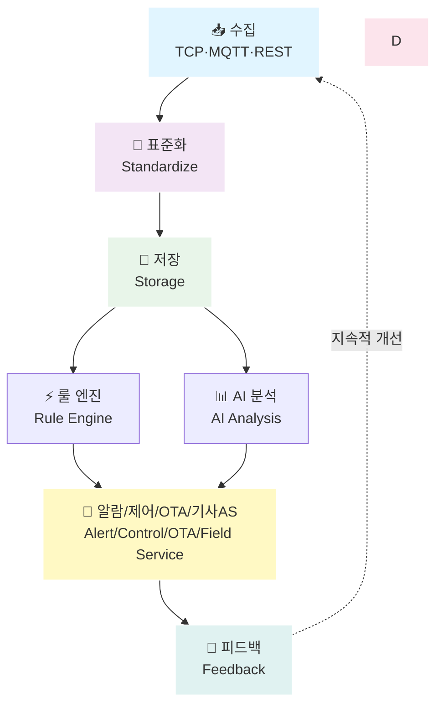

### 3️⃣ 기술 분석 - **기술 상세**
- **목적**: 기술 스택/아키텍처 결정 근거, CQRS, 보안, 운영 관점의 **기술 상세**
- **읽는 사람**: 개발팀, 기술 리더, 아키텍트
- **읽는 시간**: 약 20-30분
- **핵심 내용**:
  - 통합 데이터 플랫폼 기술적 구현 상세
  - 데이터 저장 계층 (Hot/Warm/Cold) 상세
  - CQRS 패턴 적용 (DocumentDB, Aurora)
  - AI/ML 서비스 역할 분리 (Bedrock vs SageMaker)
  - Lambda 함수 구조 (Node.js 20.x, ESM 모듈)
  - 보안 및 인증 (Cognito, Secrets Manager)
  - 필요한 AWS 리소스 목록
- **포인트**: Aurora(Document) CQRS, Bedrock/SageMaker 역할 분리, Lambda(Node.js 20 ESM)

### 4️⃣ 웹 애플리케이션 가이드 - **고객용 웹 화면·이용 방법**
- **목적**: **서비스 관점** — 고객이 접속해 사용하는 **웹 화면 구성**과 **접속·이용 방법**
- **읽는 사람**: 고객, 서비스 이용자
- **읽는 시간**: 약 5분
- **핵심 내용**:
  - 3가지 웹 화면 (프레젠테이션/대시보드/설계 문서), 접속 URL·화면 전환
  - 각 화면별 보기 내용, URL 해시로 직접 링크
- **주의**: 연구소/개발 관점(기술 스택, 프로젝트 구조, 설치·빌드)은 별도 문서

---

## 🧭 전체 설계 흐름 (한 장 요약)

### 큰 흐름 (End-to-End)

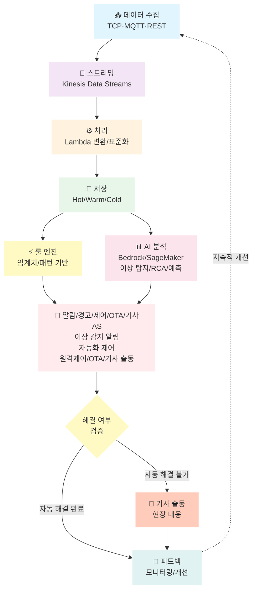

#### 1. 수집 (Ingestion)
- **VPN 연결 (필수)**: 모든 데이터 수집은 **VPN 터널링을 통한 안전한 연결**이 필요합니다
  - **Site-to-Site VPN**: 기존 온프레미스 시스템과 AWS 간 IPSec 터널 연결
  - **VPC 내부 네트워크**: Private Subnet을 통한 사설 IP 통신으로 퍼블릭 노출 없이 데이터 수집
  - **연동 대상**: 기존 RDBMS, NoSQL, API 서버, 센서 시스템 등
- **TCP**: VPN 터널을 통해 ECS 서비스가 연결을 유지하며 수신 → Kinesis Producer SDK → Kinesis Data Streams
- **MQTT**: VPN 터널을 통해 IoT Core (MQTT 브로커) → Kinesis Data Streams
- **REST API**: VPN 터널을 통해 ECS 서비스 (특별한 경우만 API Gateway) → Kinesis Data Streams

#### 2. 스트리밍 (Streaming)
- **Kinesis Data Streams**: 모든 센서 데이터를 단일 스트림으로 통합

#### 3. 처리 (Processing)
- **Lambda 중심**: 컨버트/분류/표준화/조인/계산식
  - Node.js 20.x, ESM 모듈
  - YAML 기반 데이터 변환 룰
  - Data Contract 기반 스키마 검증

#### 4. 저장 (Storage) - 3계층 구조
- **Hot Layer**: DocumentDB (CQRS: Read/Write 분리)
  - **보관 기간**: 최근 10일 데이터 (10일 이후 자동 Warm/Cold 이동)
  - 실시간 대시보드, 즉시 조회
  - **제품별 시간별/일별 집계** (센서 데이터에는 고객 정보 없음)
- **Warm Layer**: Aurora PostgreSQL (CQRS: Read/Write 분리)
  - 통합 기초 정보, **일별 고객별 집계**, **계산식 적용 분석 데이터**, 알람 이력, 에러 알림 처리 서비스 정보
  - 고객 정보 조인 후 집계 및 계산식 적용
- **Cold Layer**: S3 + Iceberg + Athena
  - 장기 보관, 히스토리 분석

#### 5. AI 분석 (Analytics) - 별도 개발
> **참고**: AI 분석은 **별도 개발 프로젝트**로 진행되며, 본 프로젝트 개발 기간(8개월)에는 포함되지 않습니다.
- **Bedrock**: LLM 기반 분석 (향후 확장)
  - 이상 탐지
  - 근본 원인 분석 (RCA)
- **SageMaker**: ML 모델 기반 예측 분석 (향후 확장)
  - 시계열 예측
  - 예지정비

#### 6. 알람/경고 및 자동화 제어 (Alert/Automation)
- **룰 기반 알람**: 룰 엔진을 통한 이상 감지 및 알람 발생
- **알람 채널**: 이메일, 전화, 대시보드 등
- **알람 분류**: 즉시 대응 필요 / 모니터링 필요 / 정보성 알람
- **자동화 제어 (함께 처리)**: 알람 발생 시 자동으로 처리되는 대응
  - **원격 제어**: Shadow 기반 제어 명령 자동 전송
  - **OTA 업데이트**: 펌웨어 업데이트를 통한 자동 문제 해결
  - **폐쇄 루프 검증**: 자동화 제어 결과를 검증하여 해결 여부 확인

#### 7. 기사 출동 (Field Service)
- **조건**: 자동화 제어(원격 제어/OTA)로 해결되지 않는 경우
- **현장 대응**: 현장에서 직접 문제를 해결
- **기록**: 출동 내역 및 해결 과정을 시스템에 기록

#### 8. 피드백 (Feedback)
- **모니터링/개선**: 대응 결과를 모니터링하고 시스템 개선
- **순환 구조**: 개선 사항이 OTA로 배포되어 새로운 데이터 수집으로 이어짐

#### 9. 보안 (Security)
- **Cognito**: 사용자 인증/권한
- **Secrets Manager**: DB 자격증명 등 시크릿 관리

---

### 전체 AWS 아키텍처 구성도

전체 시스템의 AWS 서비스 구성과 데이터 흐름을 한눈에 파악할 수 있는 아키텍처 다이어그램입니다.

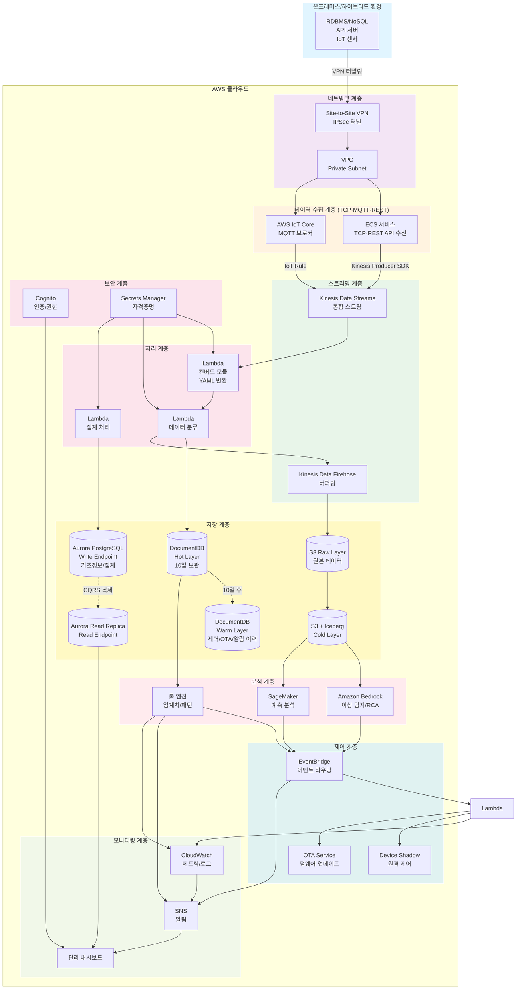

**주요 구성 요소**:
- **네트워크**: VPN 터널링을 통한 안전한 연결
- **수집**: ECS (TCP/REST), IoT Core (MQTT)
- **스트리밍**: Kinesis Data Streams, Kinesis Data Firehose
- **처리**: Lambda 함수들 (컨버트, 분류, 집계)
- **저장**: DocumentDB (Hot/Warm), Aurora PostgreSQL (CQRS), S3 + Iceberg (Cold)
- **분석**: 룰 엔진, Bedrock, SageMaker
- **제어**: EventBridge, Device Shadow, OTA Service
- **모니터링**: CloudWatch, SNS, 대시보드
- **보안**: Cognito, Secrets Manager

---

### 전체 데이터 파이프라인 구성도

데이터 수집부터 저장, 분석, 제어까지의 전체 데이터 흐름을 상세하게 보여주는 파이프라인 구성도입니다.

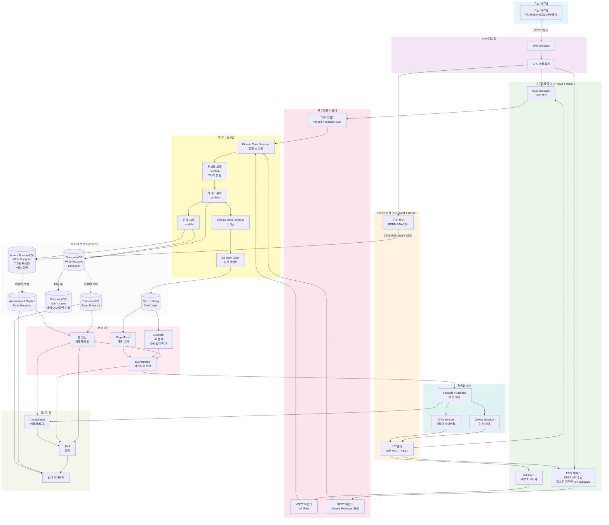

**데이터 흐름 요약**:
1. **수집**: 온프레미스 시스템 → VPN → 게이트웨이 (ECS/IoT Core)
2. **어댑터**: 프로토콜별 어댑터 → Kinesis Data Streams
3. **처리**: Kinesis → Lambda (컨버트/분류/집계)
4. **저장**: 
   - Hot: DocumentDB (10일)
   - Warm: DocumentDB (이력), Aurora (집계/기초정보)
   - Cold: S3 + Iceberg
5. **분석**: 룰 엔진, Bedrock, SageMaker
6. **제어**: EventBridge → Lambda → Shadow/OTA
7. **모니터링**: CloudWatch → SNS → 대시보드

**CQRS 패턴**:
- DocumentDB: Write Endpoint → Read Endpoint (복제)
- Aurora: Write Endpoint → Read Replica (복제)
- 모든 읽기 작업은 Read Endpoint 사용

---

## ✅ 일반적인 예시 시나리오 (End-to-End)

아래는 "현장에서 자주 나오는" 대표 시나리오를 **일반 예시**로 구성한 것입니다. (실제 고객/제품 값은 치환)

### 예시 A) 센서 이상 징후 → 알람 → 자동 복구 → 검증

**시나리오**: 제품 A의 온도 센서가 임계값을 초과하여 이상 징후가 감지되고, 자동으로 복구 조치가 실행되는 전체 프로세스

#### 단계별 상세 설명

1. **디바이스 데이터 전송**
   - 제품 A 디바이스가 5초마다 텔레메트리 데이터 전송
   - 데이터 형식: Hex Binary (예: `0x01 0x4E 0x02 0x03 0xE8 ...`)

2. **TCP 수신 (ECS 게이트웨이)**
   - TCP 연결이 필요한 장비는 **ECS 게이트웨이**가 연결을 유지하며 수신
   - ECS 서비스가 지속적으로 연결을 모니터링

3. **Kinesis Data Streams 적재**
   - 수신 데이터는 **Kinesis Producer SDK**를 통해 **Kinesis Data Streams**로 적재
   - 스트림에 데이터가 실시간으로 쌓임

4. **Lambda 변환/표준화**
   - **Lambda Function (Node.js 20.x, ESM)**이 YAML 룰을 읽어 Hex → JSON 변환
   - 변환 결과는 아래 플로우로 표현

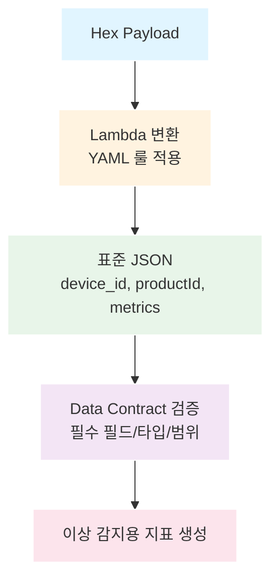

5. **DocumentDB 저장 (Hot Layer)**
   - 표준화된 이벤트가 **DocumentDB Write Endpoint**에 저장
   - 실시간 대시보드에서 즉시 조회 가능

6. **룰 엔진 이상 감지 (AI 분석 없이 가능)**
   - 룰 엔진이 임계치 기반 이상 감지
   - 예시 룰: `tempC > 80` → 알람 발생
   - 제품별 룰셋이 Aurora에서 동적으로 로드됨
   - **AI 분석 없이도 룰 기반으로 즉시 알람 발생 가능**

7. **알람 발생 및 자동화 제어**
   - 룰 엔진에서 감지된 이상 징후로 즉시 알람 발생
   - 알람 발생 시 자동화 제어 실행 (원격 제어/OTA)

8. **Bedrock 근본 원인 분석 (RCA) - 선택적**
   - **Bedrock**이 이상 데이터를 분석하여 원인 후보 및 권장 조치 생성
   - 예시 출력: "온도 상승 원인: 냉각 팬 고장 가능성 높음. 권장 조치: 팬 재시작"

8. **자동 대응 (Shadow 제어)**
   - 자동 대응 조건이면 **IoT Device Shadow**를 통해 제어 명령 실행
   - 예시: 재부팅, 설정 변경, 팬 속도 증가 등

9. **결과 검증 (폐쇄 루프)**
   - 제어 후 결과를 다시 수집/검증
   - 온도가 정상 범위로 돌아오면 알람을 자동 종료
   - 실패 시 에스컬레이션 (기사 출동 또는 원격 지원)

10. **이력 기록 (DocumentDB Warm Layer)**
    - 알람 이력, 조치 내역은 **DocumentDB Write Endpoint**에 기록 (Warm 데이터)
    - 에러 알림 처리 서비스 정보는 **Aurora Write Endpoint**에 기록
    - 리포트 및 분석에 활용

### 예시 B) 데이터 집계 및 분석 데이터 생성

**시나리오**: 센서 데이터를 집계하고, 고객 정보를 조인하여 계산식을 적용한 분석 데이터를 생성하는 프로세스

#### 단계별 상세 설명

1. **센서 데이터 수집**
   - 센서 데이터는 `device_id`, `productId`, `device_timestamp`, `metrics`만 포함 (고객 정보 없음)

2. **제품별 시간별/일별 집계 (DocumentDB)**
   - EventBridge 스케줄러가 1시간/6시간/일 단위로 트리거
   - Lambda Function이 DocumentDB에서 센서 데이터 조회
   - 제품별로 그룹화하여 시간별/일별 집계 계산
   - 집계 결과를 DocumentDB에 저장 (제품별 시간별/일별 집계)

3. **고객별 제품별 일별 집계 (Aurora)**
   - EventBridge 스케줄러가 일 단위로 트리거 (매일 자정)
   - Lambda Function이 DocumentDB에서 제품별 일별 집계 조회
   - Aurora의 기초 정보와 조인 (`device_id` → `site_id` → `customer_id`)
   - 고객별 제품별로 그룹화하여 일별 집계 계산
   - 집계 결과를 Aurora에 저장

4. **계산식 적용 및 분석 데이터 생성**
   - 고객별 집계 완료 후 Lambda Function 트리거
   - Aurora에서 계산식 조회 (고객별/제품별)
   - 고객별 제품별 일별 집계 데이터에 계산식 평가
   - 계산 결과를 분석 데이터 테이블에 저장 (Aurora)

5. **관리 화면 표시**
   - 관리 화면이 Aurora Read Endpoint에서 분석 데이터 조회
   - 고객별 제품별 일별 분석 데이터를 차트/테이블로 표시

---

## 🧩 예시 데이터 (샘플)

### 1) 표준화된 텔레메트리(Flow) 예시

**중요**: 센서 데이터에는 고객 정보(`customer_id`, `site_id`)가 포함되지 않습니다. 센서 데이터는 디바이스 식별자(`device_id`, `productId`)와 측정값(`metrics`)만 포함합니다. 고객 정보는 기초 데이터(Aurora)에서 `device_id`를 통해 조인하여 얻습니다.

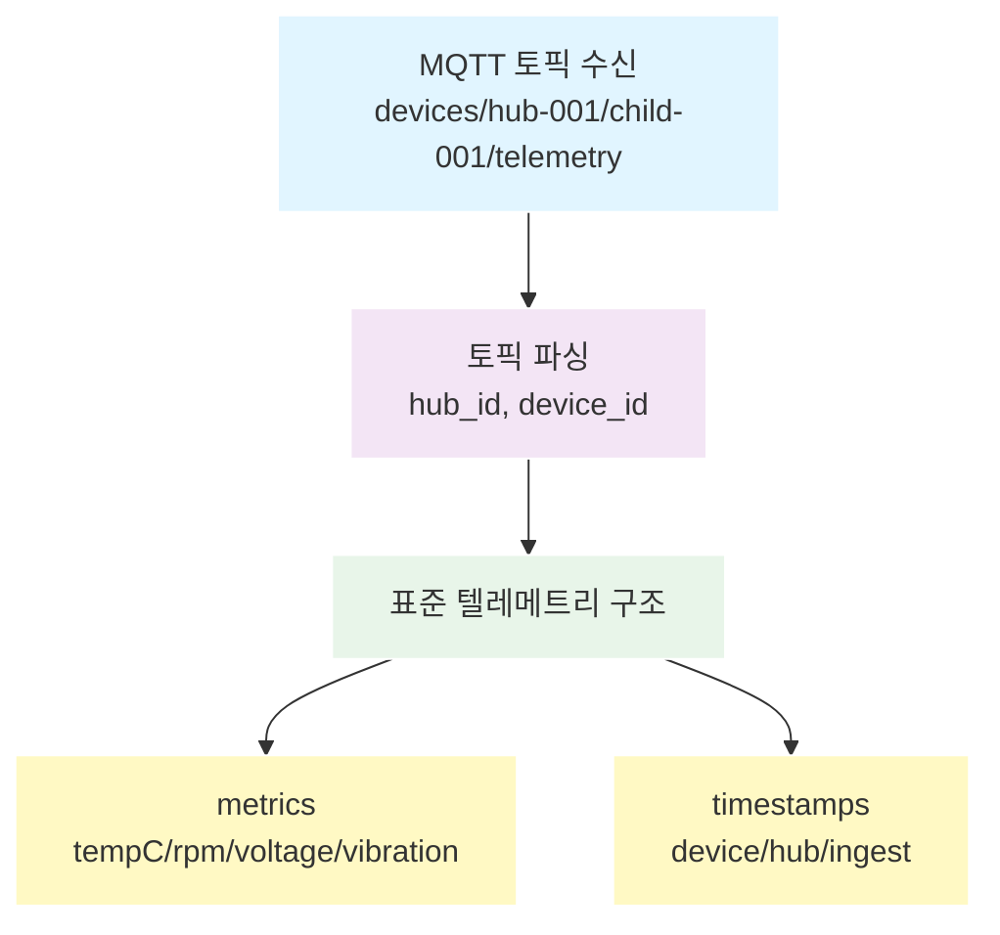

**필드 설명**:
- `device_id`: 디바이스 고유 식별자 (토픽에서 추출, 필수)
- `device_timestamp`: 디바이스에서 생성된 타임스탬프 (ISO 8601, 디바이스 측 시간)
- `hub_id`: 허브 디바이스 ID (차일드 디바이스인 경우, 토픽에서 추출)
- `hub_timestamp`: 허브에서 수신/전달한 타임스탬프 (ISO 8601, 허브 측 시간)
- `productId`: 제품 타입 식별자 (필수)
- `childDeviceId`: 차일드 디바이스 ID (허브-차일드 구조인 경우, 토픽에서 추출)
- `metrics`: 측정값 (제품별로 다름)
- `ingest_timestamp`: 플랫폼 수신 타임스탬프 (ISO 8601, Kinesis 수신 시점, 자동 생성)

> **참고**: 원본 데이터(로우 데이터)는 별도로 저장되며, 표준화된 텔레메트리 데이터에는 원본 참조 정보를 포함하지 않습니다.

### 2) 계산식 등록(분석 데이터 생성) 예시

**목적**: 분석용 파생지표(예: 건강도/효율/이상 점수)를 "코드 변경 없이" 운영자가 등록

**저장소**: Aurora (정합성/버전관리/권한)

**예시 계산식 (개념)**:
```yaml
formulaId: "health-score-prod-a"
productId: "prod-a"
formula: "clamp(100 - (tempC - 60) * 2 - vibration * 10, 0, 100)"
description: "제품 A 건강도 점수 (0-100)"
```

> **실제 구현**: 안전을 위해 허용 함수/연산만 제공하고, 샌드박스 평가 후 Lambda에서 계산합니다.

### 3) 알람 룰셋 예시

```yaml
ruleId: "temp-threshold-prod-a"
productId: "prod-a"
type: "threshold"
condition: "metrics.tempC > 80"
severity: "high"
autoAction: "restart-fan"
```

---

## 📌 추가 예시 (일반화된 토픽/룰/업로드)

### 1) 토픽 구조 (일반화)

**기본 형식**:
- `iotlink/{env}/{hub_id}/{device_id}/{type}/{direction}/{role}/{format}`
- `env`: dev | stg | prd
- `type`: periodic | event | tcp
- `direction`: pub | sub
- `role`: telemetry | alert_report | control_request | control_result
- `format`: json | bin

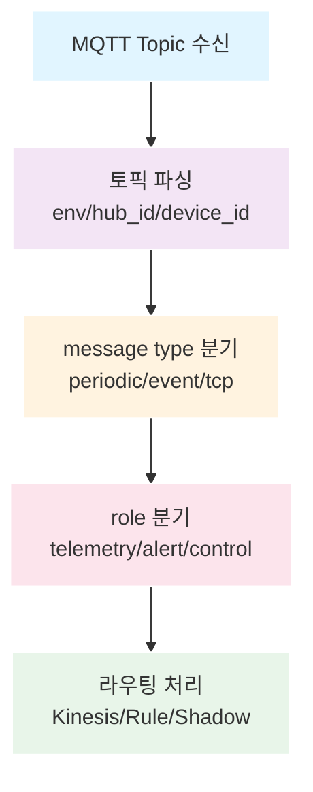

### 2) IoT Rule 예시 (일반화)

**주기 데이터 처리용 Rule**:
- `Rule Name`: `periodic_rule`
- `Topic`: `iotlink/+/+/+/periodic/+/+/+`

```sql
SELECT
  *,
  topic(1) AS env,
  topic(2) AS hub_id,
  topic(3) AS device_id,
  topic(4) AS data_type,
  topic(5) AS direction,
  topic(6) AS role,
  topic(7) AS format,
  header.timestamp AS device_time,
  timestamp() AS server_time
FROM 'iotlink/+/+/+/periodic/+/+/+'
```

### 3) 프로비저닝 완료 이벤트 (일반화)

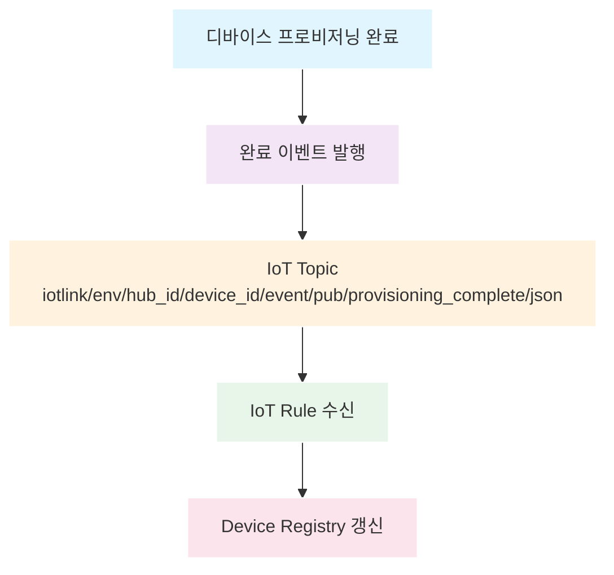

### 4) 이미지 업로드 프로세스 (일반화)

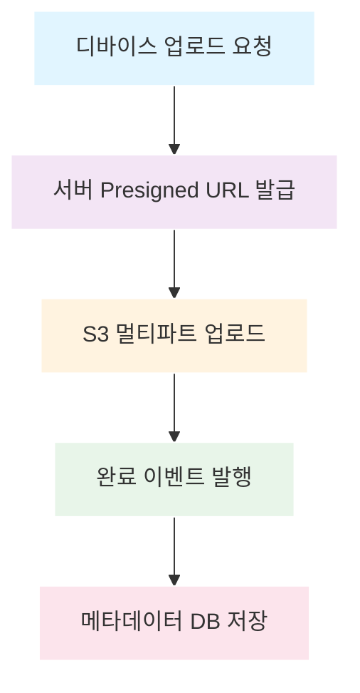

### 5) 공통 페이로드 구조 (일반화)

**JSON 페이로드 기본 형태**:
```json
{
  "hub_timestamp": 1756653767451,
  "device_timestamp": 1756653767451,
  "data": {
    "metrics": {
      "tempC": 26.3,
      "rpm": 1200
    }
  },
  "nodes": [
    {
      "device_id": "child-01",
      "role": "EndDevice",
      "parent": "hub-01"
    }
  ]
}
```

**바이너리 페이로드 기본 형태**:
```json
{
  "device_timestamp": 1756653767451,
  "data": {
    "bin": "HEX_OR_BASE64_PAYLOAD"
  }
}
```

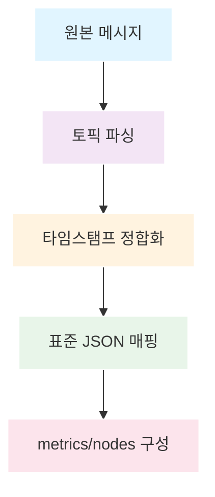

### 6) 주기 데이터 유형 (허브/단독/허브-차일드)

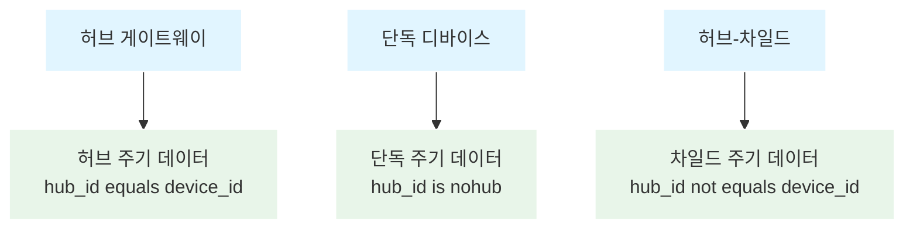

**허브 주기 데이터 토픽 예시**:
- `iotlink/stg/hub-01/hub-01/periodic/pub/telemetry/json`

**단독 주기 데이터 토픽 예시**:
- `iotlink/stg/nohub/device-01/periodic/pub/telemetry/json`

**허브-차일드 주기 데이터 토픽 예시**:
- `iotlink/stg/hub-01/device-01/periodic/pub/telemetry/json`

### 7) 제어 요청/응답 및 Shadow 흐름 (일반화)

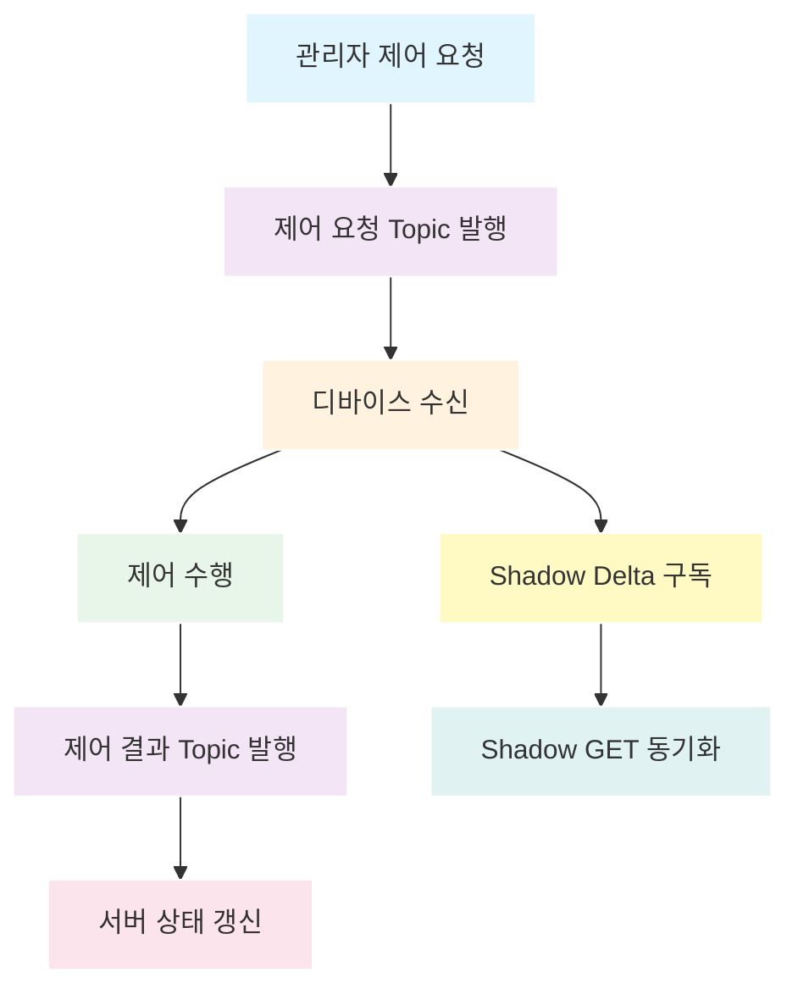

**제어 요청 토픽 예시**:
- `iotlink/{env}/{hub_id}/{device_id}/event/pub/control_request/json`

**제어 결과 토픽 예시**:
- `iotlink/{env}/{hub_id}/{device_id}/event/pub/control_result/json`

---

## 🧪 예제 코드 (샘플)

### 1) Lambda 컨버트 모듈 (Node.js 20.x, ESM)

```javascript
// 파일: convert-handler.mjs
export const handler = async (event) => {
  const records = event.Records || [];
  const outputs = [];

  for (const record of records) {
    const payload = Buffer.from(record.kinesis.data, "base64").toString("utf-8");
    const parsed = JSON.parse(payload); // 예시: JSON 형식

    // 이벤트 메타데이터에서 토픽 정보 추출 (예: IoT Core Rule에서 전달)
    // 또는 원본 데이터에서 이미 추출된 hub_id, device_id 사용
    const hub_id = parsed.hub_id || null;
    const device_id = parsed.device_id || null;

    // 표준화된 텔레메트리 구조 생성 (원본 참조 정보 제외)
    outputs.push({
      device_id,
      device_timestamp: parsed.device_timestamp,
      hub_id,
      hub_timestamp: parsed.hub_timestamp,
      productId: parsed.productId,
      metrics: parsed.metrics,
      ingest_timestamp: new Date().toISOString(),
    });
  }

  // 표준 JSON 반환 (다음 단계로 전달)
  return outputs;
};
```

### 2) DLQ 재처리 Lambda (실패 데이터 재처리)

```javascript
// 파일: dlq-retry.mjs
export const handler = async (event) => {
  for (const record of event.Records || []) {
    const body = JSON.parse(record.body);

    // 재처리 로직 (예: Kinesis 재적재)
    await putToKinesis(body, process.env.RETRY_STREAM);
  }
};

async function putToKinesis(payload, streamName) {
  // 실제 구현에서는 AWS SDK v3 사용
  console.log("retry -> kinesis", streamName, payload);
}
```

### 3) CDC 버퍼 처리 Lambda (Kinesis → Aurora)

```javascript
// 파일: cdc-apply.mjs
export const handler = async (event) => {
  for (const record of event.Records || []) {
    const change = JSON.parse(Buffer.from(record.kinesis.data, "base64").toString("utf-8"));

    // 변경 이벤트 유형에 따라 UPSERT/DELETE 처리
    if (change.op === "upsert") {
      await upsertToAurora(change.table, change.data);
    } else if (change.op === "delete") {
      await deleteFromAurora(change.table, change.keys);
    }
  }
};

async function upsertToAurora(table, data) {
  // 실제 구현에서는 SQL 템플릿 + 파라미터 바인딩
  console.log("upsert", table, data);
}

async function deleteFromAurora(table, keys) {
  console.log("delete", table, keys);
}
```

---

## 🗺️ 구현 로드맵 (6단계)

중복을 줄이기 위해 로드맵은 여기(가이드)에만 유지합니다.

### 0단계: 설계 및 목표설정 (병렬 진행, 1-2개월 중 수행)
> **참고**: 설계 및 목표설정은 프로젝트 초기 2개월 동안 1단계(데이터 수집 및 통합)와 병렬로 진행됩니다.
- 프로젝트 요구사항 분석 및 정리
- 목표 설정 및 성공 기준 정의
- 시스템 아키텍처 설계
- 데이터 모델 설계
- 기술 스택 검토 및 결정
- 개발 계획 수립
- 고객사 요구사항 정리 및 커스터마이징 범위 결정

### 1단계: 데이터 수집 및 통합 (2개월)
- VPN 연결 설정 (Site-to-Site VPN)
- ECS TCP 수신 인프라 구축
- Kinesis Data Streams 설정
- Lambda(YAML 변환) 개발
- Data Contract 스키마 정의 및 검증 시스템
- 다중 프로토콜 통합 (TCP/MQTT/REST API)

### 2단계: 데이터 저장 및 집계 자동화 (2개월)
- DocumentDB/Aurora Read/Write 엔드포인트 분리
- CQRS 패턴 적용 및 쿼리 패턴 정리
- Hot/Warm/Cold 레이어 구축
- **집계 데이터 생성 자동화**
  - 제품별 시간별/일별 집계 (DocumentDB)
  - 고객별 일별 집계 (Aurora)
  - 계산식 적용 자동화
  - EventBridge 스케줄러 기반 배치 처리

### 3단계: 알람 처리 (2개월)
- 룰 엔진 구축 (룰 기반 알람 시스템)
- 알람/에스컬레이션 시스템
- 이력 관리 (DocumentDB, Warm)

### 4단계: 자동화 확장 - 원격 제어 및 OTA (병렬 진행, 1-3개월 중 수행)
> **참고**: 자동화 확장 및 프론트엔드 개발은 프로젝트 진행 중 병렬로 수행됩니다.
- Shadow 제어 시스템 (룰 기반 자동화 제어)
- OTA 파이프라인 구축 (자동 펌웨어 업데이트)
- 롤백 및 버전 관리
- 폐쇄 루프 자동화 (검증 및 피드백)

### 프론트엔드 개발 (병렬 진행, 2-8개월 중 수행)
> **참고**: 프론트엔드 개발은 백엔드 개발과 병렬로 진행됩니다.
- **프론트엔드 개발**
  - 관리 화면 (대시보드, 모니터링)
  - 집계 데이터 조회 및 분석 화면
  - 고객 관리 화면
  - 설정 및 관리 화면 (룰셋, 계산식, OTA 관리)

### 배포 시스템 구축 (병렬 진행, 7-8개월 중 수행)
> **참고**: 배포 시스템 구축은 프로젝트 마지막 2개월 동안 병행으로 진행됩니다.
- **Terraform 배포 시스템**
  - 인프라 코드 배포 자동화
  - 환경별(Dev/Staging/Prod) 배포 파이프라인
  - 인프라 변경 관리 및 버전 관리
- **Lambda 시스템 배포**
  - Lambda 함수 배포 자동화
  - 배포 패키징 및 버전 관리
  - 환경별 Lambda 배포 설정
- **백엔드 배포**
  - ECS 서비스 배포 자동화
  - 컨테이너 이미지 빌드 및 배포
  - Blue-Green 또는 Canary 배포 전략
- **프론트엔드 배포**
  - 프론트엔드 빌드 및 배포 자동화
  - S3 + CloudFront 배포
  - CI/CD 파이프라인 구축 (CodeCommit, CodeBuild, CodeDeploy)

### 5단계: 서비스 검수 및 보완 (1개월)
- **AWS 시스템 모니터링 구축** (검수를 위한 모니터링 시스템)
  - CloudWatch 통합 모니터링
  - 인프라 모니터링 (ECS, Lambda, Kinesis, DB 등)
  - 성능 지표 수집 및 알람 설정
  - 실시간 모니터링 대시보드 구축
- 스트레스 테스트 및 성능 검증
- 보안 검수 및 취약점 점검
- 서비스 안정성 검증
- 버그 수정 및 보완 작업
- 운영 가이드 및 문서화

> **참고**: AI/ML 분석(Bedrock, SageMaker)은 **별도 개발 프로젝트**로 진행되며, 본 프로젝트 개발 기간(8개월)에는 포함되지 않습니다.

---

## 👥 프로젝트 개발 계획

### 프로젝트 범위
본 프로젝트는 다음 범위로 진행됩니다:

1. **데이터 수집 및 통합**
   - VPN 연결을 통한 다중 프로토콜 데이터 수집 (TCP/MQTT/REST API)
   - 데이터 표준화 및 변환 (YAML 룰 기반)
   - Data Contract 기반 품질 검증

2. **알람 처리**
   - 룰 기반 알람 시스템 구축
   - 알람/에스컬레이션 처리
   - 알람 이력 관리

3. **집계데이터 생성 자동화**
   - 제품별 시간별/일별 집계 자동 생성 (DocumentDB)
   - 고객별 일별 집계 자동 생성 (Aurora)
   - 계산식 적용 자동화
   - EventBridge 스케줄러 기반 배치 처리

4. **모니터링**
   - 실시간 데이터 모니터링
   - AWS 시스템 모니터링 (CloudWatch 통합)
   - 인프라 모니터링 (ECS, Lambda, Kinesis, DB 등)
   - 성능 지표 수집 및 알람

5. **프론트엔드 개발**
   - 관리 화면 개발 (대시보드, 모니터링)
   - 집계 데이터 조회 및 분석 화면
   - 고객 관리 화면
   - 설정 및 관리 화면

> **제외 범위**: AI/ML 분석(Bedrock, SageMaker)은 **별도 개발 프로젝트**로 진행되며, 본 프로젝트 개발 기간(8개월)에는 포함되지 않습니다.

### 개발 기간
- **총 개발 기간**: 8개월
- **단계별 진행**: 6단계 구현 로드맵에 따라 단계적으로 개발
  - 0단계: 설계 및 목표설정 (병렬 진행, 1-2개월 중 수행)
  - 1~5단계: 개발 및 운영 고도화 (6개월 + 병렬 진행 포함)

### 팀 구성

#### 본 프로젝트 (8개월)
- **PM/아키텍트**: 1명 (전상훈) - 전체 프로젝트 관리 및 아키텍처 설계
- **UI/UX 디자이너**: 1명 - 화면 구체화 및 디자인 역할
  - 요구사항을 바탕으로 화면을 구체화하는 역할
  - 화면 와이어프레임 및 프로토타입 제작
  - 사용자 인터페이스(UI) 및 사용자 경험(UX) 디자인
  - 프론트엔드 개발자와의 협업을 통한 화면 디자인 가이드 제공
  - 화면 설계서 및 디자인 시스템 구축
- **백엔드 개발자**: 2명
  - 유재후 - AWS 인프라 연동 및 백엔드 API 개발
  - 천필호 - AWS 인프라 연동 및 백엔드 API 개발
- **프론트엔드 개발자**: 2명
  - 이세희 - 웹 프론트엔드 화면 개발 (외부 인원)
  - 이진경 - 웹 프론트엔드 화면 개발 (외부 인원)

> **참고**: 프론트엔드 개발자(이세희, 이진경)는 외부 인원입니다. 합류가 불가능한 경우 다음 대응 방안을 적용합니다:
> - **방안 1**: 추가 프론트엔드 개발자 2명을 투입하여 총 8개월 기간 유지
> - **방안 2**: 기존 인원으로 진행하는 경우 프로젝트 기간을 2개월 추가하여 총 10개월로 조정

#### 선택적 인원
- **SA (시스템 분석가/인프라 엔지니어)**: 필요 시 1명 (선택적)
  - AWS 인프라 구성 및 관리
  - VPN 구성 (Site-to-Site VPN 설정 및 관리)
  - CI/CD 파이프라인 구성 (CodeCommit, CodeBuild, CodeDeploy)
  - 구성된 인프라 내역 공유 및 문서화
  - 인프라 모니터링 및 운영 지원
  > **참고**: Terraform 인프라 코드 작성 및 관리는 SA가 직접 수행하지 않으며, 구성된 내역에 대한 공유가 필요합니다.

#### 별도 개발 (AI/ML 프로젝트)
- **AI/ML 개발자**: 2명 - AI/ML 분석 모델 개발 (별도 프로젝트로 진행)

> **참고**: 
> - AI/ML 분석(Bedrock, SageMaker)은 별도 개발 프로젝트로 진행되며, 본 프로젝트 개발 기간에는 포함되지 않습니다.

### 개발 운영 방식
- **겸직 개발**: 백엔드 개발자와 프론트엔드 개발자는 상황에 따라 필요 시 다른 역할을 겸직하여 개발 진행
- **협업 방식**: PM/아키텍트 중심의 협업 체계로 전반적인 개발 일정 및 품질 관리
- **단계별 검증**: 각 단계별로 기능 완성 후 검증을 통해 다음 단계 진행

### 인프라 및 비용 관리

#### 인프라 운영 방식
- AWS 인프라 리소스는 **고객사가 직접 생성 및 관리**합니다
- 우리는 솔루션 수준의 아키텍처 설계 및 개발 코드를 제공합니다
- 인프라 직접 운영은 하지 않으며, 고객사가 자체적으로 운영합니다

#### 비용 구분

**1. 솔루션 개발 비용** (우리가 산정해야 할 비용)
- 솔루션 개발에 소요되는 비용
- 팀 구성 및 개발 기간(8개월) 기반 인건비
- 솔루션 설계 및 코드 개발 비용
- 고객사에게 솔루션 제공 시 청구되는 비용

**2. 고객사 운영 비용** (고객사가 별도로 계산해야 할 비용)
- AWS 인프라 리소스 운영 비용 (ECS, Lambda, Kinesis, DocumentDB, Aurora, S3 등)
- 데이터 저장 및 처리 비용
- 네트워크 비용 (VPN, 데이터 전송 등)
- 모니터링 및 로깅 비용
- 고객사가 자체적으로 운영하며 부담하는 비용

> **참고**: 솔루션 개발 비용과 고객사 운영 비용은 별도로 산정됩니다.

### 고객사 서비스 개발 및 커스터마이징

#### 프로젝트 진행 방식
- **표준 솔루션 제공**: 기본 솔루션을 고객사에 제공하며, **최선은 고객사 커스터마이징 없이 프로젝트를 수행**하는 것입니다
- **커스터마이징 옵션**: 고객사 요청에 따른 커스터마이징이 필요한 경우, **2개월 이내로 프로젝트를 진행**합니다
  - 해당 프로그램(표준 솔루션) + 고객사 요청에 따른 커스터마이징
  - 커스터마이징 범위 및 일정은 프로젝트 초기에 협의하여 결정

#### 고객사 서비스 제공 프로세스
1. **표준 솔루션 제공** (8개월 개발 완료 후)
   - 기본 솔루션 설치 및 배포
   - 고객사 환경에 맞춘 설정 및 연동
2. **커스터마이징 (필요 시)**
   - 고객사별 요구사항 수집 및 분석
   - 커스터마이징 개발 (최대 2개월)
   - 테스트 및 검증
   - 배포 및 운영 전환

---

## 🔗 다음에 읽을 문서

1. **[서비스 개요](./SERVICE_OVERVIEW.md)** - 비즈니스 관점
2. **[프로세스 플로우](./PROCESS_FLOW.md)** - 시스템 흐름
3. **[기술 분석](./PROJECT_ANALYSIS.md)** - 기술 상세

---

**버전**: 1.0.0  
**최종 업데이트**: 2026년 3월
