# 프로세스 플로우

> **🔄 서비스 관점 & 🔬 연구소 관점 문서**  
> 본 문서는 전체 데이터 흐름과 프로세스를 **서비스 관점**과 **연구소 관점**에서 설명합니다.  
> 비즈니스 가치는 [서비스 개요 문서](./SERVICE_OVERVIEW.md)를, 기술 상세는 [기술 분석 문서](./PROJECT_ANALYSIS.md)를 참고하세요. 다이어그램

## 📖 문서 개요

이 문서는 **데이터 통합 플랫폼 기반 지능형 IoT 관리 솔루션**의 전체 시스템 프로세스를 Mermaid 다이어그램과 상세 설명으로 정리한 설계 문서입니다. 핵심 목적은 **종류가 다양한 데이터를 최대한 통합해 하나의 흐름으로 관리**하는 것입니다.

### 문서의 목적

- **시스템 이해도 향상**: 전체 데이터 흐름과 프로세스를 시각적으로 이해
- **의사결정 지원**: 각 단계별 기술 선택과 아키텍처 결정 근거 제공
- **구현 가이드**: 개발팀이 참고할 수 있는 상세 프로세스 정의
- **외부 설명 자료**: 고객사, 경영진, 이해관계자에게 시스템을 설명하기 위한 자료

#### 통합 관리 범위
- **프로토콜**: TCP, MQTT, REST API
- **형식**: Hex Binary, JSON, CSV
- **원천**: IoT 센서, 파일 배치, RDBMS, NoSQL

#### 통합 대상 데이터
- **센서/텔레메트리**: 주기/이벤트 데이터
- **제어/상태**: Shadow 명령 및 결과
- **펌웨어/OTA**: 업데이트 요청 및 상태
- **파일/이미지/로그**: 업로드 파일 및 메타데이터
- **마스터/기초정보**: 고객/사이트/디바이스
- **알람/이력**: 알람 이벤트 및 처리 이력

#### 명확한 데이터 목표 (8개)

> 상세는 [DESIGN_GUIDE.md](./DESIGN_GUIDE.md)·[SERVICE_OVERVIEW.md](./SERVICE_OVERVIEW.md) 참고.

1. **다채널 데이터 원활한 수집** — 기초데이터와 IoT 센서 데이터를 TCP·MQTT·REST 등 여러 채널에서 끊김 없이 수집  
2. **제품별 YAML 관리를 통한 데이터 통합** — 제품·형식별 YAML 스펙으로 변환·표준화하여 단일 플랫폼에서 통합  
3. **알람 룰셋 등록에 따른 알람 자동화** — 제품별 룰셋 등록 시 룰 엔진으로 알람 자동 발생·분류·에스컬레이션 수행  
4. **알람 장비 원격제어·FoTA를 통한 정비** — Device Shadow·FoTA로 알람 장비 원격 제어 및 정비  
5. **AS 기사 알림 처리** — 알람·에스컬레이션에 따른 AS 기사 알림·배차·처리 이력 관리  
6. **연구소 분석 데이터 생성** — 연구소 관점의 집계·이상탐지·RCA·예측 등 분석 데이터 생성·활용  
7. **서비스 분석데이터 및 관련 서비스 데이터 관리** — 서비스 관점 분석데이터와 고객·제품별 서비스 데이터의 저장·조회·관리  
8. **향후 AI·LLM 기반 자동화** — AI 이상탐지·예측, LLM 분석·보고 자동화, 자동 대응 룰 고도화 등으로 확장  

#### 데이터 유형별 저장소 매핑
- **Hot (DocumentDB)**: 실시간 센서/알람, 최신 상태
- **Warm (DocumentDB)**: 제어/OTA/알람 이력
- **Warm (Aurora)**: 고객별 집계, 기초정보
- **Cold (S3+Iceberg)**: 장기 보관 및 분석

### 문서 구성

문서 구성:

1. **통합 데이터 플랫폼**: 수집/정제/표준화/저장/조인/분석 데이터 생성
2. **지능형 모니터링 및 알람**: 제품별 룰셋 기반의 실시간 감지와 알림
3. **원격 제어 및 OTA**: Shadow 제어/OTA 업데이트의 실행 흐름
4. **자동 진단 및 대응**: Bedrock/SageMaker 기반 분석 + 폐쇄 루프 자동화
5. **데이터 생명주기/고객별 서비스**: Hot/Warm/Cold 운영 및 SLA/리포트 흐름

> 문서 전체 목차/읽는 순서(로드맵/역할 분리 포함)는 `DESIGN_GUIDE.md`를 참고하세요.

> **참고**: 최종 서비스에 대한 종합적인 개요는 [SERVICE_OVERVIEW.md](./SERVICE_OVERVIEW.md) 문서를 참고하세요.

---

## 주요 기술 스택 및 아키텍처 결정

> **참고**: 설계 문서 전체 목차/읽는 순서는 [DESIGN_GUIDE.md](./DESIGN_GUIDE.md)를 참고하세요.

### Cold 데이터 저장소: Apache Iceberg + Athena

**선택한 기술**:
- **저장소**: Apache Iceberg 테이블 형식으로 S3에 저장
- **쿼리 엔진**: Amazon Athena를 사용하여 Iceberg 테이블 SQL 쿼리

**선택 근거 및 장점**:

1. **ACID 트랜잭션 지원**
   - 데이터 일관성 보장
   - 동시성 제어로 데이터 무결성 유지

2. **스키마 진화 (Schema Evolution)**
   - 시간에 따라 변화하는 데이터 구조에 유연하게 대응
   - 기존 데이터와 호환성 유지하며 스키마 변경 가능

3. **파티션 진화 (Partition Evolution)**
   - 쿼리 패턴 변화에 따라 파티션 전략 변경 가능
   - 성능 최적화를 위한 유연한 파티션 관리

4. **시간 여행 쿼리 (Time Travel)**
   - 과거 시점의 데이터 상태 조회 가능
   - 데이터 변경 이력 추적 및 롤백 지원

5. **파티션 프루닝 (Partition Pruning)**
   - 필요한 파티션만 스캔하여 쿼리 비용 대폭 절감
   - 대용량 데이터에서도 빠른 쿼리 성능

**비용 효율성**: 
- S3 스토리지 비용은 저렴하지만, 쿼리 비용이 주요 고려사항
- 파티션 프루닝을 통해 불필요한 데이터 스캔을 최소화하여 비용 절감
- Glacier 대비 실시간 쿼리 가능으로 분석 효율성 향상

---

## 2. 통합 데이터 플랫폼

> **참고**: 구현 로드맵은 [DESIGN_GUIDE.md](./DESIGN_GUIDE.md)의 "구현 로드맵 (6단계)" 섹션을 참고하세요.

### 개요

**통합 데이터 플랫폼**은 분산된 모든 데이터를 통합하여 분석 가능한 형태로 변환하는 기능입니다.

**주요 역할**:
1. **데이터 분산 문제 해결**: RDBMS/NoSQL/File/IoT 장비별로 분산된 데이터를 단일 플랫폼으로 통합
2. **실시간 통합**: 센서 데이터와 기초 데이터를 실시간으로 통합하여 즉시 분석 가능
3. **통합 분석 데이터 제공**: 통합된 데이터를 기반으로 지능형 모니터링, 자동 제어, 예측 분석 등 고급 기능 제공

**구성**: 두 가지 통합 프로세스로 구성되며, 이들이 결합하여 통합 분석 데이터를 생성합니다.

### 통합 프로세스

#### 1. 센서 데이터 통합 (실시간 스트리밍 통합)

다양한 프로토콜과 형식의 센서 데이터를 실시간으로 통합하여 표준화된 분석 데이터로 변환합니다.

**프로세스**:
1. **다중 프로토콜 수집**: TCP (ECS), MQTT (IoT Core), REST API (ECS, 특별한 경우만 API Gateway)
2. **Kinesis Data Streams 통합**: 모든 센서 데이터를 단일 스트림으로 통합
3. **YAML 기반 변환**: 다양한 데이터 형식(Hex Binary, JSON, CSV)을 표준 JSON으로 변환
4. **데이터 분류**: 제품별/고객별/디바이스별로 분류 및 라우팅
5. **스키마 검증**: Data Contract를 통한 데이터 품질 보장
6. **기초 정보 조인**: 통합된 기초 데이터와 조인하여 데이터 보강
7. **분석 데이터 생성**: 보강된 데이터를 분석 가능한 형태로 변환

**상세 프로세스**: [2-1. 실시간 데이터 수집 및 다중 프로토콜 통합 프로세스](#2-1-실시간-데이터-수집-및-다중-프로토콜-통합-프로세스) 참조

#### 2. 기초 데이터 통합 (분산 데이터베이스 통합)

분산된 기초 정보 데이터베이스를 통합하여 센서 데이터 분석의 기반을 구축합니다.

**프로세스**:
1. **분산 데이터베이스 식별**: MariaDB, MySQL, MSSQL, Oracle, MongoDB, DynamoDB 등
2. **DMS 마이그레이션 (Full Load + CDC 혼합)**: 초기 데이터는 Full Load로 적재하고, 이후 변경사항은 CDC로 동기화
3. **CDC 실시간 동기화 + 버퍼링**: 변경사항은 상황에 따라 Kinesis Data Streams로 버퍼 처리 후 Lambda를 통해 Aurora Write Endpoint에 반영
4. **CQRS 패턴 적용**: Read Replica를 통한 Read/Write Endpoint 분리
5. **데이터 품질 관리**: 중복 제거, 정규화, 일관성 검증
6. **통합 스키마 구축**: 모든 기초 정보를 표준화된 스키마로 통합

**상세 프로세스**: [2-0. 기초 정보 통합 프로세스 (DMS 및 CDC)](#2-0-기초-정보-통합-프로세스-dms-및-cdc) 참조

#### 3. 통합 분석 데이터 생성

센서 데이터와 기초 데이터를 결합하여 분석 가능한 통합 데이터를 생성합니다.

**프로세스**:
1. **센서 데이터 + 기초 정보 조인**: 플랫폼 내 통합 Aurora Read Endpoint의 기초 정보와 센서 데이터를 조인 (CQRS 패턴)
2. **데이터 보강**: 비즈니스 룰 적용 및 컨텍스트 정보 추가
3. **계산식 기반 분석 데이터 생성**: 등록된 계산식을 통해 분석 데이터 생성
   - 계산식 등록 및 관리 (제품별/고객별/디바이스별)
   - 실시간 계산식 적용
   - 계산 결과 저장 및 활용
4. **계층별 저장**: Hot/Warm/Cold 레이어로 분리 저장
5. **통합 분석 데이터 제공**: 플랫폼을 통해 실시간 대시보드, 리포트, 예측 분석 등에 활용

### 통합 데이터 플랫폼의 역할

통합 데이터 플랫폼의 역할:

- **데이터 통합 허브**: 모든 데이터 소스를 단일 플랫폼으로 통합
- **실시간 처리**: 센서 데이터와 기초 데이터를 실시간으로 통합 및 처리
- **분석 기반 제공**: 통합 분석 데이터를 기반으로 모든 고급 기능 제공
- **확장성**: 새로운 데이터 소스 추가 시 유연하게 확장 가능

### 통합 데이터의 활용

통합 분석 데이터 활용:

1. **실시간 모니터링**: Hot Layer를 통한 실시간 대시보드 및 알람
2. **분석 리포트**: Warm Layer를 통한 기초 정보 기반 리포트 생성
3. **히스토리 분석**: Cold Layer를 통한 장기 데이터 분석 및 트렌드 파악
4. **AI/ML 분석**: 통합 데이터를 기반으로 한 예측 분석 및 이상 탐지
   - **SageMaker**: 예측 분석, 시계열 예측 (ML 모델 기반)
   - **Bedrock**: 이상 탐지, 근본 원인 분석 (RCA), LLM 기반 분석
5. **계산식 기반 분석 데이터**: 고객별 제품별 일별 집계에 계산식 적용 → 분석 데이터 생성

### 데이터 저장 계층 (Data Lake Architecture)

통합 분석 데이터는 **3계층 데이터 레이어**로 분리 저장됩니다:

#### Hot Layer (실시간 접근)
- **저장소**: DocumentDB (CQRS 패턴 적용)
  - **Write Endpoint**: Primary DocumentDB (데이터 변경 작업)
  - **Read Endpoint**: Read Replica (데이터 조회 작업)
- **보관 기간**: 최근 10일 데이터 (10일 이후 자동 Warm/Cold 이동)
- **용도**: 실시간 대시보드, 즉시 조회가 필요한 통합 데이터
- **특징**: 빠른 읽기/쓰기 성능, 실시간 쿼리 지원, MongoDB 호환 NoSQL, Read/Write 분리로 성능 최적화
- **데이터**: 센서 데이터 + 기초 정보가 조인된 실시간 데이터
- **CQRS 패턴**: Command(Write)와 Query(Read) 분리로 효율적 운영

#### Warm Layer (빠른 조회)
- **저장소**: Aurora PostgreSQL (CQRS 패턴 적용)
  - **Write Endpoint**: Primary Aurora (데이터 변경 작업)
  - **Read Endpoint**: Read Replica (데이터 조회 작업)
- **용도**: 통합 기초 정보 + 집계 결과, 분석 리포트, 에러 알림 처리 서비스 정보
- **특징**: 관계형 데이터 조인, 복잡한 쿼리 지원, Read/Write 분리로 성능 최적화, 고가용성 및 자동 백업
- **데이터**: 통합 기초 정보, 센서 데이터 집계 결과, 에러 알림 처리 서비스 정보
- **CQRS 패턴**: Command(Write)와 Query(Read) 분리로 효율적 운영

#### Cold Layer (장기 보관)
- **저장소**: Apache Iceberg on S3 + Athena
- **용도**: 통합 데이터 장기 보관, 히스토리 분석
- **특징**: 저렴한 스토리지 비용, 대용량 데이터 분석, RDS와 조인 가능
- **데이터**: 센서 데이터와 기초 정보가 조인된 장기 보관 데이터

센서 데이터 통합과 기초 데이터 통합이 결합하여 통합 분석 데이터를 생성하는 프로세스입니다.

```mermaid
flowchart TD
    subgraph 통합데이터플랫폼["🎯 통합 데이터 플랫폼"]
        PlatformTitle[통합 데이터 플랫폼<br/>모든 데이터 통합 및 분석 기반 제공]
        
        subgraph 센서데이터통합["🔵 센서 데이터 통합 (플랫폼 내)"]
        subgraph 센서소스["센서 데이터 소스"]
            TCP[TCP 연결<br/>센서 데이터]
            MQTT[MQTT 브로커<br/>센서 데이터]
            API[REST API<br/>센서 데이터]
        end
        
        subgraph 센서수집["센서 데이터 수집"]
            Collect[Kinesis Data Streams<br/>통합 수집]
            Convert[컨버트 모듈<br/>YAML 기반 변환]
            Classify[데이터 분류<br/>제품별/고객별/디바이스별]
            Validate[스키마 검증<br/>Data Contract]
            Transform[표준화 변환<br/>Lambda]
        end
        
        TCP --> Collect
        MQTT --> Collect
        API --> Collect
        Collect --> Convert
        Convert --> Classify
        Classify --> Validate
        Validate --> Transform
    end
    
        subgraph 기초데이터통합["🟡 기초 데이터 통합 (플랫폼 내)"]
        subgraph 기초소스["분산된 기초 정보 소스"]
            MariaDB[(MariaDB<br/>기초 정보)]
            MySQL[(MySQL<br/>기초 정보)]
            MSSQL[(MSSQL<br/>기초 정보)]
            Oracle[(Oracle<br/>기초 정보)]
            NoSQL[(NoSQL<br/>MongoDB/DynamoDB<br/>기초 정보)]
        end
        
        subgraph 기초통합["기초 정보 통합"]
            DMS[DMS<br/>Database Migration Service<br/>마이그레이션]
            CDC[CDC<br/>Change Data Capture<br/>실시간 변경 캡처]
            DMSStream[Kinesis Data Streams<br/>CDC 변경사항]
            CDCLambda[Lambda Function<br/>CDC 변환]
        end
        
        MariaDB --> DMS
        MySQL --> DMS
        MSSQL --> DMS
        Oracle --> DMS
        NoSQL --> CDC
        
        DMS --> UnifiedRDSWrite[(Aurora PostgreSQL<br/>Write Endpoint<br/>통합 기초 정보)]
        CDC --> DMSStream
        DMSStream --> CDCLambda
        CDCLambda --> UnifiedRDSWrite
        UnifiedRDSWrite -.->|복제| UnifiedRDSRead[(Aurora Read Replica<br/>Read Endpoint<br/>CQRS 패턴)]
    end
    
        subgraph 통합분석데이터["🟢 통합 분석 데이터 생성 (플랫폼 출력)"]
        Join[기초 정보 조인<br/>센서 데이터 + 기초 정보]
        Enrich[데이터 보강<br/>비즈니스 룰 적용]
        CalcEngine[계산식 엔진<br/>등록된 계산식 적용<br/>분석 데이터 생성]
        Curated[(S3 Curated Layer<br/>가공된 통합 데이터)]
        
        Transform --> Join
        UnifiedRDSRead -.->|Read Endpoint<br/>조회| Join
        Join --> Enrich
        Enrich --> CalcEngine
        CalcEngine --> Curated
    end
    
        subgraph 데이터저장["📊 계층별 데이터 저장 (플랫폼 저장소)"]
        HotWrite[(DocumentDB Write<br/>Write Endpoint<br/>CQRS 패턴)]
        HotRead[(DocumentDB Read<br/>Read Replica<br/>Read Endpoint)]
        Warm[Aurora PostgreSQL<br/>통합 기초 정보 + 집계 결과]
        Cold[Cold Layer<br/>Apache Iceberg<br/>on S3 + Athena<br/>장기 보관 및 분석]
        
        Curated --> HotWrite
        HotWrite -.->|복제| HotRead
        Curated --> Warm
        Curated --> Cold
    end
    
        subgraph 데이터활용["📈 통합 데이터 활용 (플랫폼 기반 기능)"]
        Consumer1[실시간 대시보드<br/>모니터링]
        Consumer2[분석 리포트<br/>기초 정보 조회]
        Consumer3[히스토리 분석<br/>Athena SQL 쿼리<br/>RDS와 조인]
        Consumer4[AI/ML 분석<br/>예측/이상 탐지]
        
        HotRead --> Consumer1
        Warm --> Consumer2
        Cold --> Consumer3
        Curated --> Consumer4
        UnifiedRDSRead -.->|참조| Consumer3
    end
    
    style TCP fill:#2196F3,color:#fff
    style MQTT fill:#2196F3,color:#fff
    style API fill:#2196F3,color:#fff
    style Collect fill:#2196F3,color:#fff
    style Convert fill:#2196F3,color:#fff
    style Classify fill:#2196F3,color:#fff
    style Validate fill:#2196F3,color:#fff
    style Transform fill:#2196F3,color:#fff
    
    style MariaDB fill:#FFC107,color:#000
    style MySQL fill:#FFC107,color:#000
    style MSSQL fill:#FFC107,color:#000
    style Oracle fill:#FFC107,color:#000
    style NoSQL fill:#FFC107,color:#000
    style DMS fill:#FFC107,color:#000
    style CDC fill:#FFC107,color:#000
    style DMSStream fill:#FFC107,color:#000
    style CDCLambda fill:#FFC107,color:#000
    style UnifiedRDSWrite fill:#FFC107,color:#000
    style UnifiedRDSRead fill:#4CAF50,color:#fff
    
    style Join fill:#4CAF50,color:#fff
    style Enrich fill:#4CAF50,color:#fff
    style CalcEngine fill:#9C27B0,color:#fff
    style Curated fill:#4CAF50,color:#fff
    style Hot fill:#4CAF50,color:#fff
    style Warm fill:#4CAF50,color:#fff
    style Cold fill:#4CAF50,color:#fff
    
    style Consumer1 fill:#9C27B0,color:#fff
    style Consumer2 fill:#9C27B0,color:#fff
    style Consumer3 fill:#9C27B0,color:#fff
    style Consumer4 fill:#9C27B0,color:#fff
    style PlatformTitle fill:#E91E63,color:#fff,stroke-width:3px
    end
```

**기초 정보 통합 보완 설명**:
- **DMS는 Full Load + CDC 혼합 방식**으로 운영 (초기 적재 + 변경 동기화)
- **CDC 변경사항은 상황에 따라 Kinesis Data Streams로 버퍼 처리** 후 Lambda를 통해 Aurora Write Endpoint에 반영

---

## 2-1. 실시간 데이터 수집 및 다중 프로토콜 통합 프로세스

실시간 데이터 수집의 상세 프로세스: **VPN 터널링을 통한 안전한 연결** → 프로토콜별 처리 → YAML 변환 → 데이터 분류 및 라우팅

**중요**: 모든 데이터 수집은 **VPN 터널링(Site-to-Site VPN)**을 통한 안전한 연결이 필수입니다. 온프레미스 시스템과 AWS 간 IPSec 터널을 통해 VPC 내부 네트워크(Private Subnet)로 데이터를 안전하게 수집합니다.

```mermaid
flowchart TD
    subgraph 기존시스템["기존 시스템 (온프레미스/하이브리드)"]
        LegacySystem[기존 시스템<br/>RDBMS/NoSQL/API/센서]
    end
    
    subgraph VPN터널링["VPN 터널링 계층"]
        VPNGateway[AWS VPN Gateway<br/>Site-to-Site VPN]
        VPCNetwork[VPC 내부 네트워크]
    end
    
    subgraph 다중프로토콜["다중 프로토콜 수집 계층"]
        TCP[TCP 연결]
        MQTT[MQTT 브로커]
        API[REST API]
    end
    
    subgraph 인프라게이트웨이["인프라 게이트웨이 계층"]
        TCPGateway[ECS 서비스<br/>TCP 연결 수신]
        APIService[ECS 서비스<br/>REST API 수신<br/>특별한 경우만 API Gateway]
        MQTTGateway[IoT Core<br/>MQTT 브로커]
    end
    
    LegacySystem -->|VPN 터널링| VPNGateway
    VPNGateway --> VPCNetwork
    VPCNetwork --> TCPGateway
    VPCNetwork --> APIService
    
    TCP --> TCPGateway
    MQTT --> MQTTGateway
    API --> APIService
    
    subgraph 프로토콜어댑터["프로토콜 어댑터 계층 (Lambda 중심)"]
        TCPAdapter[TCP 어댑터<br/>ECS → Kinesis Producer SDK<br/>→ Kinesis Data Streams]
        MQTTAdapter[MQTT 어댑터<br/>IoT Core Rule → Kinesis]
        APIAdapter[REST 어댑터<br/>ECS/Lambda<br/>+ Kinesis Producer SDK]
    end
    
    subgraph 데이터형식["데이터 형식"]
        HexBinary[헥사 바이너리]
        JSONFormat[JSON]
        CSVFormat[CSV]
    end
    
    TCPGateway -->|Kinesis Producer SDK| TCPAdapter
    APIService --> APIAdapter
    MQTTGateway --> MQTTAdapter
    
    TCPAdapter --> HexBinary
    TCPAdapter --> JSONFormat
    TCPAdapter --> CSVFormat
    MQTTAdapter --> HexBinary
    MQTTAdapter --> JSONFormat
    APIAdapter --> JSONFormat
    
    subgraph 통합스트림["통합 스트림 계층"]
        KinesisStream[Kinesis Data Streams<br/>원시 형식 보존]
    end
    
    TCPAdapter --> KinesisStream
    MQTTAdapter -->|IoT Core Rule| KinesisStream
    APIAdapter -->|Kinesis Producer SDK| KinesisStream
    
    KinesisStream --> Firehose[Kinesis Data Firehose]
    Firehose --> RawS3[(S3 Raw Layer<br/>원시 페이로드 보존)]
    
    subgraph 컨버트모듈["컨버트 모듈 (Lambda 중심 - Kinesis 뒤)"]
        ConvertLambda[Lambda Function<br/>YAML 기반 변환<br/>센서 데이터 처리]
        ConvertLambda --> ConvertSuccess{변환<br/>성공?}
        ConvertSuccess -->|성공| StandardJSON[표준 JSON 형식]
        ConvertSuccess -->|실패| DLQ[(SQS DLQ<br/>데이터 누락 방지)]
        DLQ --> DLQProcess[DLQ 처리 Lambda<br/>재처리/분석]
        DLQProcess --> DLQRetry{재처리<br/>성공?}
        DLQRetry -->|성공| StandardJSON
        DLQRetry -->|실패| DLQArchive[(S3 DLQ Archive<br/>오류 데이터 보존)]
        DLQProcess --> Alert[오류 알림<br/>SNS]
    end
    
    subgraph 표준화저장["표준화 데이터 저장 (Firehose + Iceberg)"]
        StandardJSON --> StandardFirehose[Kinesis Data Firehose<br/>표준화된 데이터 전송]
        StandardFirehose --> StandardS3[(S3 Standardized Layer<br/>표준화된 JSON)]
        StandardS3 --> IcebergTransform[Iceberg 변환<br/>Lambda/Glue]
        IcebergTransform --> IcebergTable[(S3 + Iceberg<br/>Cold Layer 테이블)]
    end
    
    subgraph YAML관리["YAML 설정 관리"]
        YAMLRepo[(YAML 저장소<br/>Git/S3<br/>버전 관리)]
        YAMLDeploy[Lambda 배포 패키지<br/>YAML 포함]
    end
    
    YAMLRepo -->|CI/CD| YAMLDeploy
    YAMLDeploy -.->|배포 시 포함| ConvertLambda
    KinesisStream -->|Kinesis Trigger| ConvertLambda
    
    StandardJSON --> StandardFirehose
    StandardJSON --> Classify[데이터 분류<br/>Lambda Function<br/>센서 데이터 처리]
    
    subgraph 데이터분류["데이터 분류 및 라우팅"]
        Classify --> Common[공통 요소<br/>통신 에러/품질]
        Classify --> Product[제품별 데이터]
        Classify --> Customer[고객별 데이터]
        Classify --> Device[디바이스별 데이터]
    end
    
    subgraph 공통요소처리["공통 요소 처리 (주기 데이터)"]
        Common --> Periodic[주기 집계<br/>Kinesis Analytics]
        Periodic --> CommonDB[(Aurora PostgreSQL<br/>통신 통계)]
        Periodic --> CommonArchive[(S3<br/>주기 데이터 아카이브)]
    end
    
    subgraph 제품별관리["제품별 데이터 관리"]
        Product --> ProductStream[제품별 스트림<br/>Kinesis Stream Partition]
        ProductStream --> ProductRule[제품별 알람 룰셋<br/>룰 엔진 적용]
        ProductRule --> ProductDB[(DocumentDB<br/>제품별 데이터)]
        ProductRule --> ProductAlarm[제품별 알람 생성]
    end
    
    subgraph 고객별관리["고객별 데이터 관리"]
        Customer --> CustomerStream[고객별 스트림<br/>Kinesis Stream Partition]
        CustomerStream --> CustomerDB[(Aurora PostgreSQL<br/>고객별 데이터)]
        CustomerStream --> CustomerDashboard[고객별 대시보드]
    end
    
    subgraph 디바이스알람["디바이스별 알람 처리"]
        Device --> DeviceStream[디바이스별 스트림]
        DeviceStream --> DeviceRule[제품별 알람 룰셋<br/>룰 엔진 적용]
        DeviceRule --> AlarmEval{알람 조건<br/>평가}
        AlarmEval -->|조건 만족| DeviceAlarm[디바이스 알람 생성]
        AlarmEval -->|조건 불만족| Continue[계속 모니터링]
        DeviceAlarm --> AlarmDB[(DocumentDB<br/>알람 이력<br/>Warm)]
        DeviceAlarm --> ErrorDB[(Aurora PostgreSQL<br/>에러 알림 처리)]
        DeviceAlarm --> Notification[알림 발송<br/>SNS]
    end
    
    style LegacySystem fill:#2196F3,color:#fff
    style VPNGateway fill:#FF9800,color:#fff
    style VPCNetwork fill:#FF9800,color:#fff
    style TCP fill:#2196F3,color:#fff
    style MQTT fill:#2196F3,color:#fff
    style API fill:#2196F3,color:#fff
    style TCPGateway fill:#FF9800,color:#fff
    style APIGateway fill:#FF9800,color:#fff
    style MQTTGateway fill:#FF9800,color:#fff
    style TCPAdapter fill:#9C27B0,color:#fff
    style MQTTAdapter fill:#9C27B0,color:#fff
    style APIAdapter fill:#9C27B0,color:#fff
    style HexBinary fill:#9C27B0,color:#fff
    style JSONFormat fill:#9C27B0,color:#fff
    style CSVFormat fill:#9C27B0,color:#fff
    style KinesisStream fill:#4CAF50,color:#fff
    style Firehose fill:#4CAF50,color:#fff
    style RawS3 fill:#4CAF50,color:#fff
    style ConvertLambda fill:#9C27B0,color:#fff
    style ConvertSuccess fill:#FF9800,color:#fff
    style StandardJSON fill:#4CAF50,color:#fff
    style DLQ fill:#F44336,color:#fff
    style DLQProcess fill:#F44336,color:#fff
    style DLQRetry fill:#FF9800,color:#fff
    style DLQArchive fill:#9E9E9E,color:#fff
    style Alert fill:#F44336,color:#fff
    style StandardFirehose fill:#4CAF50,color:#fff
    style StandardS3 fill:#4CAF50,color:#fff
    style IcebergTransform fill:#00BCD4,color:#fff
    style IcebergTable fill:#00BCD4,color:#fff
    style YAMLRepo fill:#607D8B,color:#fff
    style YAMLDeploy fill:#607D8B,color:#fff
    style Classify fill:#FF9800,color:#fff
    style Common fill:#4CAF50,color:#fff
    style Product fill:#9C27B0,color:#fff
    style Customer fill:#2196F3,color:#fff
    style Device fill:#FF9800,color:#fff
    style Periodic fill:#4CAF50,color:#fff
    style CommonDB fill:#FFC107,color:#000
    style CommonArchive fill:#4CAF50,color:#fff
    style ProductStream fill:#9C27B0,color:#fff
    style ProductRule fill:#9C27B0,color:#fff
    style ProductDB fill:#9C27B0,color:#fff
    style ProductAlarm fill:#F44336,color:#fff
    style CustomerStream fill:#2196F3,color:#fff
    style CustomerDB fill:#2196F3,color:#fff
    style CustomerDashboard fill:#2196F3,color:#fff
    style DeviceStream fill:#FF9800,color:#fff
    style DeviceRule fill:#FF9800,color:#fff
    style AlarmEval fill:#FF9800,color:#fff
    style DeviceAlarm fill:#F44336,color:#fff
    style Continue fill:#4CAF50,color:#fff
    style AlarmDB fill:#F44336,color:#fff
    style Notification fill:#F44336,color:#fff
```

### 인프라 게이트웨이 및 프로토콜별 처리 특성

#### TCP 프로토콜
- **인프라 구성**: ECS 게이트웨이 (Container Service) 필요
- **특징**: 바이너리 또는 텍스트 기반 프로토콜, 지속 연결
- **데이터 형식**: 헥사 바이너리, JSON, CSV 등 다양한 형식 지원
- **처리 흐름**:
  1. TCP 연결 → ECS 게이트웨이 (TCP 포트 리스닝)
  2. ECS 게이트웨이 → ECS 서비스 (TCP 어댑터)
  3. ECS 서비스 → Kinesis Producer SDK → Kinesis Data Streams
  4. Kinesis → Lambda 컨버트 모듈 → YAML 로직 적용 → JSON 표준 형식
- **ECS 구성**: Fargate 또는 EC2 기반, 로드 밸런서(NLB) 연동, Auto Scaling

#### MQTT 프로토콜
- **인프라 구성**: AWS IoT Core (관리형 MQTT 브로커)
- **특징**: Pub/Sub 메시징, 토픽 기반 라우팅
- **데이터 형식**: 헥사 바이너리, JSON 등
- **처리 흐름**:
  1. MQTT 클라이언트 → AWS IoT Core (MQTT 브로커)
  2. IoT Core Rule → Kinesis Data Streams (직접 연동)
  3. Kinesis → Lambda 컨버트 모듈 (센서 데이터 처리, Lambda 중심) → YAML 로직 적용 → JSON 표준 형식
- **IoT Core 기능**: Device Gateway, Rule Engine, 보안 인증
- **센서 데이터 처리**: Lambda 중심으로 처리 (컨버트, 분류, 변환)

##### 허브-차일드 디바이스 구조 및 MQTT 토픽

**디바이스 구조**:
- **허브 디바이스 (Hub Device)**: 여러 차일드 디바이스를 관리하는 게이트웨이 역할
- **차일드 디바이스 (Child Device)**: 허브를 통해 연결되는 실제 센서/액추에이터
- **단독 디바이스 (Standalone Device)**: 허브 없이 직접 연결되는 디바이스

**MQTT 토픽 구조**:
```
# 허브 디바이스의 텔레메트리
devices/{hubId}/telemetry

# 차일드 디바이스의 텔레메트리
devices/{hubId}/child/{childDeviceId}/telemetry

# 단독 디바이스의 텔레메트리
devices/{deviceId}/telemetry

# 허브 디바이스의 상태
devices/{hubId}/status

# 차일드 디바이스의 상태
devices/{hubId}/child/{childDeviceId}/status

# 제어 명령 (Shadow 기반)
$aws/things/{thingName}/shadow/update
$aws/things/{thingName}/shadow/get
```

**토픽에서 디바이스 정보 추출**:
- Lambda 컨버트 모듈이 MQTT 토픽을 파싱하여 `hub_id`, `device_id`, `childDeviceId` 추출
- 추출된 정보는 표준화된 텔레메트리 구조에 직접 포함
- 원본 데이터(로우 데이터)는 별도로 저장되며, 표준화된 데이터에는 원본 참조 정보를 포함하지 않음
- 단독 디바이스인 경우 `hub_id`와 `childDeviceId`는 `null` 또는 생략

**타임스탬프 관리**:
- `device_timestamp`: 디바이스 페이로드에서 추출 (디바이스가 측정한 시점)
- `hub_timestamp`: 허브에서 수신/전달한 시점 (허브가 데이터를 받은 시점)
- `ingest_timestamp`: 플랫폼(Kinesis) 수신 시점 (자동 생성)
- 모든 타임스탬프는 ISO 8601 형식으로 저장

**예시**:
- 토픽: `devices/hub-001/child/sensor-01/telemetry`
  - `hub_id`: "hub-001" (토픽에서 추출)
  - `device_id`: "sensor-01" (차일드 디바이스 ID, 토픽에서 추출)
  - `childDeviceId`: "sensor-01"
  - `hub_timestamp`: 허브에서 수신한 시점
  - `device_timestamp`: 센서에서 측정한 시점

- 토픽: `devices/standalone-001/telemetry`
  - `device_id`: "standalone-001" (토픽에서 추출)
  - `hub_id`: null
  - `childDeviceId`: null
  - `device_timestamp`: 디바이스에서 측정한 시점
  - `hub_timestamp`: null

#### REST API 프로토콜
- **인프라 구성**: ECS 서비스 사용 (특별한 경우만 API Gateway)
- **기본 구성 (ECS)**:
  - ALB → ECS 서비스 → Lambda (센서 데이터 처리) → Kinesis Producer SDK → Kinesis Data Streams
  - 특징: 컨테이너 기반, 세밀한 제어, 높은 성능
- **특별한 경우 (API Gateway)**: 외부 공개 API, 복잡한 인증/인가가 필요한 경우 등
- **데이터 형식**: 주로 JSON 형식
- **처리 흐름**:
  1. HTTP 요청 → ECS 서비스 (또는 특별한 경우 API Gateway)
  2. ECS → Lambda (센서 데이터 처리) → Kinesis Producer SDK → Kinesis Data Streams
  3. Kinesis → Lambda 컨버트 모듈 (센서 데이터 처리, Lambda 중심, YAML 기반 변환) → 표준 JSON 형식
- **센서 데이터 처리**: Lambda 중심으로 처리 (컨버트, 분류, 변환)

### 데이터 형식 변환 (YAML 기반 컨버트 모듈)

**위치**: Kinesis Data Streams 뒤 (Kinesis Trigger로 Lambda 실행)

**처리 순서**:
1. 프로토콜 어댑터 → 원시 데이터 형식 (헥사/JSON/CSV) → Kinesis Data Streams
2. Kinesis Data Streams → Lambda Trigger → 컨버트 모듈 (Lambda Function)
3. 컨버트 모듈 → YAML 규칙 적용 → 표준 JSON 형식
4. 변환 실패 시 → SQS DLQ → 재처리/분석

#### 지원 데이터 형식
1. **헥사 바이너리 (Hex Binary)**
   - 특징: 바이너리 데이터의 16진수 표현
   - 예시: `0x01A2B3C4D5E6F7`
   - 변환: YAML 규칙 기반 바이트 파싱 및 필드 추출
   - **파싱 방식**:
     - **길이 기반 파싱 (Length-based)**: 고정된 바이트 길이로 필드를 분리
       - 예: offset 0부터 2바이트 = 첫 번째 필드, offset 2부터 1바이트 = 두 번째 필드
     - **Key-Value 파싱**: 키-값 쌍 형태로 데이터가 구성된 경우
       - 예: `0x4B65794156616C` (KeyA=Val 형태의 구조)
     - **하이브리드 파싱 (Separator + Length)**: 특정 세퍼레이터(키값)를 기준으로 구간을 분리하고, 각 구간 내에서 길이 기반으로 여러 키값 파싱
       - 예: 세퍼레이터 `0xAA`를 기준으로 구간 분리 → 각 구간에서 길이 기반 파싱으로 여러 필드 추출

2. **JSON 형식**
   - 특징: 구조화된 데이터 형식
   - 예시: `{"temperature": 25.5, "humidity": 60}`
   - 변환: YAML 규칙 기반 필드 매핑 및 스키마 변환

3. **CSV 형식**
   - 특징: 쉼표로 구분된 텍스트 데이터
   - 예시: `timestamp,temperature,humidity\n2026-03-01 10:00:00,25.5,60`
   - 변환: YAML 규칙 기반 컬럼 매핑 및 타입 변환

#### YAML 컨버트 모듈 구조

**YAML 관리 방식**:
- **버전 관리 저장소**: Git 또는 S3에 YAML 설정 파일 저장 및 버전 관리 (별도 관리)
- **배포 방식**: Lambda 배포 시 YAML 파일을 Lambda 패키지(ZIP)에 포함하여 함께 배포
- **관리 프로세스**: 
  1. YAML 변경 시 Git/S3 저장소에 업데이트
  2. CI/CD 파이프라인에서 Lambda 패키지에 YAML 포함
  3. Lambda 재배포 (YAML 변경 시 전체 Lambda 재배포)
- **제품별 규칙**: 제품 타입별로 다른 변환 규칙 적용
- **디바이스별 규칙**: 디바이스 모델별 세부 변환 규칙
- **변환 실행**: Lambda 내 YAML 로직 엔진을 통한 자동 변환 수행

**DLQ (Dead Letter Queue) 처리**:
- **목적**: 데이터 누락 방지 및 오류 데이터 보존
- **구현**: Lambda 실패 시 SQS Dead Letter Queue로 자동 전송
- **Lambda DLQ 설정**: Lambda Function의 Dead Letter Queue 설정을 통해 자동 전송
- **처리**: DLQ Lambda/ECS를 통한 재처리, 오류 분석, 수동 처리
- **알림**: DLQ 메시지 발생 시 SNS를 통한 즉시 알림
- **데이터 보존**: DLQ에 저장된 데이터를 통한 재처리 및 분석 가능

#### YAML 변환 규칙 예시

**1. 길이 기반 파싱 (Length-based Parsing)**
```yaml
# 제품 A - 헥사 바이너리 변환 규칙 (길이 기반)
product_type: "product_a"
format: "hex_binary"
parsing_type: "length_based"
conversion:
  - field: "temperature"
    offset: 0
    length: 2
    type: "int16"
    scale: 0.1
    unit: "celsius"
  - field: "humidity"
    offset: 2
    length: 1
    type: "uint8"
    unit: "percent"
  output_schema:
    tenant: "${device.tenant}"
    device_id: "${device.id}"
    timestamp: "${ingest_time}"
    metrics: "${converted_fields}"
```

**2. Key-Value 파싱 (Key-Value Parsing)**
```yaml
# 제품 B - 헥사 바이너리 변환 규칙 (Key-Value 형태)
product_type: "product_b"
format: "hex_binary"
parsing_type: "key_value"
conversion:
  - key: "0x0001"  # 키 값 (2바이트)
    field: "temperature"
    value_length: 2
    type: "int16"
    scale: 0.1
    unit: "celsius"
  - key: "0x0002"  # 키 값 (2바이트)
    field: "humidity"
    value_length: 1
    type: "uint8"
    unit: "percent"
  output_schema:
    tenant: "${device.tenant}"
    device_id: "${device.id}"
    timestamp: "${ingest_time}"
    metrics: "${converted_fields}"
```

**3. 하이브리드 파싱 (Separator + Length-based Parsing)**
```yaml
# 제품 C - 헥사 바이너리 변환 규칙 (세퍼레이터 + 길이 기반)
product_type: "product_c"
format: "hex_binary"
parsing_type: "hybrid"
separator: "0xAA"  # 세퍼레이터 (1바이트)
sections:
  - section_id: 1
    conversion:
      - field: "temperature"
        offset: 0
        length: 2
        type: "int16"
        scale: 0.1
        unit: "celsius"
      - field: "humidity"
        offset: 2
        length: 1
        type: "uint8"
        unit: "percent"
  - section_id: 2
    conversion:
      - field: "pressure"
        offset: 0
        length: 4
        type: "int32"
        scale: 0.01
        unit: "hPa"
  output_schema:
    tenant: "${device.tenant}"
    device_id: "${device.id}"
    timestamp: "${ingest_time}"
    metrics: "${all_sections_merged}"
```

**파싱 방식별 특징**:
- **길이 기반 파싱**: 고정 길이 구조에 적합, 파싱 속도 빠름, 스키마 변경 시 YAML 업데이트 필요
- **Key-Value 파싱**: 유연한 구조, 순서 독립적, 키 검색 오버헤드 존재
- **하이브리드 파싱**: 복합 구조 처리 가능, 세퍼레이터로 구간 분리 후 각 구간별로 길이 기반 파싱, 복잡한 프로토콜 지원

**4. CSV 변환 규칙 예시**
```yaml
# 제품 D - CSV 변환 규칙
product_type: "product_d"
format: "csv"
conversion:
  delimiter: ","
  header: true
  mapping:
    - source: "temp"
      target: "temperature"
      type: "float"
      unit: "celsius"
    - source: "hum"
      target: "humidity"
      type: "float"
      unit: "percent"
  output_schema:
    tenant: "${device.tenant}"
    device_id: "${device.id}"
    timestamp: "${timestamp}"
    metrics: "${mapped_fields}"
```

### 데이터 분류 기준

#### 표준 텔레메트리 데이터 구조

**중요**: 센서 데이터에는 고객 정보(`customer_id`, `site_id`)가 포함되지 않습니다. 센서 데이터는 디바이스 식별자와 측정값만 포함합니다.

**표준 텔레메트리 데이터 필드**:
- `device_id`: 디바이스 고유 식별자 (필수, 토픽에서 추출)
- `device_timestamp`: 디바이스에서 생성된 타임스탬프 (ISO 8601, 디바이스 측 시간)
- `hub_id`: 허브 디바이스 ID (차일드 디바이스인 경우, 토픽에서 추출)
- `hub_timestamp`: 허브에서 수신/전달한 타임스탬프 (ISO 8601, 허브 측 시간)
- `productId`: 제품 타입 식별자 (필수)
- `childDeviceId`: 차일드 디바이스 ID (허브-차일드 구조인 경우, 토픽에서 추출)
- `metrics`: 측정값 (제품별로 다름)
- `ingest_timestamp`: 플랫폼 수신 타임스탬프 (ISO 8601, Kinesis 수신 시점)

> **참고**: 원본 데이터(로우 데이터)는 별도로 저장되며, 표준화된 텔레메트리 데이터에는 원본 참조 정보(`rawRef`)를 포함하지 않습니다.

**고객 정보 조인**:
- 센서 데이터의 `device_id`를 기초 데이터(Aurora)의 `devices` 테이블과 조인
- `devices` 테이블에서 `site_id` 조회
- `sites` 테이블에서 `customer_id` 조회
- 집계 단계에서 고객 정보가 필요한 경우에만 조인 수행

#### 공통 요소 (주기 데이터)
- 통신 에러 통계: 연결 실패, 타임아웃, 패킷 손실 등
- 통신 품질 지표: 지연 시간, 처리량, 가용성 등
- 처리 방식: 시간 단위 집계 (1분, 5분, 1시간)
- 저장소: Aurora PostgreSQL (통계), S3 (아카이브)

#### 제품별 데이터 관리
- 제품 타입별로 Kinesis Stream 파티션 분리
- 제품별 알람 룰셋 정의 및 적용
- 제품별 데이터베이스 분리 또는 태깅

#### 허브-차일드 디바이스 관리
- 허브 디바이스와 차일드 디바이스의 계층 구조 관리
- MQTT 토픽에서 허브/차일드 정보 추출 및 저장
- 허브별 집계 및 모니터링 지원
- 차일드 디바이스별 개별 모니터링 및 제어

#### 디바이스별 알람 처리
- 디바이스 ID 기반 스트림 라우팅
- 제품 타입에 따라 해당 제품의 알람 룰셋 적용
- 알람 이력 관리 (DocumentDB, Warm) 및 알림 발송 (SNS)

---

## 2-2. 파일 데이터 배치 처리 프로세스 (별도 Job)

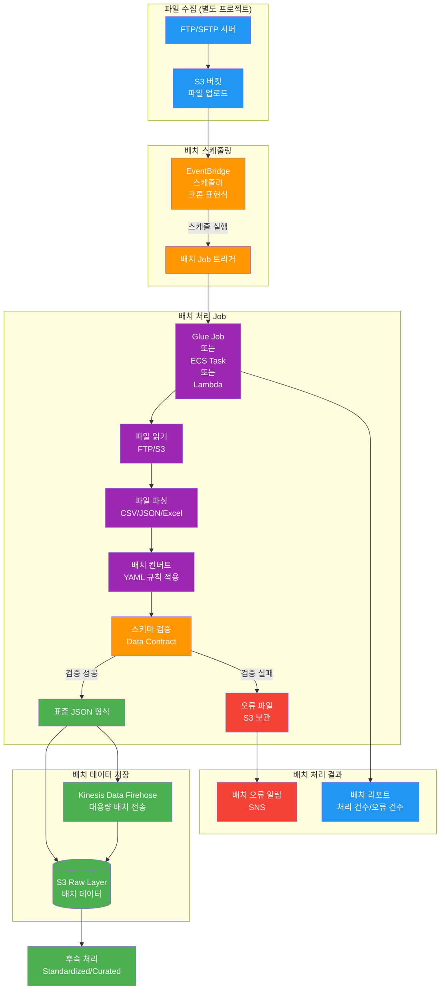

### 파일 배치 처리 특징

- **별도 프로젝트**: 실시간 데이터 수집과 분리된 별도 배치 Job으로 처리
- **스케줄링**: EventBridge 크론 표현식을 통한 주기적 실행 (일/시간 단위)
- **처리 방식**: Glue Job, ECS Task, 또는 Lambda를 통한 대용량 파일 처리
- **데이터 저장**: S3 Raw Layer에 직접 저장 또는 Kinesis Data Firehose를 통한 전송
- **오류 처리**: 검증 실패 파일은 별도 S3 경로에 보관 및 알림 발송
- **YAML 규칙**: 배치 Job에도 동일한 YAML 변환 규칙 적용 가능

---

## 2-3. 데이터 집계 및 분석 데이터 생성 프로세스

센서 데이터를 시간/일 단위로 집계하고, 고객 정보를 조인하여 계산식을 적용한 분석 데이터를 생성하는 프로세스입니다.

### 핵심 개념

#### 센서 데이터의 특성
- **센서 데이터에는 고객 정보가 없음**: 센서 데이터는 `device_id`, `productId`, `device_timestamp`, `metrics` 등만 포함
- **고객 정보는 기초 데이터에만 존재**: 기초 데이터(Aurora)에서 `device_id` → `site_id` → `customer_id` 조인 필요

#### 집계 데이터 구조 및 저장소 분리

**집계 단위별 저장소 분리 전략**:

1. **제품별 시간별/일별 집계** → **DocumentDB (Hot Layer)**
   - 집계 단위: 제품별 + 시간별(1시간, 6시간) / 일별
   - 저장소: DocumentDB (빠른 조회, 실시간 대시보드용)
   - 데이터 예시:
     ```json
     {
       "productId": "prod-a",
       "date": "2026-01-15",
       "hour": 14,
       "metrics": {
         "avgTempC": 75.2,
         "maxTempC": 82.1,
         "minTempC": 68.5,
         "count": 720
       }
     }
     ```

2. **일별 고객별 집계부터** → **Aurora PostgreSQL (Warm Layer)**
   - 집계 단위: 고객별 + 제품별 + 일별
   - 저장소: Aurora PostgreSQL (관계형 조인, 복잡한 쿼리 지원)
   - **참고**: 이 데이터는 집계된 데이터입니다. 센서 데이터에는 `customer_id`가 없으며, 집계 단계에서 기초 데이터와 조인하여 `customer_id`를 추가합니다.
   - 집계 데이터 예시:
     ```json
    {
      "customer_id": "cust-001",
       "productId": "prod-a",
       "date": "2026-01-15",
       "metrics": {
         "avgTempC": 75.2,
         "maxTempC": 82.1,
         "deviceCount": 10,
         "totalEvents": 7200
       }
     }
     ```

#### 계산식 적용 및 분석 데이터 생성

**계산식 적용 시점**: **고객별 제품별 일별 데이터부터**

- 계산식은 고객별 제품별 일별 집계 데이터에 적용
- 계산식 등록: 제품별/고객별/디바이스별로 Aurora에 저장
- 계산식 적용: Lambda Function이 집계 데이터를 읽어 계산식 평가
- 계산 결과: 분석 데이터로 저장 및 관리 화면에 표시

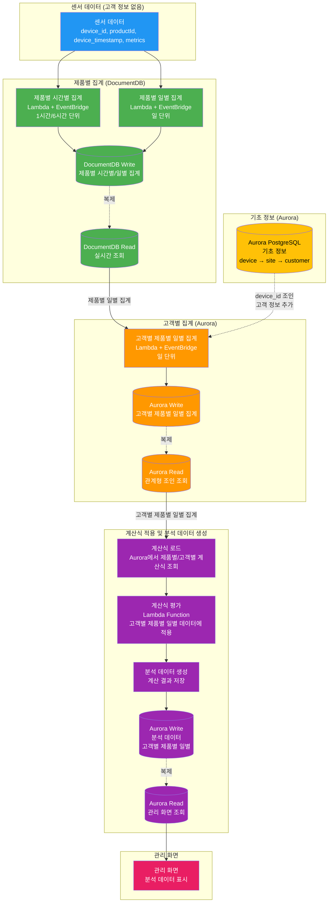

### 집계 프로세스 상세

#### 1. 제품별 시간별/일별 집계 (DocumentDB)

**트리거**: EventBridge 스케줄러 (1시간/6시간/일 단위)

**프로세스**:
1. Lambda Function이 DocumentDB에서 최근 센서 데이터 조회
2. 제품별로 그룹화하여 시간별/일별 집계 계산
   - 평균, 최대, 최소, 카운트 등
3. 집계 결과를 DocumentDB에 저장 (제품별 시간별/일별 집계 컬렉션)

**저장 데이터 구조**:
```json
{
  "_id": "prod-a_2026-01-15_14",
  "productId": "prod-a",
  "date": "2026-01-15",
  "hour": 14,
  "metrics": {
    "avgTempC": 75.2,
    "maxTempC": 82.1,
    "minTempC": 68.5,
    "avgRpm": 1620,
    "count": 720
  },
  "createdAt": "2026-01-15T14:00:00Z"
}
```

#### 2. 고객별 제품별 일별 집계 (Aurora)

**트리거**: EventBridge 스케줄러 (일 단위, 매일 자정 실행)

**프로세스**:
1. Lambda Function이 DocumentDB에서 제품별 일별 집계 조회
2. Aurora에서 기초 정보 조인 (`device_id` → `site_id` → `customer_id`)
3. 고객별 제품별로 그룹화하여 일별 집계 계산
4. 집계 결과를 Aurora에 저장

**저장 데이터 구조**:
```sql
CREATE TABLE customer_product_daily_aggregate (
  id SERIAL PRIMARY KEY,
  customer_id VARCHAR(50) NOT NULL,
  product_id VARCHAR(50) NOT NULL,
  date DATE NOT NULL,
  device_count INTEGER,
  total_events BIGINT,
  avg_temp_c DECIMAL(10,2),
  max_temp_c DECIMAL(10,2),
  min_temp_c DECIMAL(10,2),
  avg_rpm DECIMAL(10,2),
  created_at TIMESTAMP DEFAULT CURRENT_TIMESTAMP,
  UNIQUE(customer_id, product_id, date)
);
```

#### 3. 계산식 적용 및 분석 데이터 생성

**트리거**: 고객별 제품별 일별 집계 생성 후 (EventBridge 또는 Lambda 체인)

**프로세스**:
1. Lambda Function이 Aurora에서 계산식 조회 (제품별/고객별)
2. 고객별 제품별 일별 집계 데이터에 계산식 적용
3. 계산 결과를 분석 데이터로 저장 (Aurora)
4. 관리 화면에서 조회 가능

**계산식 예시**:
```yaml
formulaId: "health-score-cust-001-prod-a"
customer_id: "cust-001"
productId: "prod-a"
formula: "clamp(100 - (avg_temp_c - 60) * 2 - (max_temp_c - avg_temp_c) * 5, 0, 100)"
description: "고객 001 제품 A 건강도 점수"
```

**분석 데이터 저장 구조**:
```sql
CREATE TABLE analysis_data (
  id SERIAL PRIMARY KEY,
  customer_id VARCHAR(50) NOT NULL,
  product_id VARCHAR(50) NOT NULL,
  date DATE NOT NULL,
  formula_id VARCHAR(100) NOT NULL,
  calculated_value DECIMAL(10,2),
  raw_metrics JSONB,
  created_at TIMESTAMP DEFAULT CURRENT_TIMESTAMP,
  UNIQUE(customer_id, product_id, date, formula_id)
);
```

### 관리 화면 표시

**데이터 소스**: Aurora Read Endpoint (분석 데이터 테이블)

**표시 내용**:
- 고객별 제품별 일별 분석 데이터
- 계산식 적용 결과 (건강도 점수, 효율 지표 등)
- 트렌드 차트 (시간별 변화)
- 비교 분석 (고객별, 제품별)

---

## 3. 지능형 모니터링 및 알람 프로세스 (제품별 룰셋 적용)

제품별로 다른 알람 규칙을 적용하여 정확한 이상 감지 및 알림을 생성합니다.

### 개요

지능형 모니터링 시스템은 제품 타입별로 독립적인 알람 룰셋을 적용하여 각 제품의 특성에 맞는 모니터링을 수행합니다. **룰 기반 알람은 AI 분석 없이도 즉시 실행 가능**하며, AI 분석은 선택적으로 추가적인 알람을 제공합니다.

### 프로세스 특징

- **제품별 룰셋**: 각 제품 타입별로 독립적인 알람 규칙 정의 및 적용
- **동적 로드**: Aurora에 저장된 룰셋을 Lambda Function에서 동적으로 로드
- **4가지 룰 타입**: Threshold, Anomaly, Correlation, Predictive 룰 지원
- **AI 분석 없이 가능**: 룰 기반 알람은 AI 분석 없이도 즉시 실행 가능
- **AI 기반 개선 (선택적)**: Bedrock을 통한 False Positive 감소 및 룰셋 최적화

### 룰 엔진 타입

1. **Threshold 룰**: 임계값 기반 알람 (예: 온도 > 80도) - **AI 분석 없이 즉시 실행 가능**
2. **Anomaly 룰**: 이상 패턴 감지 (Bedrock 기반) - AI 분석 필요
3. **Correlation 룰**: 다중 데이터 소스 상관관계 분석 - **AI 분석 없이도 가능**
4. **Predictive 룰**: 예측 기반 사전 알람 (SageMaker 기반) - AI 분석 필요

### 제품별 룰셋 관리

- **룰셋 저장**: Aurora PostgreSQL에 제품별 룰셋 정의 및 저장
- **동적 로드**: Lambda Function이 제품 타입을 식별하여 해당 룰셋 로드
- **버전 관리**: 룰셋 변경 이력 관리 및 롤백 지원
- **A/B 테스트**: 새로운 룰셋을 일부 디바이스에만 적용하여 효과 검증

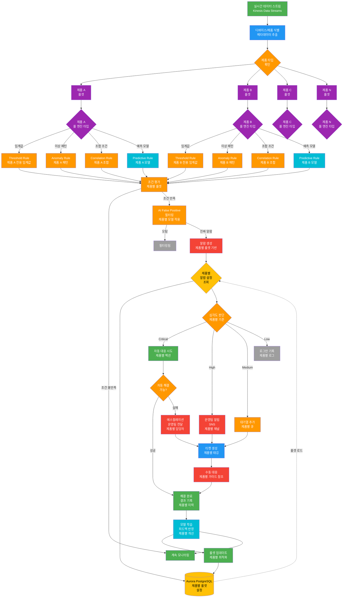

---

## 4. 원격 제어 프로세스 (Shadow 기반)

AWS IoT Device Shadow를 활용한 안전하고 신뢰할 수 있는 원격 디바이스 제어 프로세스입니다.

### 개요

IoT 디바이스의 상태를 동기화하고, 원격에서 명령을 전송하여 디바이스를 제어합니다. AWS IoT Device Shadow를 사용하여 디바이스가 오프라인 상태일 때도 명령을 보관하고, 재연결 시 자동으로 동기화합니다.

### 프로세스 특징

- **Shadow 기반 제어**: 디바이스의 desired 상태와 reported 상태를 분리하여 관리
- **오프라인 지원**: 디바이스가 오프라인일 때도 명령을 보관하고, 재연결 시 자동 동기화
- **상태 동기화**: 디바이스의 실제 상태(reported)와 원하는 상태(desired)를 자동 동기화
- **이력 관리**: 모든 제어 명령과 상태 변경을 DocumentDB에 기록하여 추적 가능

### 주요 제어 명령 예시

- **재시작**: 디바이스 재부팅 명령
- **설정 변경**: 온도 임계값, 팬 속도 등 설정 변경
- **모드 전환**: 운영 모드, 대기 모드, 점검 모드 등 전환
- **펌웨어 다운로드**: OTA 업데이트와 연동하여 펌웨어 다운로드 시작

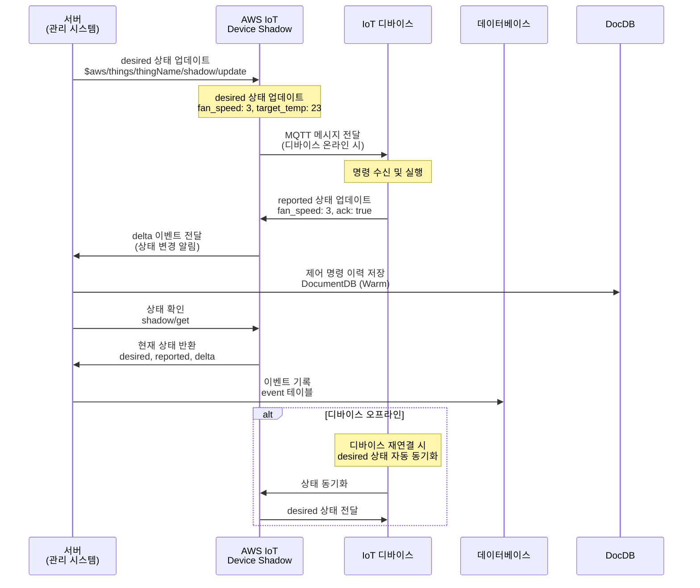

### 제어 명령 실행 예시

**시나리오**: 온도가 임계값을 초과하여 팬 속도를 증가시키는 경우

1. **알람 발생**: 룰 엔진이 온도 임계값 초과 감지
2. **자동 대응 결정**: 자동 대응 가능 여부 확인 (Shadow 제어 가능)
3. **Shadow 업데이트**: `$aws/things/{thingName}/shadow/update`로 desired 상태 업데이트
   ```json
   {
     "desired": {
       "fan_speed": 3,
       "target_temp": 23
     }
   }
   ```
4. **디바이스 동기화**: 디바이스가 MQTT 메시지를 수신하여 명령 실행
5. **상태 보고**: 디바이스가 reported 상태를 업데이트하여 실행 결과 보고
6. **검증**: 시스템이 reported 상태를 확인하여 제어 성공 여부 판단
7. **이력 기록**: 제어 명령과 결과를 DocumentDB에 기록

---

## 5. OTA (Over-The-Air) 업데이트 프로세스

무선 펌웨어 업데이트를 통한 디바이스 소프트웨어 자동 업데이트 및 관리 프로세스입니다.

### 개요

OTA(Over-The-Air) 업데이트는 디바이스에 물리적으로 접근하지 않고도 무선으로 펌웨어를 업데이트할 수 있는 기능입니다. Canary 배포 전략을 통해 점진적으로 배포하여 안전성을 확보합니다.

### 프로세스 특징

- **단계별 배포**: Test → Canary(5%) → Pilot(25%) → Production(100%)
- **롤백 지원**: 문제 발생 시 즉시 이전 버전으로 롤백
- **성공률 기준**: 각 단계별 성공률 기준을 만족해야 다음 단계로 진행
- **모니터링**: 배포 진행 상황과 디바이스 상태를 실시간 모니터링

### 배포 전략

1. **Test 환경**: 테스트 환경에서 검증 완료 후 배포 시작
2. **Canary 배포**: 전체 디바이스의 5%에만 배포하여 초기 검증
3. **Pilot 배포**: Canary 성공 후 25%로 확대 배포
4. **Production 배포**: Pilot 성공 후 전체 디바이스에 배포

### 성공률 기준

- **Canary 단계**: 성공률 95% 이상
- **Pilot 단계**: 성공률 98% 이상
- **Production 단계**: 전체 배포 후 지속 모니터링

### 롤백 조건

- 성공률이 기준 미만인 경우
- 심각한 오류가 발생한 경우
- 디바이스 재시작 실패율이 높은 경우

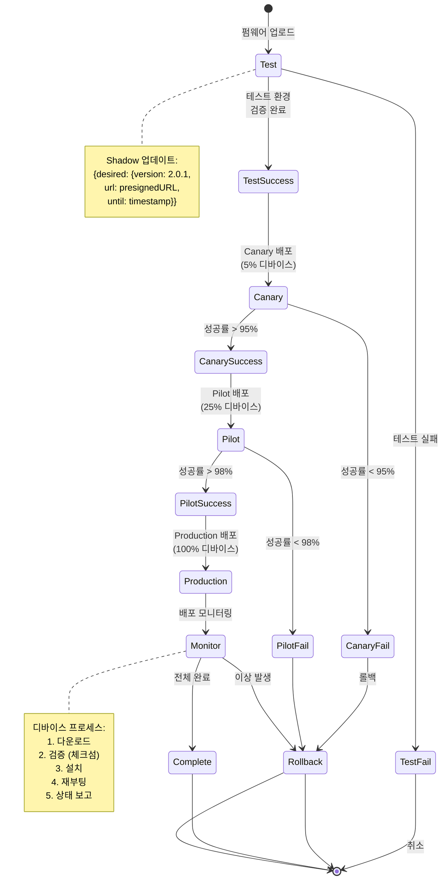

### OTA 업데이트 프로세스 상세

**디바이스 측 프로세스**:
1. **다운로드**: Shadow에서 제공된 presigned URL로 펌웨어 다운로드
2. **검증**: 체크섬을 통한 파일 무결성 검증
3. **설치**: 펌웨어 설치 및 설정 적용
4. **재부팅**: 디바이스 재시작
5. **상태 보고**: 설치 성공/실패 상태를 Shadow에 보고

**서버 측 모니터링**:
- 배포 진행률 추적
- 성공/실패 디바이스 목록 관리
- 자동 롤백 트리거
- 알림 발송 (SNS)

---

## 6. 자동 진단 및 대응 프로세스 (폐쇄 루프)

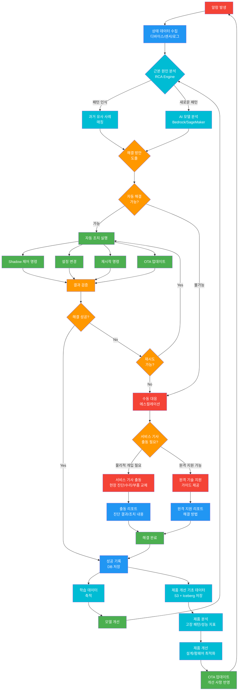

### 자동 진단 및 대응 프로세스 특징

**폐쇄 루프 시스템**: 이상 감지 → 자동 진단 → 자동 대응 → 결과 검증의 완전 자동화 사이클

#### 근본 원인 분석 (RCA)

- **Bedrock 기반 분석**: LLM을 활용한 이상 패턴 분석 및 원인 추론
- **과거 사례 매칭**: 유사한 과거 사례를 찾아 해결 방안 제안
- **AI 모델 분석**: 새로운 패턴의 경우 SageMaker 모델을 통한 분석

#### 자동 대응

- **Shadow 제어**: 원격 제어 명령 실행
- **설정 변경**: 디바이스 설정 자동 조정
- **재시작**: 디바이스 재부팅
- **OTA 업데이트**: 펌웨어 패치 배포

#### 검증 및 학습

- **결과 검증**: 자동 대응 후 상태 확인
- **성공 기록**: 성공 사례를 학습 데이터로 축적
- **모델 개선**: 축적된 데이터로 AI 모델 지속 개선

---

## 6-1. 운영 사이클: 무중단 서비스 지원 프로세스

**목표**: 데이터 수집 → 모니터링 → 알림 발생 → 제어/OTA 처리 → 기사 출동 처리 → 제품 개선을 통한 무중단 서비스 지원

```mermaid
flowchart TD
    subgraph 수집["1. 데이터 수집"]
        DataSource[IoT/센서/측정 데이터<br/>TCP·MQTT·REST]
        DataSource --> Kinesis[Kinesis Data Streams<br/>통합 수집]
        Kinesis --> Convert[컨버트 모듈<br/>YAML 기반 변환]
        Convert --> Standard[표준 JSON 형식]
    end
    
    subgraph 모니터링["2. 모니터링"]
        Standard --> Monitor[실시간 모니터링<br/>제품별 룰셋 적용]
        Monitor --> RuleEngine[룰 엔진<br/>임계값/패턴/예측]
        RuleEngine --> Eval{조건 평가}
    end
    
    subgraph 알림["3. 알림 발생"]
        Eval -->|조건 만족| Alarm[알람 생성<br/>제품별 심각도]
        Alarm --> Notify[알림 발송<br/>SNS/대시보드]
    end
    
    subgraph 제어["4. 제어/OTA 처리"]
        Notify --> AutoAction{자동 대응<br/>가능?}
        AutoAction -->|가능| Shadow[Shadow 제어<br/>원격 명령]
        AutoAction -->|가능| OTA[OTA 업데이트<br/>펌웨어 패치]
        Shadow --> Verify1[결과 검증]
        OTA --> Verify1
        Verify1 --> Success1{해결 성공?}
        Success1 -->|Yes| Resolved1[해결 완료]
        Success1 -->|No| Escalate[에스컬레이션]
    end
    
    subgraph 기사출동["5. 기사 출동 처리"]
        AutoAction -->|불가능| Dispatch{기사 출동<br/>필요?}
        Escalate --> Dispatch
        Dispatch -->|물리적 개입| FieldService[서비스 기사 출동<br/>현장 진단/수리]
        Dispatch -->|원격 지원| RemoteSupport[원격 기술 지원]
        FieldService --> FieldReport[출동 리포트]
        RemoteSupport --> RemoteReport[원격 지원 리포트]
        FieldReport --> Resolved2[해결 완료]
        RemoteReport --> Resolved2
    end
    
    subgraph 제품개선["6. 제품 개선 (기초 데이터)"]
        Resolved1 --> DataStore[해결 데이터 저장<br/>S3 + Iceberg]
        Resolved2 --> DataStore
        DataStore --> Analytics[제품 분석<br/>고장 패턴/성능 지표]
        Analytics --> Improvement[제품 개선<br/>설계/펌웨어 최적화]
        Improvement --> Deploy[개선 사항 배포<br/>OTA 업데이트]
        Deploy --> DataSource
    end
    
    style DataSource fill:#2196F3,color:#fff
    style Kinesis fill:#4CAF50,color:#fff
    style Convert fill:#9C27B0,color:#fff
    style Standard fill:#4CAF50,color:#fff
    style Monitor fill:#FF9800,color:#fff
    style RuleEngine fill:#FF9800,color:#fff
    style Eval fill:#FF9800,color:#fff
    style Alarm fill:#F44336,color:#fff
    style Notify fill:#F44336,color:#fff
    style AutoAction fill:#FF9800,color:#fff
    style Shadow fill:#4CAF50,color:#fff
    style OTA fill:#4CAF50,color:#fff
    style Verify1 fill:#FF9800,color:#fff
    style Success1 fill:#FF9800,color:#fff
    style Resolved1 fill:#4CAF50,color:#fff
    style Escalate fill:#F44336,color:#fff
    style Dispatch fill:#FF9800,color:#fff
    style FieldService fill:#F44336,color:#fff
    style RemoteSupport fill:#F44336,color:#fff
    style FieldReport fill:#2196F3,color:#fff
    style RemoteReport fill:#2196F3,color:#fff
    style Resolved2 fill:#4CAF50,color:#fff
    style DataStore fill:#00BCD4,color:#fff
    style Analytics fill:#00BCD4,color:#fff
    style Improvement fill:#00BCD4,color:#fff
    style Deploy fill:#4CAF50,color:#fff
```

### 사이클 특징

1. **데이터 수집**: 다중 프로토콜(TCP/MQTT/API)을 통한 실시간 데이터 수집 및 통합
2. **모니터링**: 제품별 룰셋 기반 실시간 모니터링 및 이상 감지
3. **알림 발생**: 제품별 심각도에 따른 알림 발송 및 대응 우선순위 결정
4. **제어/OTA 처리**: 자동 대응 가능 시 Shadow 제어 또는 OTA 업데이트로 원격 해결
5. **기사 출동 처리**: 자동 대응 불가능 시 서비스 기사 출동 또는 원격 기술 지원
6. **제품 개선**: 해결 데이터를 기초 데이터로 저장하여 제품 분석 및 개선에 활용

### 무중단 서비스 지원

- **자동 대응 우선**: Shadow 제어 및 OTA를 통한 원격 해결로 기사 출동 최소화
- **빠른 대응**: 실시간 모니터링 및 자동 알림으로 즉각 대응
- **지속적 개선**: 해결 데이터 축적을 통한 제품 개선 및 알람 룰셋 최적화
- **피드백 루프**: 제품 개선 사항이 OTA를 통해 배포되어 동일 문제 재발 방지

### 제품 개선을 위한 기초 데이터

- **해결 데이터 저장**: 모든 해결 과정(자동/수동)의 데이터를 S3 + Iceberg에 저장
- **제품 분석**: 고장 패턴, 성능 지표, 고객 피드백 등을 분석
- **개선 반영**: 분석 결과를 바탕으로 제품 설계, 펌웨어, 알람 룰셋 개선
- **순환 구조**: 개선 사항이 OTA로 배포되어 새로운 데이터 수집으로 이어지는 순환 구조

---

## 7. 통신 오류 배치 체크 프로세스

주기적으로 통신 오류를 체크하여 실시간 모니터링에서 누락된 통신 문제를 보완합니다.

### 개요

실시간 모니터링은 즉각적인 이상을 감지하지만, 통신 자체가 끊어진 경우에는 감지하지 못할 수 있습니다. 배치 체크 프로세스는 주기적으로(매 정시) 최근 시간대의 통신 데이터를 분석하여 통신 오류를 감지합니다.

### 프로세스 특징

- **주기적 실행**: EventBridge 스케줄러를 통한 매 정시 실행
- **그레이스 기간**: 일시적인 통신 지연을 고려한 10분 그레이스 기간
- **연속성 체크**: 연속 2회 이상 미수신 시에만 알람 생성
- **고객사별 집계**: 고객사/허브/디바이스별로 집계하여 정확한 오류 위치 파악

### 체크 기준

- **미수신 임계치**: 최근 60분 동안 예상 수신 횟수 대비 실제 수신 횟수 비교
- **그레이스 기간**: 10분 지연 허용 (일시적 네트워크 지연 고려)
- **연속성 기준**: 연속 2회 이상 미수신 시 High Severity 알람 생성

### 알람 및 대응

- **알람 생성**: High Severity 알람 생성
- **알림 전송**: 고객사 및 운영팀에 즉시 알림 전송
- **티켓 생성**: 자동으로 티켓 생성하여 추적
- **이벤트 로그**: 모든 체크 결과를 이벤트 로그에 기록

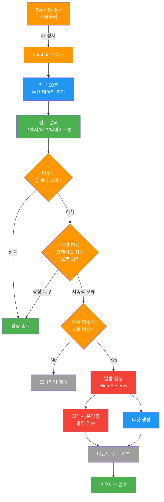

### 통신 오류 배치 체크 예시

**시나리오**: 디바이스가 5초마다 데이터를 전송해야 하는데, 최근 60분 동안 예상 수신 횟수(720회) 대비 실제 수신 횟수(600회)가 120회 부족한 경우

1. **EventBridge 스케줄러**: 매 정시에 Lambda 트리거
2. **데이터 쿼리**: 최근 60분간의 통신 데이터를 DocumentDB에서 조회
3. **집계 분석**: 고객사/허브/디바이스별로 미수신 횟수 집계
4. **임계치 체크**: 미수신 비율이 임계치(예: 10%)를 초과하는지 확인
5. **그레이스 기간**: 10분 지연을 고려하여 재확인
6. **연속성 체크**: 연속 2회 이상 미수신인지 확인
7. **알람 생성**: 조건 만족 시 High Severity 알람 생성 및 알림 전송

---

## 8. 전체 시스템 아키텍처 프로세스

전체 시스템의 계층별 구성과 데이터 흐름을 한눈에 파악할 수 있는 통합 아키텍처입니다.

### 아키텍처 계층 구조

전체 시스템 계층 구조:

1. **기존 시스템 계층**: 온프레미스 또는 하이브리드 환경의 기존 시스템
2. **VPN 터널링 계층**: AWS와 기존 시스템 간의 안전한 연결
3. **데이터 수집 계층**: IoT/센서 데이터 및 기초 정보 수집
4. **게이트웨이 계층**: 프로토콜별 게이트웨이 (ECS, IoT Core)
5. **프로토콜 어댑터 계층**: 프로토콜 변환 및 Kinesis 전송
6. **데이터 플랫폼 계층**: 데이터 변환, 분류, 저장
7. **분석 엔진 계층**: 룰 엔진, AI/ML 분석
8. **자동화 제어 계층**: Shadow 제어, OTA 업데이트
9. **모니터링 계층**: CloudWatch, SNS, 대시보드
10. **데이터 저장소 계층**: DocumentDB, Aurora (CQRS), S3+Iceberg

### 주요 데이터 흐름

- **센서 데이터 흐름**: IoT → 게이트웨이 → 어댑터 → Kinesis → 변환 → 분류 → 저장
- **기초 정보 흐름**: 기존 DB → DMS/CDC → Aurora Write → Aurora Read
- **제어 명령 흐름**: 분석 엔진 → EventBridge → Lambda → Shadow/OTA → 디바이스
- **CQRS 패턴**: 모든 저장소에서 Write/Read Endpoint 분리

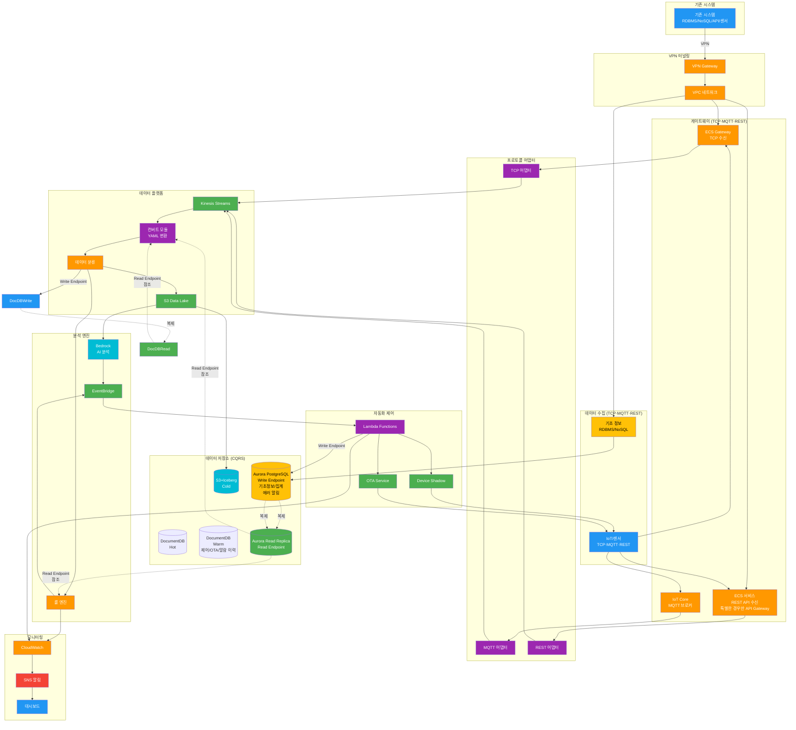

### 아키텍처 포인트

- **CQRS 패턴**: DocumentDB와 Aurora 모두 Write/Read Endpoint 분리
- **프로토콜별 처리**: TCP는 ECS, MQTT는 IoT Core, REST는 ECS(특별한 경우만 API Gateway)
- **통합 스트림**: 모든 센서 데이터가 Kinesis Data Streams로 통합
- **Lambda 중심 처리**: 센서 데이터 처리, 변환, 분류 모두 Lambda Function
- **AI/ML 통합**: Bedrock과 SageMaker를 통한 지능형 분석

---

## 9. 데이터 생명주기 관리 프로세스

데이터의 생성부터 삭제까지 전체 생명주기를 효율적으로 관리하여 비용 최적화 및 성능을 향상시킵니다.

### 개요

데이터의 접근 빈도와 중요도에 따라 적절한 저장소로 이동시켜 비용을 최적화하고 성능을 유지합니다. Hot/Warm/Cold 3계층 구조를 통해 데이터를 효율적으로 관리합니다.

### 생명주기 단계

1. **원데이터 수집**: IoT/센서/이벤트 데이터 수집
2. **Raw Layer**: 원본 데이터 보존 (S3 Standard)
3. **Standardized Layer**: 표준화된 데이터 (S3 Standard)
4. **Curated Layer**: 가공된 통합 데이터 (S3 Standard)
5. **Hot Layer**: 실시간 접근 데이터 (DocumentDB, 최근 10일 보관)
6. **Cold Layer**: 장기 보관 데이터 (S3 + Iceberg, 90일 이후)
7. **삭제**: 7년 후 데이터 삭제 또는 Iceberg 파티션 삭제

### 기초 정보 관리

- **상시 유지**: 기초 정보(업체/고객/사용자/사이트/장비)는 Aurora에 상시 유지
- **변경 이력**: 모든 변경사항을 이력으로 관리
- **참조 관계**: 다른 데이터와의 조인을 위해 항상 참조 가능

### 집계 데이터 관리

- **집계 결과**: Aurora에 3년간 보관
- **아카이브**: 3년 후 Cold Layer로 이동
- **분석 활용**: 리포트 및 대시보드에서 활용

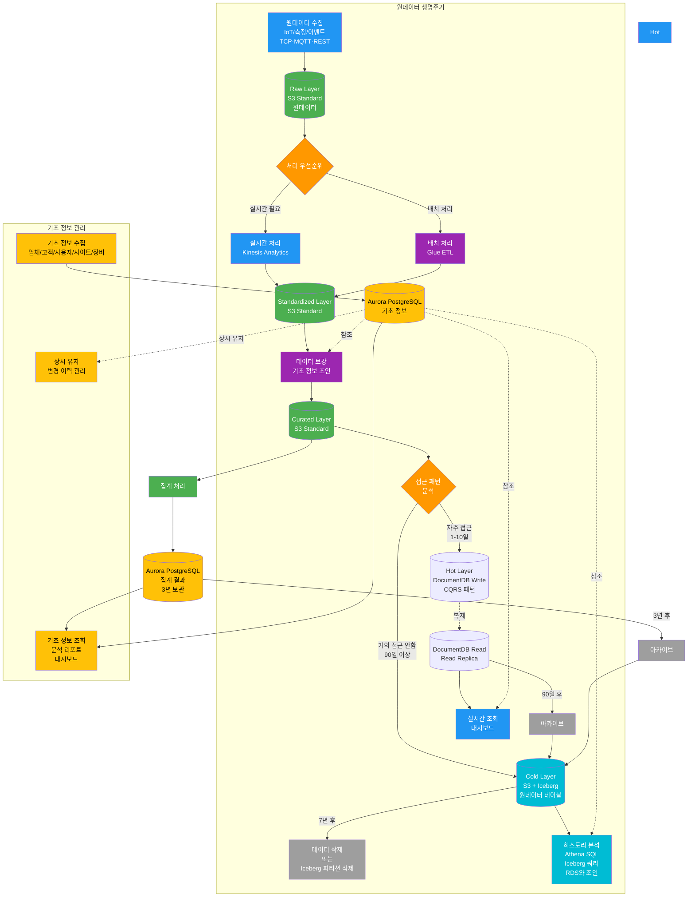

### 데이터 생명주기 관리 특징

- **자동화된 이동**: EventBridge 스케줄러와 Lambda를 통한 자동 데이터 이동
- **비용 최적화**: 접근 빈도에 따라 적절한 저장소로 이동하여 비용 절감
- **성능 유지**: 자주 접근하는 데이터는 Hot Layer에 유지하여 빠른 조회
- **규정 준수**: 장기 보관 및 삭제 정책을 워크플로우로 자동화

### 티어링 전략

- **Hot Layer (DocumentDB)**: 최근 10일 데이터 보관, 실시간 대시보드용 (10일 후 자동 Warm/Cold 이동)
- **Warm Layer (Aurora)**: 기초 정보 상시 유지, 집계 결과 3년 보관
- **Cold Layer (S3 + Iceberg)**: 90일 이후 데이터, 히스토리 분석용

---

## 10. 고객별 맞춤 서비스 프로세스

고객사별로 다른 SLA와 요구사항에 맞춘 맞춤형 서비스를 제공합니다.

### 개요

고객별 맞춤 서비스는 각 고객사의 산업 특성, 서비스 수준 협약(SLA), 선호하는 알림 채널 등을 고려하여 맞춤형 모니터링과 리포트를 제공하는 프로세스입니다.

### 주요 기능

- **SLA 관리**: 고객사별 SLA 정의 및 모니터링
- **맞춤 정책**: 임계값, 점검 일정, 알림 채널을 고객사별로 차등 설정
- **실시간 대시보드**: 고객사 전용 대시보드 제공
- **자동 리포트**: 정기적으로 SLA 준수율 리포트 생성 및 전송
- **트렌드 분석**: 과거 데이터를 분석하여 서비스 개선 제안

### 프로세스 특징

- **고객사별 차등**: 산업별, 고객사별로 다른 모니터링 정책 적용
- **SLA 준수율 추적**: 실시간으로 SLA 준수율 계산 및 표시
- **자동 알림**: SLA 위반 시 즉시 알림 전송
- **지속적 개선**: 트렌드 분석을 통한 서비스 개선 제안

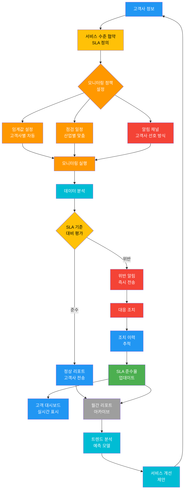

### 고객별 맞춤 서비스 예시

**시나리오**: 제조업 고객사 A와 의료기관 고객사 B에 다른 SLA와 모니터링 정책 적용

**고객사 A (제조업)**:
- SLA: 가동률 99.5% 이상
- 임계값: 온도 80도 초과 시 알람
- 점검 일정: 주 1회 정기 점검
- 알림 채널: 이메일 + SMS

**고객사 B (의료기관)**:
- SLA: 가동률 99.9% 이상
- 임계값: 온도 75도 초과 시 알람 (더 엄격)
- 점검 일정: 일 1회 정기 점검
- 알림 채널: 이메일 + 전화 + 대시보드

각 고객사별로 다른 정책이 적용되며, SLA 준수율이 실시간으로 추적되고 리포트로 제공됩니다.

---

## 주요 특징 요약

### 실시간 데이터 수집 및 통합
- **VPN 연결 (필수)**: 모든 데이터 수집은 **VPN 터널링을 통한 안전한 연결**이 필요합니다
  - **목적**: 이전 시스템과 AWS 연동을 위한 보안 통신
  - **구성**: AWS VPN Gateway (Site-to-Site VPN, IPSec 터널)
  - **네트워크**: VPC 내부 네트워크 (Private Subnet)를 통한 내부망 통신
  - **보안**: 사설 IP 통신으로 퍼블릭 노출 없이 기존 시스템과 통신
  - **연동 대상**: 기존 RDBMS, NoSQL, API 서버, 센서 시스템 등
- **다중 프로토콜 지원**: TCP, MQTT, REST API 등 다양한 프로토콜 통합 (파일은 별도 배치 처리)
  - 모든 프로토콜은 VPN 터널을 통해 안전하게 데이터를 수집
- **인프라 게이트웨이**:
  - **TCP**: ECS 서비스 필요 (TCP 포트 리스닝을 위한 Container Service)
  - **MQTT**: AWS IoT Core (관리형 MQTT 브로커)
  - **REST API**: ECS 서비스 사용 (특별한 경우만 API Gateway)
- **Kinesis 연동 방식**:
  - **TCP**: ECS 서비스 → Kinesis Producer SDK → Kinesis Data Streams (직접 전송)
  - **REST API**: ECS → Lambda (센서 데이터 처리) → Kinesis Producer SDK → Kinesis Data Streams
  - **MQTT**: IoT Core Rule Engine을 통한 자동 Kinesis 연동
- **센서 데이터 처리**: Lambda 중심 (컨버트, 분류, 변환)
- **다중 데이터 형식**: 헥사 바이너리, JSON, CSV 등 다양한 데이터 형식 지원
- **통합 스트림**: Kinesis Data Streams를 통한 모든 데이터의 단일 진입점 (원시 형식 보존)
- **컨버트 모듈 위치**: Kinesis Data Streams 뒤에서 Lambda Function으로 실행 (Kinesis Trigger)
- **YAML 기반 변환**: 제품별/디바이스별 변환 규칙을 YAML로 관리 (Lambda 패키지에 포함)
- **YAML 관리**: Git/S3에서 버전 관리, CI/CD 파이프라인을 통한 Lambda 재배포
- **DLQ 처리**: Lambda 실패 시 SQS DLQ로 전송하여 데이터 누락 방지 및 재처리
- **페이로드 변환**: YAML 로직을 통한 표준 JSON 형식 변환
- **원시 데이터 보존**: S3 Raw Layer에 원본 페이로드(헥사/CSV/JSON) 보존으로 재처리 가능

### 파일 데이터 배치 처리
- **별도 프로젝트**: 실시간 처리와 분리된 별도 배치 Job으로 처리
- **스케줄링**: EventBridge 크론 표현식을 통한 주기적 실행
- **처리 방식**: Glue Job, ECS Task, 또는 Lambda를 통한 대용량 파일 처리
- **YAML 규칙**: 배치 Job에도 동일한 YAML 변환 규칙 적용 가능

### 데이터 분류 및 관리
- **공통 요소 (주기 데이터)**: 통신 에러, 통신 품질 등 시간 단위 집계 처리 (Kinesis Analytics → Aurora)
- **제품별 관리**: 제품 타입별 스트림 파티션 분리 및 제품별 알람 룰셋 적용 (Aurora에서 동적 로드)
- **허브-차일드 디바이스 구조**: 허브 디바이스와 차일드 디바이스의 계층 구조 관리, MQTT 토픽에서 정보 추출
- **디바이스별 처리**: 디바이스별 스트림 라우팅 및 제품별 룰셋 기반 알람 처리 (Aurora PostgreSQL + SNS)
- **고객 정보 조인**: 센서 데이터에는 고객 정보가 없으므로, 집계 단계에서 `device_id` → `site_id` → `customer_id` 조인 수행

### 제품별 알람 룰셋 시스템
- **제품 타입 식별**: 디바이스 메타데이터 기반 자동 제품 타입 식별
- **룰셋 관리**: Aurora에 저장된 제품별 알람 룰셋 동적 로드
- **룰 엔진 적용**: 제품별로 다른 임계값, 패턴, 조합, 예측 모델 적용
- **자동화 대응**: 제품별 자동 대응 액션 및 알림 채널 관리
- **지속적 개선**: 제품별 피드백 기반 룰셋 최적화

### 운영 사이클: 무중단 서비스 지원
- **데이터 수집**: 다중 프로토콜(TCP/MQTT/API)을 통한 실시간 데이터 수집 및 통합
- **모니터링**: 제품별 룰셋 기반 실시간 모니터링 및 이상 감지
- **알림 발생**: 제품별 심각도에 따른 알림 발송 및 대응 우선순위 결정
- **제어/OTA 처리**: 자동 대응 가능 시 Shadow 제어 또는 OTA 업데이트로 원격 해결
- **기사 출동 처리**: 자동 대응 불가능 시 서비스 기사 출동 또는 원격 기술 지원
- **제품 개선**: 해결 데이터를 기초 데이터로 저장하여 제품 분석 및 개선에 활용
- **무중단 서비스**: 자동 대응 우선 정책으로 기사 출동 최소화 및 빠른 대응
- **피드백 루프**: 제품 개선 사항이 OTA를 통해 배포되어 동일 문제 재발 방지

---

> **참고**: 웹 애플리케이션 접속 및 이용 방법은 [README.md](./README.md)를 참고하세요. (설치·배포는 별도 운영 문서)

**최종 업데이트**: 2026년 3월
