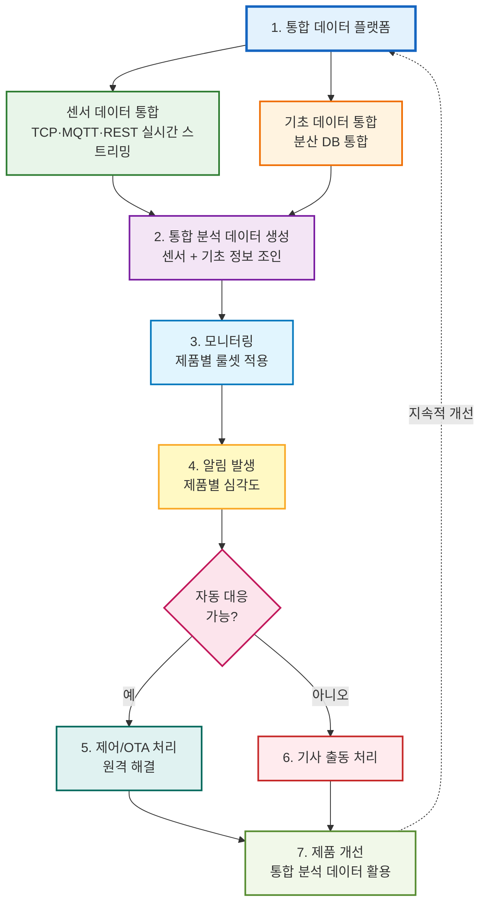

# 최종 서비스 개요

> **💼 서비스 관점 & 👥 고객 관점 문서**  
> 본 문서는 서비스 가치, 비즈니스 모델, 고객 혜택 등 **서비스 관점**과 **고객 관점**에서 작성되었습니다.  
> 기술 상세 내용은 [기술 분석 문서](./PROJECT_ANALYSIS.md)를 참고하세요.

## 📋 서비스 개요

### 서비스명
**데이터 통합 플랫폼 기반 지능형 IoT 관리 솔루션**

### 서비스 목적
분산된 IoT 데이터를 통합하고, **프로토콜/형식/저장소가 다른 데이터까지 최대한 폭넓게 통합 관리**하며, 실시간 모니터링, 원격 제어, AI 기반 분석을 통해 **무중단 서비스를 지원하는 지능형 IoT 관리 플랫폼**을 제공합니다.

#### 통합 관리 범위
- **프로토콜**: TCP, MQTT, REST API
- **형식**: Hex Binary, JSON, CSV
- **원천**: IoT 센서, 파일 배치, RDBMS, NoSQL

#### 통합 대상 데이터
- **센서/텔레메트리**: 주기/이벤트 데이터
- **제어/상태**: Shadow 명령 및 결과
- **펌웨어/OTA**: 업데이트 요청 및 상태
- **파일/이미지/로그**: 업로드 파일 및 메타데이터
- **마스터/기초정보**: 고객/사이트/디바이스
- **알람/이력**: 알람 이벤트 및 처리 이력

#### 명확한 데이터 목표 (8개)

| # | 목표 | 내용 |
|---|------|------|
| 1 | 다채널 데이터 원활한 수집 | 기초데이터와 IoT 센서 데이터를 TCP·MQTT·REST 등 여러 채널에서 끊김 없이 수집 |
| 2 | 제품별 YAML 관리를 통한 데이터 통합 | 제품·형식별 YAML 스펙으로 변환·표준화하여 단일 플랫폼에서 데이터 통합 |
| 3 | 알람 룰셋 등록에 따른 알람 자동화 | 제품별 룰셋 등록 시 룰 엔진으로 알람 자동 발생·분류·에스컬레이션 수행 |
| 4 | 알람 장비 원격제어·FoTA를 통한 정비 | Device Shadow·FoTA로 알람 장비 원격 제어 및 정비 |
| 5 | AS 기사 알림 처리 | 알람·에스컬레이션에 따른 AS 기사 알림·배차·처리 이력 관리 |
| 6 | 연구소 분석 데이터 생성 | 연구소 관점의 집계·이상탐지·RCA·예측 등 분석 데이터 생성·활용 |
| 7 | 서비스 분석데이터 및 관련 서비스 데이터 관리 | 서비스 관점 분석데이터와 고객·제품별 서비스 데이터의 저장·조회·관리 |
| 8 | 향후 AI·LLM 기반 자동화 | AI 이상탐지·예측, LLM 분석·보고 자동화, 자동 대응 룰 고도화 등으로 확장 |

#### 데이터 유형별 저장소 매핑
- **Hot (DocumentDB)**: 실시간 센서/알람, 최신 상태
- **Warm (DocumentDB)**: 제어/OTA/알람 이력
- **Warm (Aurora)**: 고객별 집계, 기초정보
- **Cold (S3+Iceberg)**: 장기 보관 및 분석

---

## 🎯 핵심 가치 제안

### 해결하는 문제
1. **데이터 분산 문제**: RDBMS/NoSQL/File/IoT 장비별로 분산되어 통합 불가
2. **운영 문제**: 알람 오탐/미탐으로 운영 혼란 및 대응 지연 (평균 복구 시간 4시간)
3. **제품 문제**: 제품/펌웨어별 성능 데이터 부족으로 불량 원인 규명 지연
4. **서비스 문제**: 원격 제어 및 무선 펌웨어 업데이트 미흡으로 월 120건 현장 출동
5. **보안/비용 문제**: 권한 관리 미비 및 불필요한 장기 DB 보관으로 연간 2억원 운영비 초과

### 제공하는 가치
- **데이터 활용도 30% → 90%+**: 통합 플랫폼을 통한 데이터 통합 및 활용
- **평균 복구 시간 4시간 → 15분**: 실시간 모니터링 및 자동 대응
- **알람 정확도 30% → 98%**: AI 기반 룰 엔진 및 오탐 감소
- **현장 출동 월 120건 → 18건**: 원격 제어 및 OTA를 통한 자동 해결 (85% 자동 해결률)
- **운영비 절감 40%**: 자동화 및 최적화된 데이터 저장 전략

---

## 🔄 핵심 운영 사이클

### 무중단 서비스 지원 프로세스

### 통합 데이터 플랫폼의 역할

**통합 데이터 플랫폼**의 역할:

1. **데이터 통합 허브**: 모든 데이터 소스를 단일 플랫폼으로 통합
   - 센서 데이터 통합: 다양한 프로토콜과 형식의 센서 데이터를 실시간으로 통합
   - 기초 데이터 통합: 분산된 기초 정보 데이터베이스를 통합하여 분석 기반 구축
2. **실시간 처리**: 센서 데이터와 기초 데이터를 실시간으로 통합 및 처리
3. **통합 분석 데이터 생성**: 두 통합이 만나 통합 분석 데이터를 생성
4. **분석 기반 제공**: 통합 분석 데이터를 기반으로 지능형 모니터링, 자동 제어, 예측 분석 등 모든 고급 기능 제공
5. **확장성**: 새로운 데이터 소스 추가 시 유연하게 확장 가능

### 사이클 특징
- **통합 데이터 플랫폼 중심**: 통합 데이터 플랫폼이 모든 기능의 기반이며, 센서 데이터와 기초 데이터의 통합이 플랫폼 내에서 이루어짐
- **플랫폼 기반 기능**: 모든 기능(모니터링, 알림, 제어, 분석)이 통합 데이터 플랫폼의 통합 분석 데이터를 기반으로 동작
- **자동 대응 우선**: Shadow 제어 및 OTA를 통한 원격 해결로 기사 출동 최소화
- **빠른 대응**: 실시간 모니터링 및 자동 알림으로 즉각 대응
- **지속적 개선**: 통합 데이터 플랫폼의 통합 분석 데이터 축적을 통한 제품 개선 및 알람 룰셋 최적화
- **피드백 루프**: 제품 개선 사항이 OTA를 통해 배포되어 동일 문제 재발 방지

---

## 🏗️ 시스템 아키텍처

### 4계층 아키텍처

1. **데이터 수집 계층**
   - **VPN 연결 (필수)**: 모든 데이터 수집은 VPN 터널링을 통한 안전한 연결 필요
     - Site-to-Site VPN (IPSec 터널)을 통한 온프레미스 시스템과 AWS 간 연결
     - VPC 내부 네트워크(Private Subnet)를 통한 사설 IP 통신으로 퍼블릭 노출 없음
   - 다중 프로토콜 지원: TCP, MQTT, REST API (모두 VPN 터널을 통해 수집)
   - Kinesis Data Streams를 통한 통합 수집

2. **데이터 플랫폼 계층**
   - 3계층 데이터 레이어: Hot (DocumentDB, CQRS 패턴), Warm (Aurora PostgreSQL, CQRS 패턴), Cold (S3 + Iceberg + Athena)
   - YAML 기반 데이터 변환 모듈
   - Data Contract 기반 품질 관리

3. **분석 엔진 계층**
   - AI/ML 기반 이상 탐지 (SageMaker, Bedrock)
   - 제품별 룰셋 엔진 (Threshold, Anomaly, Correlation, Predictive)
   - 근본 원인 분석 (RCA) 엔진

4. **자동화 제어 계층**
   - AWS IoT Device Shadow 기반 원격 제어
   - OTA (Over-The-Air) 펌웨어 업데이트
   - 자동 진단 및 대응 워크플로우

---

## 📊 주요 기능

### 1. 통합 데이터 플랫폼

서비스 목적에서 정의한 **다양한 데이터 통합 범위**를 실행하는 핵심 기능입니다. 두 가지 통합 프로세스로 구성됩니다:

#### 🔵 센서 데이터 통합 (실시간 스트리밍 통합)

다양한 프로토콜과 형식의 센서 데이터를 실시간으로 통합하여 표준화된 분석 데이터로 변환합니다.

- **VPN 연결 (필수)**: 모든 데이터 수집은 **VPN 터널링을 통한 안전한 연결**이 필요합니다
  - Site-to-Site VPN (IPSec 터널)을 통한 온프레미스 시스템과 AWS 간 연결
  - VPC 내부 네트워크(Private Subnet)를 통한 사설 IP 통신으로 퍼블릭 노출 없이 데이터 수집
- **다중 프로토콜 지원**: TCP (ECS), MQTT (IoT Core), REST API (ECS, 특별한 경우만 API Gateway)
  - 모든 프로토콜은 VPN 터널을 통해 안전하게 데이터를 수집
- **실시간 스트리밍**: Kinesis Data Streams를 통한 실시간 데이터 통합 수집
- **YAML 기반 변환**: 다양한 데이터 형식(Hex Binary, JSON, CSV)을 표준 JSON으로 변환
- **데이터 분류**: 제품별/고객별/디바이스별로 분류 및 라우팅
- **스키마 검증**: Data Contract를 통한 데이터 품질 보장
- **배치 처리**: 파일 데이터는 별도 배치 Job으로 처리

#### 🟡 기초 데이터 통합 (분산 데이터베이스 통합)

분산된 기초 정보 데이터베이스를 통합하여 센서 데이터 분석의 기반을 구축합니다.

- **분산된 RDBMS 통합**: MariaDB, MySQL, MSSQL, Oracle 등 다양한 데이터베이스 통합
- **NoSQL 통합**: MongoDB, DynamoDB 등 NoSQL 데이터베이스 통합
- **DMS (Database Migration Service)**: 분산된 RDBMS를 통합 Aurora PostgreSQL로 마이그레이션
  - **Full Load + CDC 혼합**: 초기 데이터는 Full Load, 이후 변경사항은 CDC로 동기화
  - **버퍼 처리**: 상황에 따라 CDC 변경사항을 Kinesis Data Streams로 버퍼링 후 반영
- **CDC (Change Data Capture)**: 실시간 변경 데이터 캡처 및 동기화
  - **DMS CDC**: RDBMS 변경사항을 실시간으로 Kinesis로 전송
  - **NoSQL CDC**: MongoDB Change Streams, DynamoDB Streams 등을 통한 변경사항 캡처
- **통합 Aurora**: 모든 기초 정보를 Aurora PostgreSQL로 통합 저장
  - **CQRS 패턴**: Read/Write Endpoint 분리
    - **Write Endpoint**: Primary Aurora (데이터 변경)
    - **Read Endpoint**: Read Replica (데이터 조회)
- **데이터 품질 관리**: 중복 제거, 정규화, 일관성 검증

#### 🟢 통합 분석 데이터 생성

센서 데이터와 기초 데이터를 결합하여 분석 가능한 통합 데이터를 생성합니다.

- **데이터 조인**: 통합 Aurora의 기초 정보와 센서 데이터를 조인
- **데이터 보강**: 비즈니스 룰 적용 및 컨텍스트 정보 추가
- **계층별 저장**: Hot/Warm/Cold 레이어로 분리 저장
- **분석 데이터 제공**: 실시간 대시보드, 리포트, 예측 분석 등에 활용
- **데이터 품질 관리**: 중복 제거, 정규화, 일관성 검증

#### 데이터 변환 및 표준화
- **YAML 기반 컨버트 모듈**: 다양한 데이터 형식(Hex Binary, JSON, CSV)을 표준 JSON으로 변환
  - 길이 기반 파싱
  - Key-Value 파싱 (2바이트 헥스 키)
  - 하이브리드 파싱 (세퍼레이터 + 길이)
- **7개 도메인 통합 스키마**: telemetry, event, device, site, customer, control, ota
- **Data Contract**: 스키마 검증 및 데이터 품질 보장
- **DLQ (Dead Letter Queue)**: 변환 실패 데이터 보존 및 재처리

#### 데이터 저장
- **Hot Layer**: DocumentDB (실시간 접근, MongoDB 호환 NoSQL, CQRS 패턴)
  - **Write Endpoint**: Primary DocumentDB (데이터 변경)
  - **Read Endpoint**: Read Replica (데이터 조회)
  - **보관 기간**: 최근 10일 데이터 (10일 이후 자동 Warm/Cold 이동)
  - **집계 데이터**: 제품별 시간별(1시간, 6시간) / 일별 집계
    - 센서 데이터에는 고객 정보가 없으므로 제품별 집계만 수행
- **Warm Layer (DocumentDB)**: 제어/OTA/알람 이력 (Warm 데이터, CQRS 패턴)
- **Warm Layer (Aurora)**: Aurora PostgreSQL (기초 정보 + **일별 고객별 집계** + **계산식 적용 분석 데이터** + 에러 알림 처리 서비스 정보, CQRS 패턴)
  - **Write Endpoint**: Primary Aurora (데이터 변경)
  - **Read Endpoint**: Read Replica (데이터 조회)
  - **집계 데이터**: 일별 고객별 제품별 집계
    - DocumentDB의 제품별 일별 집계 + 기초 정보(`device_id` → `customer_id`) 조인 후 집계
  - **분석 데이터**: 고객별 제품별 일별 데이터에 계산식 적용 결과
    - 관리 화면에서 조회하여 표시
- **Cold Layer**: Apache Iceberg on S3 + Athena (장기 보관 및 분석)
  - ACID 트랜잭션 지원
  - 스키마 진화 및 파티션 진화
  - 시간 여행 쿼리
  - 파티션 프루닝으로 쿼리 비용 절감

### 2. 지능형 모니터링 시스템

#### 룰 엔진
- **Threshold 룰**: 임계값 기반 알람 - **AI 분석 없이 즉시 실행 가능**
- **Anomaly 룰**: 이상 패턴 감지 - AI 분석 필요
- **Correlation 룰**: 다중 데이터 소스 상관관계 분석 - **AI 분석 없이도 가능**
- **Predictive 룰**: 예측 기반 사전 알람 - AI 분석 필요

#### 제품별 룰셋
- 제품별로 독립적인 알람 룰셋 정의 및 관리
- 고객별, 디바이스별 맞춤 룰셋 적용
- **룰 기반 알람은 AI 분석 없이도 즉시 실행 가능**
- AI 기반 False Positive 감소 (선택적)

#### 실시간 대시보드
- 실시간 데이터 시각화
- KPI 지표 모니터링
- 알람 현황 및 이력 관리 (DocumentDB, Warm)

### 3. 원격 제어 및 OTA

#### AWS IoT Device Shadow
- 디바이스 상태 동기화
- 원격 명령 전송 및 실행
- 상태 변경 이력 추적 (DocumentDB, Warm)

#### OTA 업데이트
- 무선 펌웨어 업데이트
- 버전 관리 및 롤백 지원
- 배포 전략 (Blue-Green, Canary)
- 성공률 98% 이상, 되돌리기 비율 1% 이하

### 4. AI/ML 기반 분석

#### 이상 탐지 및 예측
- **Bedrock**: LLM 기반 이상 탐지, 근본 원인 분석 (RCA)
- **SageMaker**: ML 모델 기반 예측 분석, 시계열 예측
- 예방 보수 추천
- 룰 자동 튜닝

#### 계산식 기반 분석 데이터 생성
- **계산식 등록 및 관리**: 제품별/고객별/디바이스별 계산식 등록 (Aurora 저장)
- **계산식 적용 시점**: **고객별 제품별 일별 집계 데이터부터** 계산식 적용
  - 센서 데이터에는 고객 정보가 없으므로, 고객 정보가 포함된 집계 데이터부터 계산식 적용
  - 제품별 시간별/일별 집계에는 계산식 적용하지 않음
- **계산식 적용 프로세스**:
  1. EventBridge 스케줄러가 일별 집계 완료 후 트리거
  2. Lambda Function이 Aurora에서 계산식 조회 (고객별/제품별)
  3. 고객별 제품별 일별 집계 데이터에 계산식 평가
  4. 계산 결과를 분석 데이터 테이블에 저장 (Aurora)
- **계산 결과 저장**: 분석 데이터로 저장 및 활용 (Aurora)
- **관리 화면 표시**: Aurora Read Endpoint에서 분석 데이터 조회하여 관리 화면에 표시

#### 근본 원인 분석 (RCA)
- 자동 원인 분석 엔진
- 자연어 질문 처리
- 해결책 제안
- 이력 추적

### 5. 자동 진단 및 대응

#### 폐쇄 루프 시스템
- 이상 감지 → 자동 진단 → 자동 대응 → 결과 검증
- 자동 해결률 85% 목표
- 에스컬레이션: 자동 대응 실패 시 기사 출동 또는 원격 지원

---

## 💼 비즈니스 모델

### 솔루션 제공 방식

#### 인프라 운영 방식
- **고객사 리소스**: AWS 인프라 리소스는 고객사가 직접 생성 및 관리합니다
- **솔루션 제공**: 우리는 솔루션 수준의 아키텍처 설계 및 개발 코드를 제공합니다
- **비용 구분**: 
  - **솔루션 개발 비용**: 솔루션 제공 측에서 산정 (고객사에게 청구)
  - **고객사 운영 비용**: 고객사가 별도로 계산하여 부담 (인프라 운영 비용)

#### 설치 및 배포
- Terraform 기반 인프라 코드 제공 (고객사가 실행)
- Blue-Green, Canary 배포 전략 지원
- CI/CD 파이프라인 (CodeCommit, CodeBuild, CodeDeploy)

#### 기존 시스템 연동
- VPN 터널링을 통한 안전한 연동
- Site-to-Site VPN 또는 PrivateLink
- 기존 시스템과의 데이터 동기화

#### 고객별 맞춤 서비스
- 고객사별 SLA 관리
- 맞춤형 리포트 생성
- 제품별 성능 분석 및 개선 제안

#### 고객사 서비스 개발 및 커스터마이징
- **표준 솔루션 제공**: 기본 솔루션을 고객사에 제공하며, **최선은 고객사 커스터마이징 없이 프로젝트를 수행**하는 것입니다
- **커스터마이징 옵션**: 고객사 요청에 따른 커스터마이징이 필요한 경우, **2개월 이내로 프로젝트를 진행**합니다
  - 해당 프로그램(표준 솔루션) + 고객사 요청에 따른 커스터마이징
  - 커스터마이징 범위 및 일정은 프로젝트 초기에 협의하여 결정

---

## 📈 예상 성과 지표

### 운영 개선
- **알람 정확도**: 30% → 98% (+68%p)
- **자동 해결률**: 20% → 85% (+65%p)
- **평균 복구 시간**: 4시간 → 15분 (-75%)
- **현장 출동**: 월 120건 → 18건 (-85%)

### 비용 절감 (고객사 운영 비용)
> **참고**: 아래 비용 절감 효과는 고객사가 실제로 운영할 때 발생하는 **고객사 운영 비용**에 대한 것입니다. 솔루션 개발 비용은 별도로 산정됩니다.

- **운영비 절감**: 40% (자동화 및 최적화를 통한 효과)
- **스토리지 비용**: 80% 절감 (Iceberg + Athena 최적화)
- **데이터 품질 실패율**: 50% 감소

### 품질 개선
- **제품 품질**: 40% 개선
- **고객 만족도**: 25% 향상
- **OTA 성공률**: 98% 이상

---

## 🚀 구현 로드맵

> **참고**: 상세한 로드맵은 [DESIGN_GUIDE.md](./DESIGN_GUIDE.md)를 참고하세요. 중복을 줄이기 위해 여기서는 요약만 제공합니다.

### 6단계 구현 계획 (총 8개월)

**0단계: 설계 및 목표설정 (병렬 진행, 1-2개월 중 수행)**
- 프로젝트 요구사항 분석 및 정리
- 목표 설정 및 성공 기준 정의
- 시스템 아키텍처 설계
- 데이터 모델 설계
- 기술 스택 검토 및 개발 계획 수립
- 고객사 요구사항 정리 및 커스터마이징 범위 결정

**1단계: 데이터 수집 및 통합 (2개월)**
- VPN 연결 설정 (Site-to-Site VPN)
- 다중 프로토콜 통합 (TCP/MQTT/REST API)
- 데이터 표준화 및 변환 시스템
- Data Contract 기반 품질 검증

**2단계: 데이터 저장 및 집계 자동화 (2개월)**
- CQRS 패턴 적용 (DocumentDB, Aurora)
- Hot/Warm/Cold 레이어 구축
- 제품별/고객별 집계 자동화
- 계산식 적용 자동화

**3단계: 알람 처리 (2개월)**
- 룰 기반 알람 시스템 구축
- 알람/에스컬레이션 처리
- 이력 관리

**4단계: 자동화 확장 및 프론트엔드 (병렬 진행, 1-7개월 중 수행)**
- Shadow 기반 원격 제어
- OTA 파이프라인 구축
- 프론트엔드 개발 (병렬)

**배포 시스템 구축 (병렬 진행, 7-8개월 중 수행)**
- Terraform 배포 시스템
- Lambda 시스템 배포
- 백엔드/프론트엔드 배포
- CI/CD 파이프라인

**5단계: 서비스 검수 및 보완 (1개월)**
- AWS 시스템 모니터링 구축
- 스트레스 테스트 및 성능 검증
- 보안 검수 및 보완 작업

> **참고**: AI/ML 분석(Bedrock, SageMaker)은 **별도 개발 프로젝트**로 진행되며, 본 프로젝트 개발 기간(8개월)에는 포함되지 않습니다.

---

## 🛠️ 기술 스택

### 데이터 수집 및 스트리밍
- **Kinesis Data Streams**: 실시간 데이터 수집
- **IoT Core**: MQTT 브로커
- **ECS**: TCP 연결 수신 및 REST API 수집 (특별한 경우만 API Gateway)
- **Lambda**: 센서 데이터 처리 (컨버트, 분류, 변환)

### 기초 정보 통합
- **DMS (Database Migration Service)**: 분산된 RDBMS 통합 마이그레이션
  - 지원 데이터베이스: MariaDB, MySQL, MSSQL, Oracle, PostgreSQL, MongoDB
  - Full Load + CDC 혼합 방식 (초기 적재 + 변경 동기화)
  - 상황에 따라 Kinesis Data Streams로 CDC 변경사항 버퍼 처리
- **CDC (Change Data Capture)**: 실시간 변경사항 동기화
  - DMS CDC: RDBMS 트랜잭션 로그 기반 실시간 캡처 → Kinesis 버퍼 처리 가능
  - MongoDB Change Streams: NoSQL 변경사항 스트리밍
  - DynamoDB Streams: DynamoDB 변경사항 캡처
- **통합 Aurora PostgreSQL**: 모든 기초 정보를 통합 저장

### 데이터 처리
- **Lambda**: 서버리스 데이터 변환 및 처리 (Node.js 20.x, ESM 모듈)
- **EventBridge**: 이벤트 기반 스케줄링
- **Step Functions**: 워크플로우 오케스트레이션

### 데이터 저장
- **S3**: 원본 데이터 및 Iceberg 테이블 저장
- **Apache Iceberg**: 테이블 형식 (ACID, 스키마 진화, 시간 여행)
- **Amazon Athena**: SQL 쿼리 엔진
- **DocumentDB (Warm)**: 제어/OTA/알람 이력
- **Aurora PostgreSQL**: 기초 정보, 일별 고객별 집계, 계산식 적용 분석 데이터, 에러 알림 처리 서비스 정보
  - **CQRS 패턴**: Write(Primary) / Read(Replica) 분리
- **DocumentDB**: Hot 데이터 실시간 접근 (MongoDB 호환 NoSQL, CQRS 패턴)
  - **Write Endpoint**: Primary DocumentDB (데이터 변경)
  - **Read Endpoint**: Read Replica (데이터 조회)

### 모니터링 및 알람
- **EventBridge**: 이벤트 라우팅
- **SNS**: 알림 발송
- **CloudWatch**: 로그 및 메트릭 수집

### 제어 및 IoT
- **IoT Core**: 디바이스 관리 및 Shadow
- **IoT Device Shadow**: 디바이스 상태 동기화 및 원격 제어

### AI/ML 분석
- **Bedrock**: LLM 기반 분석 (이상 탐지, 근본 원인 분석 (RCA))
- **SageMaker**: ML 모델 기반 예측 분석, 시계열 예측

### 인프라 및 보안
- **VPC**: 격리된 네트워크 환경
- **VPN Gateway**: Site-to-Site VPN
- **PrivateLink**: 프라이빗 연결
- **Cognito**: 사용자 인증 및 권한 관리
- **IAM**: 역할 및 정책
- **Secrets Manager**: 데이터베이스 연결 정보 등 시크릿 관리
- **Terraform**: 인프라 코드화

### 분석 및 시각화
- **QuickSight**: 비즈니스 인텔리전스
- **Athena**: SQL 쿼리 및 분석

### CI/CD
- **CodeCommit**: 소스 코드 관리
- **CodeBuild**: 빌드 자동화
- **CodeDeploy**: 배포 자동화

---

## 🎯 핵심 차별화 포인트

1. **통합 플랫폼**: 분산된 데이터를 단일 플랫폼으로 통합
2. **제품별 룰셋**: 제품별로 독립적인 알람 규칙 관리
3. **자동화 우선**: 자동 대응을 통한 기사 출동 최소화
4. **지속적 개선**: 해결 데이터를 기초 데이터로 활용하여 제품 개선
5. **비용 효율**: Iceberg + Athena를 통한 스토리지 및 쿼리 비용 최적화
6. **SaaS 형태**: 빠른 설치 및 배포, 기존 시스템과의 원활한 연동

---

## 📝 서비스 범위

### 포함 사항

이 서비스의 주요 기능:

1. **데이터 통합 플랫폼 구축**
   - 센서 데이터 통합 (다중 프로토콜 지원)
   - 기초 데이터 통합 (DMS/CDC)
   - 통합 분석 데이터 생성

2. **실시간 모니터링 시스템**
   - 제품별 룰셋 기반 모니터링
   - 실시간 대시보드
   - 알람 관리 및 이력 추적

3. **원격 제어 및 OTA 시스템**
   - AWS IoT Device Shadow 기반 원격 제어
   - 무선 펌웨어 업데이트 (OTA)
   - 롤백 및 버전 관리

4. **AI/ML 기반 분석 엔진**
   - Bedrock: 이상 탐지, 근본 원인 분석 (RCA)
   - SageMaker: 예측 분석, 시계열 예측
   - 계산식 기반 분석 데이터 생성

5. **자동 진단 및 대응 시스템**
   - 폐쇄 루프 자동화
   - 자동 대응 워크플로우
   - 결과 검증 및 학습

6. **고객별 맞춤 서비스 대시보드**
   - SLA 관리 및 모니터링
   - 맞춤형 리포트 생성
   - 고객사별 대시보드 커스터마이징

### 확장 가능 영역

향후 추가 가능한 기능들:

- **예측 정비 서비스**: AI 기반 예방 정비 추천
- **제품 품질 개선 서비스**: 제품 성능 데이터 분석 및 개선 제안
- **AI 운영 도우미**: 자연어 기반 운영 질의응답 시스템
- **고객 만족 서비스 대시보드**: 고객 만족도 지표 및 피드백 관리

---

## 💡 핵심 성공 요인

1. **데이터 통합**: 분산된 데이터를 단일 플랫폼으로 통합하여 데이터 활용도 극대화
2. **자동화**: 자동 대응을 통한 운영 효율성 향상 및 비용 절감
3. **지능형 분석**: AI/ML을 통한 예측 및 근본 원인 분석으로 사전 대응
4. **지속적 개선**: 해결 데이터 축적을 통한 제품 개선 및 서비스 품질 향상
5. **무중단 서비스**: 실시간 모니터링 및 자동 대응을 통한 서비스 가용성 확보

---

**버전**: 1.0.0  
**작성일**: 2026년 3월  
**최종 업데이트**: 2026년 3월
