# 프로세스 플로우 다이어그램

전체 시스템 프로세스를 Mermaid 다이어그램으로 정리한 문서입니다.

## 문서 구조 및 프로젝트 구성

이 프로젝트는 **설계 문서**, **Next.js 웹 애플리케이션**으로 구성되어 있습니다.

### 프로젝트 구성

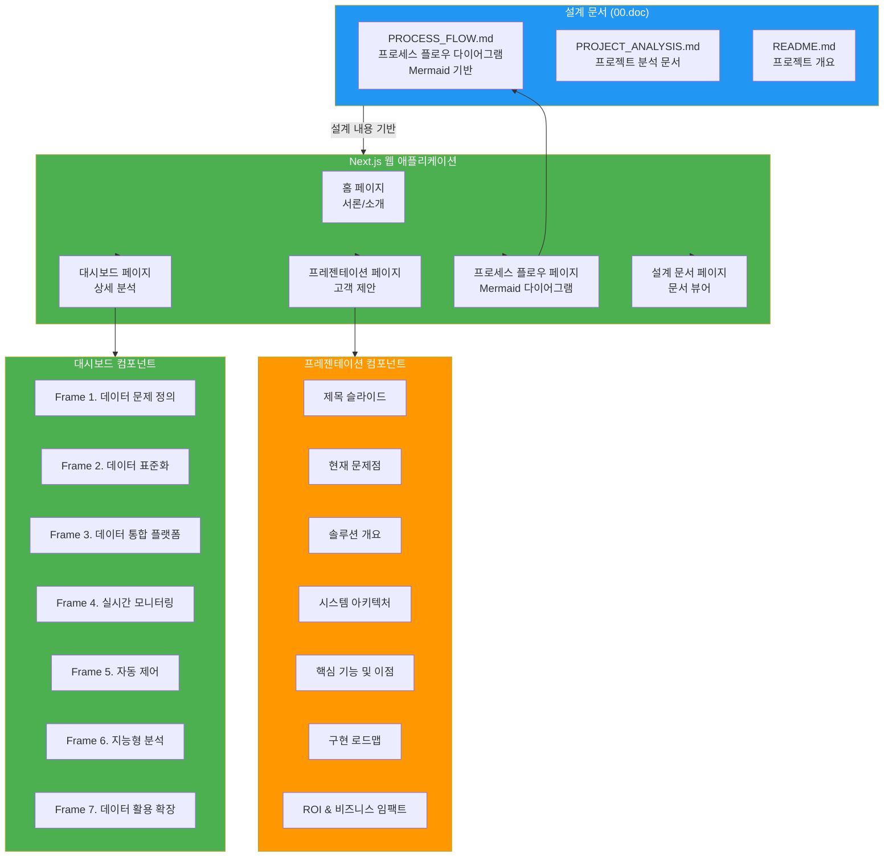
```mermaid
flowchart TD
    subgraph 설계["설계 문서 (00.doc)"]
        ProcessFlow[PROCESS_FLOW.md<br/>프로세스 플로우 다이어그램<br/>Mermaid 기반]
        ProjectAnalysis[PROJECT_ANALYSIS.md<br/>프로젝트 분석 문서]
        README[README.md<br/>프로젝트 개요]
    end
    
    subgraph NextJS["Next.js 웹 애플리케이션"]
        HomePage[홈 페이지<br/>서론/소개]
        DashboardPage[대시보드 페이지<br/>상세 분석]
        PresentationPage[프레젠테이션 페이지<br/>고객 제안]
        ProcessFlowPage[프로세스 플로우 페이지<br/>Mermaid 다이어그램]
        DocsPage[설계 문서 페이지<br/>문서 뷰어]
    end
    
    subgraph 대시보드["대시보드 컴포넌트"]
        ProblemFrame[Frame 1. 데이터 문제 정의]
        SchemaFrame[Frame 2. 데이터 표준화]
        IntegrationFrame[Frame 3. 데이터 통합 플랫폼]
        MonitoringFrame[Frame 4. 실시간 모니터링]
        ControlFrame[Frame 5. 자동 제어]
        AnalysisFrame[Frame 6. 지능형 분석]
        FutureFrame[Frame 7. 데이터 활용 확장]
    end
    
    subgraph 프레젠테이션["프레젠테이션 컴포넌트"]
        TitleSlide[제목 슬라이드]
        ProblemSlide[현재 문제점]
        SolutionSlide[솔루션 개요]
        ArchitectureSlide[시스템 아키텍처]
        BenefitsSlide[핵심 기능 및 이점]
        RoadmapSlide[구현 로드맵]
        ROISlide[ROI & 비즈니스 임팩트]
    end
    
    설계 -->|설계 내용 기반| NextJS
    NextJS --> DashboardPage
    NextJS --> PresentationPage
    NextJS --> ProcessFlowPage
    NextJS --> DocsPage
    
    DashboardPage --> 대시보드
    PresentationPage --> 프레젠테이션
    ProcessFlowPage --> ProcessFlow
    
    style 설계 fill:#2196F3,color:#fff
    style NextJS fill:#4CAF50,color:#fff
    style 대시보드 fill:#4CAF50,color:#fff
    style 프레젠테이션 fill:#FF9800,color:#fff
```

### 문서 및 애플리케이션 역할

#### 1. 설계 문서 (00.doc/)
- **PROCESS_FLOW.md**: 전체 시스템 프로세스를 Mermaid 다이어그램으로 정리
  - 데이터 수집부터 제품 개선까지 전체 프로세스
  - 설치/배포 프로세스
  - 기존 시스템 연동 프로세스
  - 구축 필요 리소스 정리
- **PROJECT_ANALYSIS.md**: 프로젝트 상세 분석 및 기술 스택
- **README.md**: 프로젝트 개요 및 빠른 시작 가이드

#### 2. 대시보드 웹 애플리케이션 (DashboardApp)
- **목적**: 상세 분석 및 기술 검토용
- **구성**: 7개 Frame으로 구성된 상세 대시보드
  - Frame 1: 데이터 문제 정의
  - Frame 2: 데이터 표준화
  - Frame 3: 데이터 통합 플랫폼
  - Frame 4: 실시간 데이터 모니터링
  - Frame 5: 데이터 기반 자동 제어
  - Frame 6: 지능형 데이터 분석
  - Frame 7: 데이터 활용 확장
- **대상**: 기술팀, 아키텍트, 개발팀

#### 3. 프레젠테이션 웹 애플리케이션 (PresentationApp)
- **목적**: 고객 제안 및 비즈니스 검토용
- **구성**: 7개 슬라이드로 구성된 프레젠테이션
  - 제목: 데이터 통합 플랫폼 기반 지능형 IoT 관리 솔루션
  - 현재 문제점: 데이터 분산 문제, 느린 장애 대응 등
  - 솔루션 개요: 통합 플랫폼 및 자동화
  - 시스템 아키텍처: 전체 아키텍처 개요
  - 핵심 기능 및 이점: 주요 기능과 기대 효과
  - 구현 로드맵: 6단계 구현 계획
  - ROI & 비즈니스 임팩트: 투자 대비 효과
- **대상**: 고객사, 경영진, 의사결정자

---

## 주요 기술 스택

- **Cold 데이터 저장소**: Apache Iceberg 테이블 형식으로 S3에 저장
- **쿼리 엔진**: Amazon Athena를 사용하여 Iceberg 테이블 SQL 쿼리
- **장점**: ACID 트랜잭션, 스키마 진화, 파티션 진화, 시간 여행 쿼리, 파티션 프루닝으로 쿼리 비용 절감

---

## 1. 전체 로드맵 프로세스 (6단계)

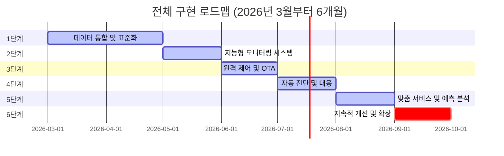
```mermaid
gantt
    title 전체 구현 로드맵 (2026년 3월부터 6개월)
    dateFormat YYYY-MM
    section 1단계
    데이터 통합 및 표준화    :active, step1, 2026-03, 2M
    section 2단계
    지능형 모니터링 시스템    :active, step2, after step1, 1M
    section 3단계
    원격 제어 및 OTA        :active, step3, after step2, 1M
    section 4단계
    자동 진단 및 대응       :active, step4, after step3, 1M
    section 5단계
    맞춤 서비스 및 예측 분석 :active, step5, after step4, 1M
    section 6단계
    지속적 개선 및 확장     :crit, step6, after step5, 1M
```

---

## 2. 데이터 통합 플랫폼 프로세스 (전체 개요)

**목적**: 전체 데이터 통합 플랫폼의 데이터 흐름과 라이프사이클 개요

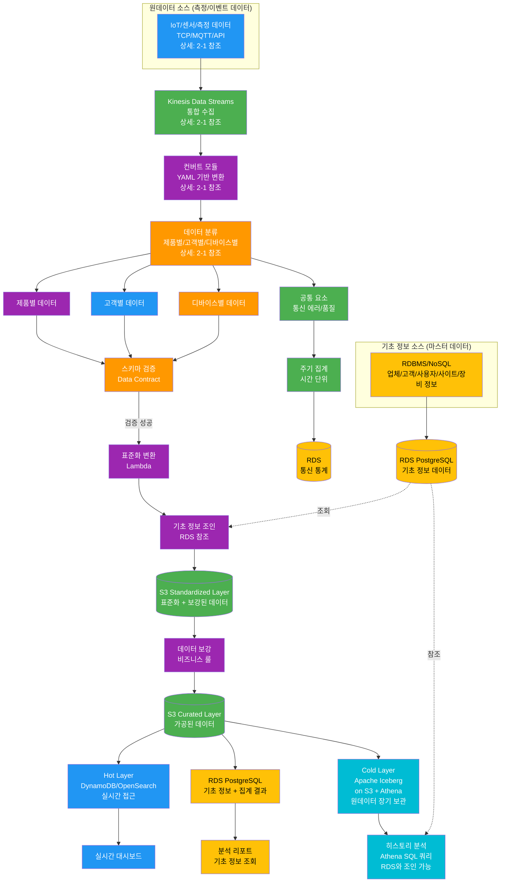
```mermaid
flowchart TD
    subgraph 원데이터소스["원데이터 소스 (측정/이벤트 데이터)"]
        Source[IoT/센서/측정 데이터<br/>TCP/MQTT/API<br/>상세: 2-1 참조]
    end
    
    subgraph 기초정보소스["기초 정보 소스 (마스터 데이터)"]
        Master[RDBMS/NoSQL<br/>업체/고객/사용자/사이트/장비 정보]
    end
    
    Source --> Collect[Kinesis Data Streams<br/>통합 수집<br/>상세: 2-1 참조]
    Collect --> Convert[컨버트 모듈<br/>YAML 기반 변환<br/>상세: 2-1 참조]
    Convert --> Classify[데이터 분류<br/>제품별/고객별/디바이스별<br/>상세: 2-1 참조]
    
    Master --> RDS[(RDS PostgreSQL<br/>기초 정보 데이터)]
    
    Classify --> Common[공통 요소<br/>통신 에러/품질]
    Classify --> Product[제품별 데이터]
    Classify --> Customer[고객별 데이터]
    Classify --> Device[디바이스별 데이터]
    
    Common --> Periodic[주기 집계<br/>시간 단위]
    Periodic --> CommonDB[(RDS<br/>통신 통계)]
    
    Product --> Validate[스키마 검증<br/>Data Contract]
    Customer --> Validate
    Device --> Validate
    
    Validate -->|검증 성공| Transform[표준화 변환<br/>Lambda]
    Transform --> Join[기초 정보 조인<br/>RDS 참조]
    RDS -.->|조회| Join
    
    Join --> Standardized[(S3 Standardized Layer<br/>표준화 + 보강된 데이터)]
    Standardized --> Enrich[데이터 보강<br/>비즈니스 룰]
    Enrich --> Curated[(S3 Curated Layer<br/>가공된 데이터)]
    
    Curated --> Hot[Hot Layer<br/>DynamoDB/OpenSearch<br/>실시간 접근]
    Curated --> Warm[RDS PostgreSQL<br/>기초 정보 + 집계 결과]
    Curated --> Cold[Cold Layer<br/>Apache Iceberg<br/>on S3 + Athena<br/>원데이터 장기 보관]
    
    Hot --> Consumer1[실시간 대시보드]
    Warm --> Consumer2[분석 리포트<br/>기초 정보 조회]
    Cold --> Consumer3[히스토리 분석<br/>Athena SQL 쿼리<br/>RDS와 조인 가능]
    RDS -.->|참조| Consumer3
    
    style Source fill:#2196F3,color:#fff
    style Master fill:#FFC107,color:#000
    style Collect fill:#4CAF50,color:#fff
    style Convert fill:#9C27B0,color:#fff
    style Classify fill:#FF9800,color:#fff
    style Common fill:#4CAF50,color:#fff
    style Product fill:#9C27B0,color:#fff
    style Customer fill:#2196F3,color:#fff
    style Device fill:#FF9800,color:#fff
    style Periodic fill:#4CAF50,color:#fff
    style CommonDB fill:#FFC107,color:#000
    style Validate fill:#FF9800,color:#fff
    style Transform fill:#9C27B0,color:#fff
    style Join fill:#9C27B0,color:#fff
    style Standardized fill:#4CAF50,color:#fff
    style Enrich fill:#9C27B0,color:#fff
    style Curated fill:#4CAF50,color:#fff
    style Hot fill:#2196F3,color:#fff
    style Warm fill:#FFC107,color:#000
    style Cold fill:#00BCD4,color:#fff
    style RDS fill:#FFC107,color:#000
    style Consumer1 fill:#2196F3,color:#fff
    style Consumer2 fill:#FFC107,color:#000
    style Consumer3 fill:#00BCD4,color:#fff
```

---

## 2-1. 실시간 데이터 수집 및 다중 프로토콜 통합 프로세스

**목적**: 실시간 데이터 수집의 상세 프로세스 (프로토콜별 처리, YAML 변환, 데이터 분류 및 라우팅)

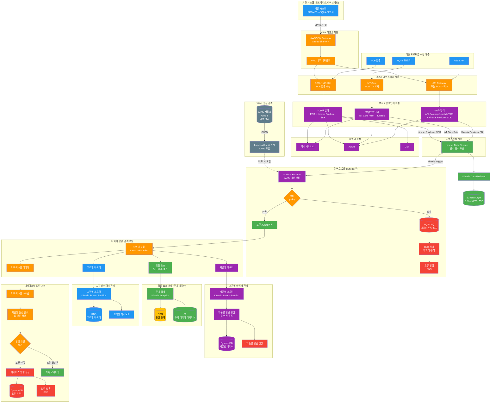
```mermaid
flowchart TD
    subgraph 기존시스템["기존 시스템 (온프레미스/하이브리드)"]
        LegacySystem[기존 시스템<br/>RDBMS/NoSQL/API/센서]
    end
    
    subgraph VPN터널링["VPN 터널링 계층"]
        VPNGateway[AWS VPN Gateway<br/>Site-to-Site VPN]
        VPCNetwork[VPC 내부 네트워크]
    end
    
    subgraph 다중프로토콜["다중 프로토콜 수집 계층"]
        TCP[TCP 연결]
        MQTT[MQTT 브로커]
        API[REST API]
    end
    
    subgraph 인프라게이트웨이["인프라 게이트웨이 계층"]
        TCPGateway[ECS 게이트웨이<br/>TCP 연결 수신]
        APIGateway[API Gateway<br/>또는 ECS 서비스]
        MQTTGateway[IoT Core<br/>MQTT 브로커]
    end
    
    LegacySystem -->|VPN 터널링| VPNGateway
    VPNGateway --> VPCNetwork
    VPCNetwork --> TCPGateway
    VPCNetwork --> APIGateway
    
    TCP --> TCPGateway
    MQTT --> MQTTGateway
    API --> APIGateway
    
    subgraph 프로토콜어댑터["프로토콜 어댑터 계층"]
        TCPAdapter[TCP 어댑터<br/>ECS + Kinesis Producer SDK]
        MQTTAdapter[MQTT 어댑터<br/>IoT Core Rule → Kinesis]
        APIAdapter[API 어댑터<br/>API Gateway/Lambda/ECS<br/>+ Kinesis Producer SDK]
    end
    
    subgraph 데이터형식["데이터 형식"]
        HexBinary[헥사 바이너리]
        JSONFormat[JSON]
        CSVFormat[CSV]
    end
    
    TCPGateway --> TCPAdapter
    APIGateway --> APIAdapter
    MQTTGateway --> MQTTAdapter
    
    TCPAdapter --> HexBinary
    TCPAdapter --> JSONFormat
    TCPAdapter --> CSVFormat
    MQTTAdapter --> HexBinary
    MQTTAdapter --> JSONFormat
    APIAdapter --> JSONFormat
    
    subgraph 통합스트림["통합 스트림 계층"]
        KinesisStream[Kinesis Data Streams<br/>원시 형식 보존]
    end
    
    TCPAdapter -->|Kinesis Producer SDK| KinesisStream
    MQTTAdapter -->|IoT Core Rule| KinesisStream
    APIAdapter -->|Kinesis Producer SDK| KinesisStream
    
    KinesisStream --> Firehose[Kinesis Data Firehose]
    Firehose --> RawS3[(S3 Raw Layer<br/>원시 페이로드 보존)]
    
    subgraph 컨버트모듈["컨버트 모듈 (Kinesis 뒤)"]
        ConvertLambda[Lambda Function<br/>YAML 기반 변환]
        ConvertLambda --> ConvertSuccess{변환<br/>성공?}
        ConvertSuccess -->|성공| StandardJSON[표준 JSON 형식]
        ConvertSuccess -->|실패| DLQ[(SQS DLQ<br/>데이터 누락 방지)]
        DLQ --> DLQProcess[DLQ 처리<br/>재처리/분석]
        DLQProcess --> Alert[오류 알림<br/>SNS]
    end
    
    subgraph YAML관리["YAML 설정 관리"]
        YAMLRepo[(YAML 저장소<br/>Git/S3<br/>버전 관리)]
        YAMLDeploy[Lambda 배포 패키지<br/>YAML 포함]
    end
    
    YAMLRepo -->|CI/CD| YAMLDeploy
    YAMLDeploy -.->|배포 시 포함| ConvertLambda
    KinesisStream -->|Kinesis Trigger| ConvertLambda
    
    StandardJSON --> Classify[데이터 분류<br/>Lambda Function]
    
    subgraph 데이터분류["데이터 분류 및 라우팅"]
        Classify --> Common[공통 요소<br/>통신 에러/품질]
        Classify --> Product[제품별 데이터]
        Classify --> Customer[고객별 데이터]
        Classify --> Device[디바이스별 데이터]
    end
    
    subgraph 공통요소처리["공통 요소 처리 (주기 데이터)"]
        Common --> Periodic[주기 집계<br/>Kinesis Analytics]
        Periodic --> CommonDB[(RDS<br/>통신 통계)]
        Periodic --> CommonArchive[(S3<br/>주기 데이터 아카이브)]
    end
    
    subgraph 제품별관리["제품별 데이터 관리"]
        Product --> ProductStream[제품별 스트림<br/>Kinesis Stream Partition]
        ProductStream --> ProductRule[제품별 알람 룰셋<br/>룰 엔진 적용]
        ProductRule --> ProductDB[(DynamoDB<br/>제품별 데이터)]
        ProductRule --> ProductAlarm[제품별 알람 생성]
    end
    
    subgraph 고객별관리["고객별 데이터 관리"]
        Customer --> CustomerStream[고객별 스트림<br/>Kinesis Stream Partition]
        CustomerStream --> CustomerDB[(RDS<br/>고객별 데이터)]
        CustomerStream --> CustomerDashboard[고객별 대시보드]
    end
    
    subgraph 디바이스알람["디바이스별 알람 처리"]
        Device --> DeviceStream[디바이스별 스트림]
        DeviceStream --> DeviceRule[제품별 알람 룰셋<br/>룰 엔진 적용]
        DeviceRule --> AlarmEval{알람 조건<br/>평가}
        AlarmEval -->|조건 만족| DeviceAlarm[디바이스 알람 생성]
        AlarmEval -->|조건 불만족| Continue[계속 모니터링]
        DeviceAlarm --> AlarmDB[(DynamoDB<br/>알람 이력)]
        DeviceAlarm --> Notification[알림 발송<br/>SNS]
    end
    
    style LegacySystem fill:#2196F3,color:#fff
    style VPNGateway fill:#FF9800,color:#fff
    style VPCNetwork fill:#FF9800,color:#fff
    style TCP fill:#2196F3,color:#fff
    style MQTT fill:#2196F3,color:#fff
    style API fill:#2196F3,color:#fff
    style TCPGateway fill:#FF9800,color:#fff
    style APIGateway fill:#FF9800,color:#fff
    style MQTTGateway fill:#FF9800,color:#fff
    style TCPAdapter fill:#9C27B0,color:#fff
    style MQTTAdapter fill:#9C27B0,color:#fff
    style APIAdapter fill:#9C27B0,color:#fff
    style HexBinary fill:#9C27B0,color:#fff
    style JSONFormat fill:#9C27B0,color:#fff
    style CSVFormat fill:#9C27B0,color:#fff
    style KinesisStream fill:#4CAF50,color:#fff
    style Firehose fill:#4CAF50,color:#fff
    style RawS3 fill:#4CAF50,color:#fff
    style ConvertLambda fill:#9C27B0,color:#fff
    style ConvertSuccess fill:#FF9800,color:#fff
    style StandardJSON fill:#4CAF50,color:#fff
    style DLQ fill:#F44336,color:#fff
    style DLQProcess fill:#F44336,color:#fff
    style Alert fill:#F44336,color:#fff
    style YAMLRepo fill:#607D8B,color:#fff
    style YAMLDeploy fill:#607D8B,color:#fff
    style Classify fill:#FF9800,color:#fff
    style Common fill:#4CAF50,color:#fff
    style Product fill:#9C27B0,color:#fff
    style Customer fill:#2196F3,color:#fff
    style Device fill:#FF9800,color:#fff
    style Periodic fill:#4CAF50,color:#fff
    style CommonDB fill:#FFC107,color:#000
    style CommonArchive fill:#4CAF50,color:#fff
    style ProductStream fill:#9C27B0,color:#fff
    style ProductRule fill:#9C27B0,color:#fff
    style ProductDB fill:#9C27B0,color:#fff
    style ProductAlarm fill:#F44336,color:#fff
    style CustomerStream fill:#2196F3,color:#fff
    style CustomerDB fill:#2196F3,color:#fff
    style CustomerDashboard fill:#2196F3,color:#fff
    style DeviceStream fill:#FF9800,color:#fff
    style DeviceRule fill:#FF9800,color:#fff
    style AlarmEval fill:#FF9800,color:#fff
    style DeviceAlarm fill:#F44336,color:#fff
    style Continue fill:#4CAF50,color:#fff
    style AlarmDB fill:#F44336,color:#fff
    style Notification fill:#F44336,color:#fff
```

### 인프라 게이트웨이 및 프로토콜별 처리 특성

#### TCP 프로토콜
- **인프라 구성**: ECS 게이트웨이 (Container Service) 필요
- **특징**: 바이너리 또는 텍스트 기반 프로토콜, 지속 연결
- **데이터 형식**: 헥사 바이너리, JSON, CSV 등 다양한 형식 지원
- **처리 흐름**:
  1. TCP 연결 → ECS 게이트웨이 (TCP 포트 리스닝)
  2. ECS 게이트웨이 → ECS 서비스 (TCP 어댑터)
  3. ECS 서비스 → Kinesis Producer SDK → Kinesis Data Streams
  4. Kinesis → Lambda 컨버트 모듈 → YAML 로직 적용 → JSON 표준 형식
- **ECS 구성**: Fargate 또는 EC2 기반, 로드 밸런서(NLB) 연동, Auto Scaling

#### MQTT 프로토콜
- **인프라 구성**: AWS IoT Core (관리형 MQTT 브로커)
- **특징**: Pub/Sub 메시징, 토픽 기반 라우팅
- **데이터 형식**: 헥사 바이너리, JSON 등
- **처리 흐름**:
  1. MQTT 클라이언트 → AWS IoT Core (MQTT 브로커)
  2. IoT Core Rule → Kinesis Data Streams (직접 연동)
  3. Kinesis → Lambda 컨버트 모듈 → YAML 로직 적용 → JSON 표준 형식
- **IoT Core 기능**: Device Gateway, Rule Engine, 보안 인증

#### REST API 프로토콜
- **인프라 구성**: API Gateway 또는 ECS 서비스 필요
- **옵션 1 (API Gateway)**: 
  - API Gateway → Lambda → Kinesis Producer SDK → Kinesis Data Streams
  - 특징: 서버리스, 자동 스케일링, API 버전 관리
- **옵션 2 (ECS 서비스)**:
  - API Gateway 또는 ALB → ECS 서비스 → Kinesis Producer SDK → Kinesis Data Streams
  - 특징: 컨테이너 기반, 세밀한 제어, 높은 성능
- **데이터 형식**: 주로 JSON 형식
- **처리 흐름**:
  1. HTTP 요청 → API Gateway/ECS
  2. API Gateway/ECS → Lambda/ECS 서비스
  3. Lambda/ECS → Kinesis Producer SDK → Kinesis Data Streams
  4. Kinesis → Lambda 컨버트 모듈 → YAML 로직 적용 → 표준 JSON 형식

### 데이터 형식 변환 (YAML 기반 컨버트 모듈)

**위치**: Kinesis Data Streams 뒤 (Kinesis Trigger로 Lambda 실행)

**처리 순서**:
1. 프로토콜 어댑터 → 원시 데이터 형식 (헥사/JSON/CSV) → Kinesis Data Streams
2. Kinesis Data Streams → Lambda Trigger → 컨버트 모듈 (Lambda Function)
3. 컨버트 모듈 → YAML 규칙 적용 → 표준 JSON 형식
4. 변환 실패 시 → SQS DLQ → 재처리/분석

#### 지원 데이터 형식
1. **헥사 바이너리 (Hex Binary)**
   - 특징: 바이너리 데이터의 16진수 표현
   - 예시: `0x01A2B3C4D5E6F7`
   - 변환: YAML 규칙 기반 바이트 파싱 및 필드 추출
   - **파싱 방식**:
     - **길이 기반 파싱 (Length-based)**: 고정된 바이트 길이로 필드를 분리
       - 예: offset 0부터 2바이트 = 첫 번째 필드, offset 2부터 1바이트 = 두 번째 필드
     - **Key-Value 파싱**: 키-값 쌍 형태로 데이터가 구성된 경우
       - 예: `0x4B65794156616C` (KeyA=Val 형태의 구조)
     - **하이브리드 파싱 (Separator + Length)**: 특정 세퍼레이터(키값)를 기준으로 구간을 분리하고, 각 구간 내에서 길이 기반으로 여러 키값 파싱
       - 예: 세퍼레이터 `0xAA`를 기준으로 구간 분리 → 각 구간에서 길이 기반 파싱으로 여러 필드 추출

2. **JSON 형식**
   - 특징: 구조화된 데이터 형식
   - 예시: `{"temperature": 25.5, "humidity": 60}`
   - 변환: YAML 규칙 기반 필드 매핑 및 스키마 변환

3. **CSV 형식**
   - 특징: 쉼표로 구분된 텍스트 데이터
   - 예시: `timestamp,temperature,humidity\n2026-03-01 10:00:00,25.5,60`
   - 변환: YAML 규칙 기반 컬럼 매핑 및 타입 변환

#### YAML 컨버트 모듈 구조

**YAML 관리 방식**:
- **버전 관리 저장소**: Git 또는 S3에 YAML 설정 파일 저장 및 버전 관리 (별도 관리)
- **배포 방식**: Lambda 배포 시 YAML 파일을 Lambda 패키지(ZIP)에 포함하여 함께 배포
- **관리 프로세스**: 
  1. YAML 변경 시 Git/S3 저장소에 업데이트
  2. CI/CD 파이프라인에서 Lambda 패키지에 YAML 포함
  3. Lambda 재배포 (YAML 변경 시 전체 Lambda 재배포)
- **제품별 규칙**: 제품 타입별로 다른 변환 규칙 적용
- **디바이스별 규칙**: 디바이스 모델별 세부 변환 규칙
- **변환 실행**: Lambda 내 YAML 로직 엔진을 통한 자동 변환 수행

**DLQ (Dead Letter Queue) 처리**:
- **목적**: 데이터 누락 방지 및 오류 데이터 보존
- **구현**: Lambda 실패 시 SQS Dead Letter Queue로 자동 전송
- **Lambda DLQ 설정**: Lambda Function의 Dead Letter Queue 설정을 통해 자동 전송
- **처리**: DLQ Lambda/ECS를 통한 재처리, 오류 분석, 수동 처리
- **알림**: DLQ 메시지 발생 시 SNS를 통한 즉시 알림
- **데이터 보존**: DLQ에 저장된 데이터를 통한 재처리 및 분석 가능

#### YAML 변환 규칙 예시

**1. 길이 기반 파싱 (Length-based Parsing)**
```yaml
# 제품 A - 헥사 바이너리 변환 규칙 (길이 기반)
product_type: "product_a"
format: "hex_binary"
parsing_type: "length_based"
conversion:
  - field: "temperature"
    offset: 0
    length: 2
    type: "int16"
    scale: 0.1
    unit: "celsius"
  - field: "humidity"
    offset: 2
    length: 1
    type: "uint8"
    unit: "percent"
  output_schema:
    tenant: "${device.tenant}"
    device_id: "${device.id}"
    timestamp: "${ingest_time}"
    metrics: "${converted_fields}"
```

**2. Key-Value 파싱 (Key-Value Parsing)**
```yaml
# 제품 B - 헥사 바이너리 변환 규칙 (Key-Value 형태)
product_type: "product_b"
format: "hex_binary"
parsing_type: "key_value"
conversion:
  - key: "0x0001"  # 키 값 (2바이트)
    field: "temperature"
    value_length: 2
    type: "int16"
    scale: 0.1
    unit: "celsius"
  - key: "0x0002"  # 키 값 (2바이트)
    field: "humidity"
    value_length: 1
    type: "uint8"
    unit: "percent"
  output_schema:
    tenant: "${device.tenant}"
    device_id: "${device.id}"
    timestamp: "${ingest_time}"
    metrics: "${converted_fields}"
```

**3. 하이브리드 파싱 (Separator + Length-based Parsing)**
```yaml
# 제품 C - 헥사 바이너리 변환 규칙 (세퍼레이터 + 길이 기반)
product_type: "product_c"
format: "hex_binary"
parsing_type: "hybrid"
separator: "0xAA"  # 세퍼레이터 (1바이트)
sections:
  - section_id: 1
    conversion:
      - field: "temperature"
        offset: 0
        length: 2
        type: "int16"
        scale: 0.1
        unit: "celsius"
      - field: "humidity"
        offset: 2
        length: 1
        type: "uint8"
        unit: "percent"
  - section_id: 2
    conversion:
      - field: "pressure"
        offset: 0
        length: 4
        type: "int32"
        scale: 0.01
        unit: "hPa"
  output_schema:
    tenant: "${device.tenant}"
    device_id: "${device.id}"
    timestamp: "${ingest_time}"
    metrics: "${all_sections_merged}"
```

**파싱 방식별 특징**:
- **길이 기반 파싱**: 고정 길이 구조에 적합, 파싱 속도 빠름, 스키마 변경 시 YAML 업데이트 필요
- **Key-Value 파싱**: 유연한 구조, 순서 독립적, 키 검색 오버헤드 존재
- **하이브리드 파싱**: 복합 구조 처리 가능, 세퍼레이터로 구간 분리 후 각 구간별로 길이 기반 파싱, 복잡한 프로토콜 지원

**4. CSV 변환 규칙 예시**
```yaml
# 제품 D - CSV 변환 규칙
product_type: "product_d"
format: "csv"
conversion:
  delimiter: ","
  header: true
  mapping:
    - source: "temp"
      target: "temperature"
      type: "float"
      unit: "celsius"
    - source: "hum"
      target: "humidity"
      type: "float"
      unit: "percent"
  output_schema:
    tenant: "${device.tenant}"
    device_id: "${device.id}"
    timestamp: "${timestamp}"
    metrics: "${mapped_fields}"
```

### 데이터 분류 기준

#### 공통 요소 (주기 데이터)
- 통신 에러 통계: 연결 실패, 타임아웃, 패킷 손실 등
- 통신 품질 지표: 지연 시간, 처리량, 가용성 등
- 처리 방식: 시간 단위 집계 (1분, 5분, 1시간)
- 저장소: RDS (통계), S3 (아카이브)

#### 제품별 데이터 관리
- 제품 타입별로 Kinesis Stream 파티션 분리
- 제품별 알람 룰셋 정의 및 적용
- 제품별 데이터베이스 분리 또는 태깅

#### 고객별 데이터 관리
- 고객 ID 기반 Kinesis Stream 파티션 분리
- 고객별 데이터 격리 및 권한 관리
- 고객별 맞춤 대시보드 제공

#### 디바이스별 알람 처리
- 디바이스 ID 기반 스트림 라우팅
- 제품 타입에 따라 해당 제품의 알람 룰셋 적용
- 알람 이력 관리 및 알림 발송

---

## 2-2. 파일 데이터 배치 처리 프로세스 (별도 Job)

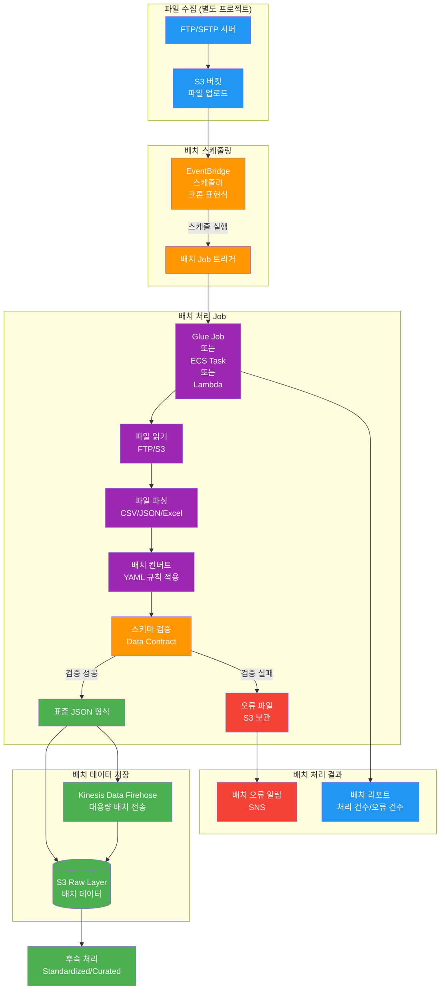
```mermaid
flowchart TD
    subgraph 파일수집["파일 수집 (별도 프로젝트)"]
        FTP[FTP/SFTP 서버]
        S3File[S3 버킷<br/>파일 업로드]
    end
    
    subgraph 배치스케줄링["배치 스케줄링"]
        Schedule[EventBridge<br/>스케줄러<br/>크론 표현식]
        Trigger[배치 Job 트리거]
    end
    
    subgraph 배치처리["배치 처리 Job"]
        BatchJob[Glue Job<br/>또는<br/>ECS Task<br/>또는<br/>Lambda]
        
        BatchJob --> FileRead[파일 읽기<br/>FTP/S3]
        FileRead --> FileParse[파일 파싱<br/>CSV/JSON/Excel]
        FileParse --> BatchConvert[배치 컨버트<br/>YAML 규칙 적용]
        BatchConvert --> BatchValidate[스키마 검증<br/>Data Contract]
        BatchValidate -->|검증 성공| BatchJSON[표준 JSON 형식]
        BatchValidate -->|검증 실패| BatchError[오류 파일<br/>S3 보관]
    end
    
    subgraph 배치저장["배치 데이터 저장"]
        BatchJSON --> BatchS3[(S3 Raw Layer<br/>배치 데이터)]
        BatchJSON --> BatchKinesis[Kinesis Data Firehose<br/>대용량 배치 전송]
        BatchKinesis --> BatchS3
    end
    
    subgraph 배치알림["배치 처리 결과"]
        BatchError --> BatchAlert[배치 오류 알림<br/>SNS]
        BatchJob --> BatchReport[배치 리포트<br/>처리 건수/오류 건수]
    end
    
    FTP --> S3File
    S3File --> Schedule
    Schedule -->|스케줄 실행| Trigger
    Trigger --> BatchJob
    
    BatchS3 --> Process[후속 처리<br/>Standardized/Curated]
    
    style FTP fill:#2196F3,color:#fff
    style S3File fill:#2196F3,color:#fff
    style Schedule fill:#FF9800,color:#fff
    style Trigger fill:#FF9800,color:#fff
    style BatchJob fill:#9C27B0,color:#fff
    style FileRead fill:#9C27B0,color:#fff
    style FileParse fill:#9C27B0,color:#fff
    style BatchConvert fill:#9C27B0,color:#fff
    style BatchValidate fill:#FF9800,color:#fff
    style BatchJSON fill:#4CAF50,color:#fff
    style BatchError fill:#F44336,color:#fff
    style BatchS3 fill:#4CAF50,color:#fff
    style BatchKinesis fill:#4CAF50,color:#fff
    style BatchAlert fill:#F44336,color:#fff
    style BatchReport fill:#2196F3,color:#fff
    style Process fill:#4CAF50,color:#fff
```

### 파일 배치 처리 특징

- **별도 프로젝트**: 실시간 데이터 수집과 분리된 별도 배치 Job으로 처리
- **스케줄링**: EventBridge 크론 표현식을 통한 주기적 실행 (일/시간 단위)
- **처리 방식**: Glue Job, ECS Task, 또는 Lambda를 통한 대용량 파일 처리
- **데이터 저장**: S3 Raw Layer에 직접 저장 또는 Kinesis Data Firehose를 통한 전송
- **오류 처리**: 검증 실패 파일은 별도 S3 경로에 보관 및 알림 발송
- **YAML 규칙**: 배치 Job에도 동일한 YAML 변환 규칙 적용 가능

---

## 3. 지능형 모니터링 및 알람 프로세스 (제품별 룰셋 적용)

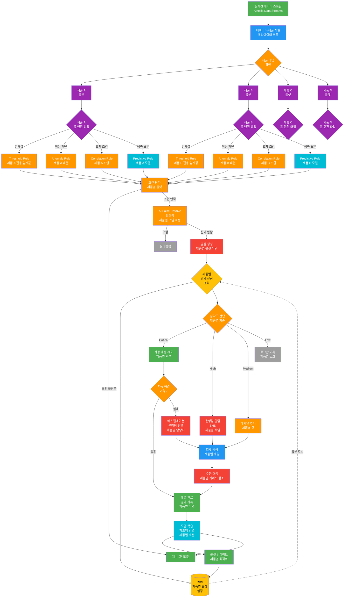
```mermaid
flowchart TD
    Data[실시간 데이터 스트림<br/>Kinesis Data Streams] --> Identify[디바이스/제품 식별<br/>메타데이터 추출]
    
    Identify --> ProductType{제품 타입<br/>확인}
    
    ProductType --> Product1[제품 A<br/>룰셋]
    ProductType --> Product2[제품 B<br/>룰셋]
    ProductType --> Product3[제품 C<br/>룰셋]
    ProductType --> ProductN[제품 N<br/>룰셋]
    
    Product1 --> Rules1{제품 A<br/>룰 엔진 타입}
    Product2 --> Rules2{제품 B<br/>룰 엔진 타입}
    Product3 --> Rules3{제품 C<br/>룰 엔진 타입}
    ProductN --> RulesN{제품 N<br/>룰 엔진 타입}
    
    Rules1 -->|임계값| Threshold1[Threshold Rule<br/>제품 A 전용 임계값]
    Rules1 -->|이상 패턴| Anomaly1[Anomaly Rule<br/>제품 A 패턴]
    Rules1 -->|조합 조건| Correlation1[Correlation Rule<br/>제품 A 조합]
    Rules1 -->|예측 모델| Predictive1[Predictive Rule<br/>제품 A 모델]
    
    Rules2 -->|임계값| Threshold2[Threshold Rule<br/>제품 B 전용 임계값]
    Rules2 -->|이상 패턴| Anomaly2[Anomaly Rule<br/>제품 B 패턴]
    Rules2 -->|조합 조건| Correlation2[Correlation Rule<br/>제품 B 조합]
    Rules2 -->|예측 모델| Predictive2[Predictive Rule<br/>제품 B 모델]
    
    Threshold1 --> Evaluate[조건 평가<br/>제품별 룰셋]
    Anomaly1 --> Evaluate
    Correlation1 --> Evaluate
    Predictive1 --> Evaluate
    
    Threshold2 --> Evaluate
    Anomaly2 --> Evaluate
    Correlation2 --> Evaluate
    Predictive2 --> Evaluate
    
    Evaluate -->|조건 불만족| Continue[계속 모니터링]
    Evaluate -->|조건 만족| Filter[AI False Positive<br/>필터링<br/>제품별 모델 적용]
    
    Filter -->|오탐| FilterOut[필터링됨]
    Filter -->|진짜 알람| CreateAlarm[알람 생성<br/>제품별 룰셋 기반]
    
    CreateAlarm --> RuleConfig{제품별<br/>알람 설정<br/>조회}
    RuleConfig --> RDSRules[(RDS<br/>제품별 룰셋<br/>설정)]
    RDSRules -.->|룰셋 로드| RuleConfig
    
    RuleConfig --> Priority{심각도 판단<br/>제품별 기준}
    
    Priority -->|Critical| AutoAction[자동 대응 시도<br/>제품별 액션]
    Priority -->|High| Notify[운영팀 알림<br/>SNS<br/>제품별 채널]
    Priority -->|Medium| Queue[대기열 추가<br/>제품별 큐]
    Priority -->|Low| Log[로그만 기록<br/>제품별 로그]
    
    AutoAction --> Result{자동 해결<br/>가능?}
    Result -->|성공| Resolved[해결 완료<br/>결과 기록<br/>제품별 이력]
    Result -->|실패| Escalate[에스컬레이션<br/>운영팀 전달<br/>제품별 담당자]
    
    Notify --> Ticket[티켓 생성<br/>제품별 태깅]
    Escalate --> Ticket
    Queue --> Ticket
    
    Ticket --> ManualAction[수동 대응<br/>제품별 가이드 참조]
    ManualAction --> Resolved
    
    Resolved --> Learn[모델 학습<br/>피드백 반영<br/>제품별 개선]
    Learn --> RuleUpdate[룰셋 업데이트<br/>제품별 최적화]
    RuleUpdate --> RDSRules
    Learn --> Continue
    
    style Data fill:#4CAF50,color:#fff
    style Identify fill:#2196F3,color:#fff
    style ProductType fill:#FF9800,color:#fff
    style Product1 fill:#9C27B0,color:#fff
    style Product2 fill:#9C27B0,color:#fff
    style Product3 fill:#9C27B0,color:#fff
    style ProductN fill:#9C27B0,color:#fff
    style Rules1 fill:#9C27B0,color:#fff
    style Rules2 fill:#9C27B0,color:#fff
    style Rules3 fill:#9C27B0,color:#fff
    style RulesN fill:#9C27B0,color:#fff
    style Threshold1 fill:#FF9800,color:#fff
    style Threshold2 fill:#FF9800,color:#fff
    style Anomaly1 fill:#FF9800,color:#fff
    style Anomaly2 fill:#FF9800,color:#fff
    style Correlation1 fill:#FF9800,color:#fff
    style Correlation2 fill:#FF9800,color:#fff
    style Predictive1 fill:#00BCD4,color:#fff
    style Predictive2 fill:#00BCD4,color:#fff
    style Evaluate fill:#FF9800,color:#fff
    style Continue fill:#4CAF50,color:#fff
    style Filter fill:#FF9800,color:#fff
    style FilterOut fill:#9E9E9E,color:#fff
    style CreateAlarm fill:#F44336,color:#fff
    style RuleConfig fill:#FFC107,color:#000
    style RDSRules fill:#FFC107,color:#000
    style Priority fill:#FF9800,color:#fff
    style AutoAction fill:#4CAF50,color:#fff
    style Notify fill:#F44336,color:#fff
    style Queue fill:#FF9800,color:#fff
    style Log fill:#9E9E9E,color:#fff
    style Result fill:#FF9800,color:#fff
    style Resolved fill:#4CAF50,color:#fff
    style Escalate fill:#F44336,color:#fff
    style Ticket fill:#2196F3,color:#fff
    style ManualAction fill:#F44336,color:#fff
    style Learn fill:#00BCD4,color:#fff
    style RuleUpdate fill:#4CAF50,color:#fff
```

---

## 4. 원격 제어 프로세스 (Shadow 기반)

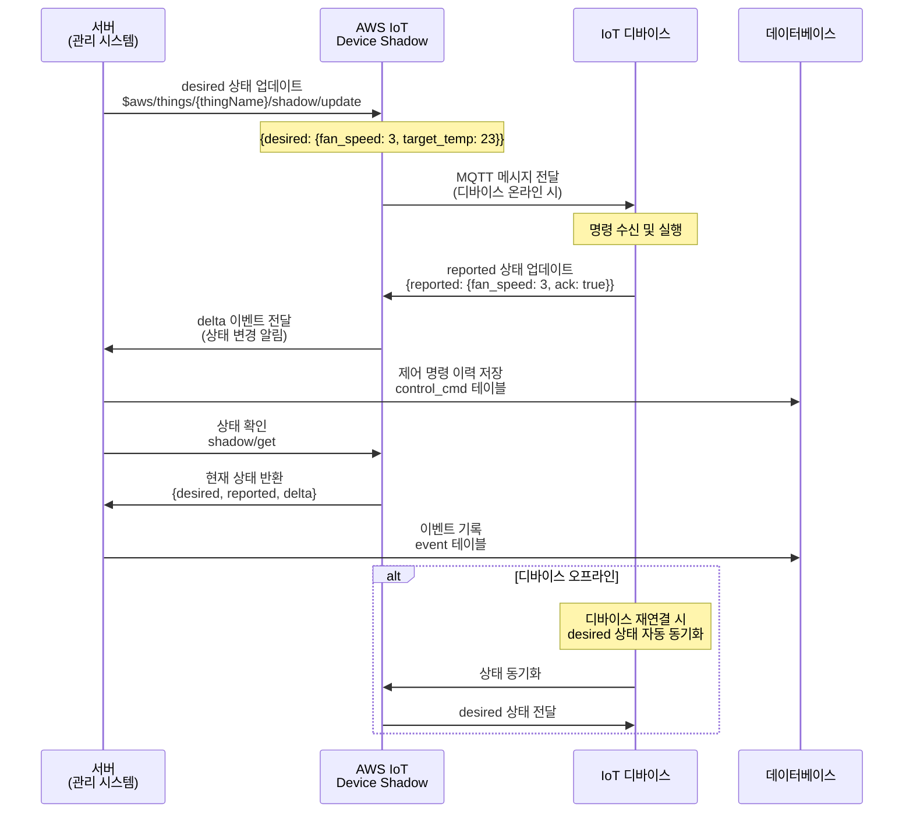
```mermaid
sequenceDiagram
    participant Server as 서버<br/>(관리 시스템)
    participant Shadow as AWS IoT<br/>Device Shadow
    participant Device as IoT 디바이스
    participant DB as 데이터베이스
    
    Server->>Shadow: desired 상태 업데이트<br/>$aws/things/{thingName}/shadow/update
    Note over Shadow: {desired: {fan_speed: 3, target_temp: 23}}
    
    Shadow->>Device: MQTT 메시지 전달<br/>(디바이스 온라인 시)
    Note over Device: 명령 수신 및 실행
    
    Device->>Shadow: reported 상태 업데이트<br/>{reported: {fan_speed: 3, ack: true}}
    
    Shadow->>Server: delta 이벤트 전달<br/>(상태 변경 알림)
    
    Server->>DB: 제어 명령 이력 저장<br/>control_cmd 테이블
    
    Server->>Shadow: 상태 확인<br/>shadow/get
    
    Shadow->>Server: 현재 상태 반환<br/>{desired, reported, delta}
    
    Server->>DB: 이벤트 기록<br/>event 테이블
    
    alt 디바이스 오프라인
        Note over Device: 디바이스 재연결 시<br/>desired 상태 자동 동기화
        Device->>Shadow: 상태 동기화
        Shadow->>Device: desired 상태 전달
    end
```

---

## 5. OTA (Over-The-Air) 업데이트 프로세스

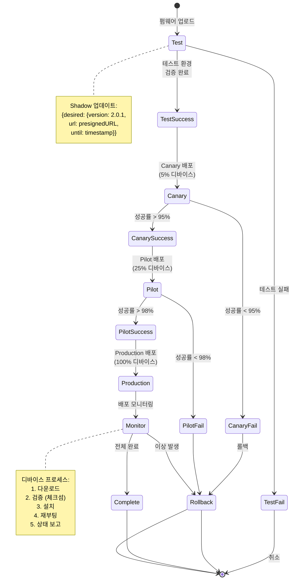
```mermaid
stateDiagram-v2
    [*] --> Test: 펌웨어 업로드
    Test --> TestSuccess: 테스트 환경<br/>검증 완료
    Test --> TestFail: 테스트 실패
    TestFail --> [*]: 취소
    
    TestSuccess --> Canary: Canary 배포<br/>(5% 디바이스)
    
    Canary --> CanarySuccess: 성공률 > 95%
    Canary --> CanaryFail: 성공률 < 95%
    
    CanaryFail --> Rollback: 롤백
    Rollback --> [*]
    
    CanarySuccess --> Pilot: Pilot 배포<br/>(25% 디바이스)
    
    Pilot --> PilotSuccess: 성공률 > 98%
    Pilot --> PilotFail: 성공률 < 98%
    
    PilotFail --> Rollback
    
    PilotSuccess --> Production: Production 배포<br/>(100% 디바이스)
    
    Production --> Monitor: 배포 모니터링
    Monitor --> Complete: 전체 완료
    Monitor --> Rollback: 이상 발생
    
    Complete --> [*]
    Rollback --> [*]
    
    note right of Test
        Shadow 업데이트:
        {desired: {version: 2.0.1, 
         url: presignedURL,
         until: timestamp}}
    end note
    
    note right of Monitor
        디바이스 프로세스:
        1. 다운로드
        2. 검증 (체크섬)
        3. 설치
        4. 재부팅
        5. 상태 보고
    end note
```

---

## 6. 자동 진단 및 대응 프로세스 (폐쇄 루프)

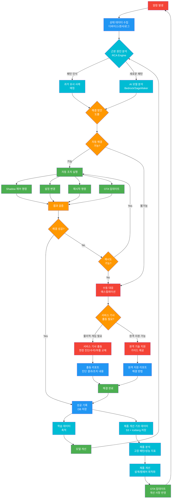
```mermaid
flowchart TD
    Alarm[알람 발생] --> Collect[상태 데이터 수집<br/>디바이스/센서/로그]
    
    Collect --> Analysis{근본 원인 분석<br/>RCA Engine}
    
    Analysis -->|패턴 인식| PatternMatch[과거 유사 사례<br/>매칭]
    Analysis -->|새로운 패턴| AIModel[AI 모델 분석<br/>Bedrock/SageMaker]
    
    PatternMatch --> Solution{해결 방안<br/>도출}
    AIModel --> Solution
    
    Solution --> AutoFix{자동 해결<br/>가능?}
    
    AutoFix -->|가능| Execute[자동 조치 실행]
    AutoFix -->|불가능| Manual[수동 대응<br/>에스컬레이션]
    
    Execute --> Action1[Shadow 제어 명령]
    Execute --> Action2[설정 변경]
    Execute --> Action3[재시작 명령]
    Execute --> Action4[OTA 업데이트]
    
    Action1 --> Verify[결과 검증]
    Action2 --> Verify
    Action3 --> Verify
    Action4 --> Verify
    
    Verify --> Success{해결 성공?}
    
    Success -->|Yes| Record[성공 기록<br/>DB 저장]
    Success -->|No| Retry{재시도<br/>가능?}
    
    Retry -->|Yes| Execute
    Retry -->|No| Manual
    
    Record --> Learn[학습 데이터<br/>축적]
    Learn --> Update[모델 개선]
    Update --> Analysis
    
    Manual --> ServiceDispatch{서비스 기사<br/>출동 필요?}
    
    ServiceDispatch -->|물리적 개입 필요| FieldService[서비스 기사 출동<br/>현장 진단/수리/부품 교체]
    ServiceDispatch -->|원격 지원 가능| RemoteSupport[원격 기술 지원<br/>가이드 제공]
    
    FieldService --> FieldReport[출동 리포트<br/>진단 결과/조치 내용]
    RemoteSupport --> RemoteReport[원격 지원 리포트<br/>해결 방법]
    
    FieldReport --> Resolved[해결 완료]
    RemoteReport --> Resolved
    
    Resolved --> Record
    
    Record --> ProductData[제품 개선 기초 데이터<br/>S3 + Iceberg 저장]
    ProductData --> Analytics[제품 분석<br/>고장 패턴/성능 지표]
    Analytics --> Improvement[제품 개선<br/>설계/펌웨어 최적화]
    Improvement --> OTAUpdate[OTA 업데이트<br/>개선 사항 반영]
    OTAUpdate --> Alarm
    
    style Alarm fill:#F44336,color:#fff
    style Collect fill:#2196F3,color:#fff
    style Analysis fill:#00BCD4,color:#fff
    style PatternMatch fill:#00BCD4,color:#fff
    style AIModel fill:#00BCD4,color:#fff
    style Solution fill:#FF9800,color:#fff
    style AutoFix fill:#FF9800,color:#fff
    style Execute fill:#4CAF50,color:#fff
    style Action1 fill:#4CAF50,color:#fff
    style Action2 fill:#4CAF50,color:#fff
    style Action3 fill:#4CAF50,color:#fff
    style Action4 fill:#4CAF50,color:#fff
    style Verify fill:#FF9800,color:#fff
    style Success fill:#FF9800,color:#fff
    style Record fill:#2196F3,color:#fff
    style Retry fill:#FF9800,color:#fff
    style Learn fill:#00BCD4,color:#fff
    style Update fill:#4CAF50,color:#fff
    style Manual fill:#F44336,color:#fff
    style ServiceDispatch fill:#FF9800,color:#fff
    style FieldService fill:#F44336,color:#fff
    style RemoteSupport fill:#F44336,color:#fff
    style FieldReport fill:#2196F3,color:#fff
    style RemoteReport fill:#2196F3,color:#fff
    style Resolved fill:#4CAF50,color:#fff
    style ProductData fill:#00BCD4,color:#fff
    style Analytics fill:#00BCD4,color:#fff
    style Improvement fill:#00BCD4,color:#fff
    style OTAUpdate fill:#4CAF50,color:#fff
```

---

## 6-1. 핵심 운영 사이클: 무중단 서비스 지원 프로세스

**목표**: 데이터 수집 → 모니터링 → 알림 발생 → 제어/OTA 처리 → 기사 출동 처리 → 제품 개선을 통한 무중단 서비스 지원


```mermaid
flowchart TD
    subgraph 수집["1. 데이터 수집"]
        DataSource[IoT/센서/측정 데이터<br/>TCP/MQTT/API]
        DataSource --> Kinesis[Kinesis Data Streams<br/>통합 수집]
        Kinesis --> Convert[컨버트 모듈<br/>YAML 기반 변환]
        Convert --> Standard[표준 JSON 형식]
    end
    
    subgraph 모니터링["2. 모니터링"]
        Standard --> Monitor[실시간 모니터링<br/>제품별 룰셋 적용]
        Monitor --> RuleEngine[룰 엔진<br/>임계값/패턴/예측]
        RuleEngine --> Eval{조건 평가}
    end
    
    subgraph 알림["3. 알림 발생"]
        Eval -->|조건 만족| Alarm[알람 생성<br/>제품별 심각도]
        Alarm --> Notify[알림 발송<br/>SNS/대시보드]
    end
    
    subgraph 제어["4. 제어/OTA 처리"]
        Notify --> AutoAction{자동 대응<br/>가능?}
        AutoAction -->|가능| Shadow[Shadow 제어<br/>원격 명령]
        AutoAction -->|가능| OTA[OTA 업데이트<br/>펌웨어 패치]
        Shadow --> Verify1[결과 검증]
        OTA --> Verify1
        Verify1 --> Success1{해결 성공?}
        Success1 -->|Yes| Resolved1[해결 완료]
        Success1 -->|No| Escalate[에스컬레이션]
    end
    
    subgraph 기사출동["5. 기사 출동 처리"]
        AutoAction -->|불가능| Dispatch{기사 출동<br/>필요?}
        Escalate --> Dispatch
        Dispatch -->|물리적 개입| FieldService[서비스 기사 출동<br/>현장 진단/수리]
        Dispatch -->|원격 지원| RemoteSupport[원격 기술 지원]
        FieldService --> FieldReport[출동 리포트]
        RemoteSupport --> RemoteReport[원격 지원 리포트]
        FieldReport --> Resolved2[해결 완료]
        RemoteReport --> Resolved2
    end
    
    subgraph 제품개선["6. 제품 개선 (기초 데이터)"]
        Resolved1 --> DataStore[해결 데이터 저장<br/>S3 + Iceberg]
        Resolved2 --> DataStore
        DataStore --> Analytics[제품 분석<br/>고장 패턴/성능 지표]
        Analytics --> Improvement[제품 개선<br/>설계/펌웨어 최적화]
        Improvement --> Deploy[개선 사항 배포<br/>OTA 업데이트]
        Deploy --> DataSource
    end
    
    style DataSource fill:#2196F3,color:#fff
    style Kinesis fill:#4CAF50,color:#fff
    style Convert fill:#9C27B0,color:#fff
    style Standard fill:#4CAF50,color:#fff
    style Monitor fill:#FF9800,color:#fff
    style RuleEngine fill:#FF9800,color:#fff
    style Eval fill:#FF9800,color:#fff
    style Alarm fill:#F44336,color:#fff
    style Notify fill:#F44336,color:#fff
    style AutoAction fill:#FF9800,color:#fff
    style Shadow fill:#4CAF50,color:#fff
    style OTA fill:#4CAF50,color:#fff
    style Verify1 fill:#FF9800,color:#fff
    style Success1 fill:#FF9800,color:#fff
    style Resolved1 fill:#4CAF50,color:#fff
    style Escalate fill:#F44336,color:#fff
    style Dispatch fill:#FF9800,color:#fff
    style FieldService fill:#F44336,color:#fff
    style RemoteSupport fill:#F44336,color:#fff
    style FieldReport fill:#2196F3,color:#fff
    style RemoteReport fill:#2196F3,color:#fff
    style Resolved2 fill:#4CAF50,color:#fff
    style DataStore fill:#00BCD4,color:#fff
    style Analytics fill:#00BCD4,color:#fff
    style Improvement fill:#00BCD4,color:#fff
    style Deploy fill:#4CAF50,color:#fff
```

### 핵심 사이클 특징

1. **데이터 수집**: 다중 프로토콜(TCP/MQTT/API)을 통한 실시간 데이터 수집 및 통합
2. **모니터링**: 제품별 룰셋 기반 실시간 모니터링 및 이상 감지
3. **알림 발생**: 제품별 심각도에 따른 알림 발송 및 대응 우선순위 결정
4. **제어/OTA 처리**: 자동 대응 가능 시 Shadow 제어 또는 OTA 업데이트로 원격 해결
5. **기사 출동 처리**: 자동 대응 불가능 시 서비스 기사 출동 또는 원격 기술 지원
6. **제품 개선**: 해결 데이터를 기초 데이터로 저장하여 제품 분석 및 개선에 활용

### 무중단 서비스 지원

- **자동 대응 우선**: Shadow 제어 및 OTA를 통한 원격 해결로 기사 출동 최소화
- **빠른 대응**: 실시간 모니터링 및 자동 알림으로 즉각 대응
- **지속적 개선**: 해결 데이터 축적을 통한 제품 개선 및 알람 룰셋 최적화
- **피드백 루프**: 제품 개선 사항이 OTA를 통해 배포되어 동일 문제 재발 방지

### 제품 개선을 위한 기초 데이터

- **해결 데이터 저장**: 모든 해결 과정(자동/수동)의 데이터를 S3 + Iceberg에 저장
- **제품 분석**: 고장 패턴, 성능 지표, 고객 피드백 등을 분석
- **개선 반영**: 분석 결과를 바탕으로 제품 설계, 펌웨어, 알람 룰셋 개선
- **순환 구조**: 개선 사항이 OTA로 배포되어 새로운 데이터 수집으로 이어지는 순환 구조

---

## 7. 통신 오류 배치 체크 프로세스

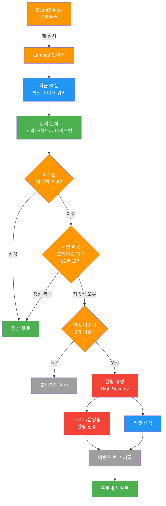
```mermaid
flowchart TD
    Schedule[EventBridge<br/>스케줄러] -->|매 정시| Trigger[Lambda 트리거]
    
    Trigger --> Query[최근 60분<br/>통신 데이터 쿼리]
    
    Query --> Aggregate[집계 분석<br/>고객사/허브/디바이스별]
    
    Aggregate --> Check{미수신<br/>임계치 초과?}
    
    Check -->|정상| End1[정상 종료]
    Check -->|이상| Grace{지연 허용<br/>그레이스 기간<br/>10분 고려}
    
    Grace -->|정상 복구| End1
    Grace -->|지속적 오류| Count{연속 미수신<br/>2회 이상?}
    
    Count -->|No| End2[모니터링 계속]
    Count -->|Yes| Alert[알람 생성<br/>High Severity]
    
    Alert --> Notify[고객사/운영팀<br/>알림 전송]
    Alert --> Ticket[티켓 생성]
    
    Notify --> Log[이벤트 로그 기록]
    Ticket --> Log
    
    Log --> End3[프로세스 완료]
    
    style Schedule fill:#FF9800,color:#fff
    style Trigger fill:#FF9800,color:#fff
    style Query fill:#2196F3,color:#fff
    style Aggregate fill:#4CAF50,color:#fff
    style Check fill:#FF9800,color:#fff
    style End1 fill:#4CAF50,color:#fff
    style Grace fill:#FF9800,color:#fff
    style Count fill:#FF9800,color:#fff
    style End2 fill:#9E9E9E,color:#fff
    style Alert fill:#F44336,color:#fff
    style Notify fill:#F44336,color:#fff
    style Ticket fill:#2196F3,color:#fff
    style Log fill:#9E9E9E,color:#fff
    style End3 fill:#4CAF50,color:#fff
```

---

## 8. 전체 시스템 아키텍처 프로세스

**목적**: 전체 시스템의 계층별 구성과 데이터 흐름 개요

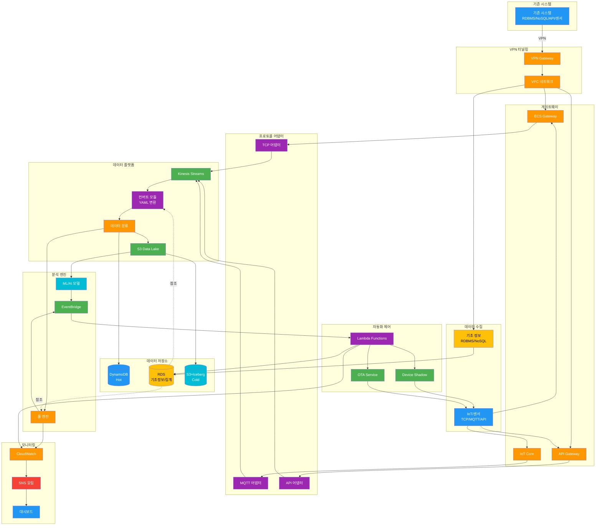
```mermaid
flowchart TD
    subgraph 기존시스템["기존 시스템"]
        Legacy[기존 시스템<br/>RDBMS/NoSQL/API/센서]
    end
    
    subgraph VPN["VPN 터널링"]
        VPNGateway[VPN Gateway]
        VPCNetwork[VPC 네트워크]
    end
    
    subgraph 수집["데이터 수집"]
        IoT[IoT/센서<br/>TCP/MQTT/API]
        Master[기초 정보<br/>RDBMS/NoSQL]
    end
    
    subgraph 게이트웨이["게이트웨이"]
        TCPGW[ECS Gateway]
        APIGW[API Gateway]
        MQTTGW[IoT Core]
    end
    
    subgraph 어댑터["프로토콜 어댑터"]
        TCPAdp[TCP 어댑터]
        MQTTAdp[MQTT 어댑터]
        APIAdp[API 어댑터]
    end
    
    subgraph 플랫폼["데이터 플랫폼"]
        Kinesis[Kinesis Streams]
        Convert[컨버트 모듈<br/>YAML 변환]
        Classify[데이터 분류]
        S3[S3 Data Lake]
    end
    
    subgraph 분석["분석 엔진"]
        Rules[룰 엔진]
        ML[ML/AI 모델]
        EventBridge[EventBridge]
    end
    
    subgraph 제어["자동화 제어"]
        Shadow[Device Shadow]
        OTA[OTA Service]
        Lambda[Lambda Functions]
    end
    
    subgraph 모니터링["모니터링"]
        CloudWatch[CloudWatch]
        SNS[SNS 알림]
        Dashboard[대시보드]
    end
    
    subgraph 저장소["데이터 저장소"]
        DynamoDB[(DynamoDB<br/>Hot)]
        RDS[(RDS<br/>기초정보/집계)]
        S3Archive[(S3+Iceberg<br/>Cold)]
    end
    
    Legacy -->|VPN| VPNGateway
    VPNGateway --> VPCNetwork
    VPCNetwork --> TCPGW
    VPCNetwork --> APIGW
    VPCNetwork --> Master
    
    IoT --> TCPGW
    IoT --> MQTTGW
    IoT --> APIGW
    
    TCPGW --> TCPAdp
    APIGW --> APIAdp
    MQTTGW --> MQTTAdp
    
    TCPAdp --> Kinesis
    MQTTAdp --> Kinesis
    APIAdp --> Kinesis
    
    Kinesis --> Convert
    Convert --> Classify
    Classify --> S3
    Classify --> Rules
    
    Master --> RDS
    S3 --> ML
    Rules --> EventBridge
    ML --> EventBridge
    
    EventBridge --> Lambda
    Lambda --> Shadow
    Lambda --> OTA
    
    Rules --> CloudWatch
    Lambda --> CloudWatch
    CloudWatch --> SNS
    SNS --> Dashboard
    
    Classify --> DynamoDB
    S3 --> S3Archive
    Lambda --> RDS
    
    Shadow --> IoT
    OTA --> IoT
    
    RDS -.->|참조| Convert
    RDS -.->|참조| Rules
    
    style Legacy fill:#2196F3,color:#fff
    style VPNGateway fill:#FF9800,color:#fff
    style VPCNetwork fill:#FF9800,color:#fff
    style IoT fill:#2196F3,color:#fff
    style Master fill:#FFC107,color:#000
    style TCPGW fill:#FF9800,color:#fff
    style APIGW fill:#FF9800,color:#fff
    style MQTTGW fill:#FF9800,color:#fff
    style TCPAdp fill:#9C27B0,color:#fff
    style MQTTAdp fill:#9C27B0,color:#fff
    style APIAdp fill:#9C27B0,color:#fff
    style Kinesis fill:#4CAF50,color:#fff
    style Convert fill:#9C27B0,color:#fff
    style Classify fill:#FF9800,color:#fff
    style S3 fill:#4CAF50,color:#fff
    style Rules fill:#FF9800,color:#fff
    style ML fill:#00BCD4,color:#fff
    style EventBridge fill:#4CAF50,color:#fff
    style Shadow fill:#4CAF50,color:#fff
    style OTA fill:#4CAF50,color:#fff
    style Lambda fill:#9C27B0,color:#fff
    style CloudWatch fill:#FF9800,color:#fff
    style SNS fill:#F44336,color:#fff
    style Dashboard fill:#2196F3,color:#fff
    style DynamoDB fill:#2196F3,color:#fff
    style RDS fill:#FFC107,color:#000
    style S3Archive fill:#00BCD4,color:#fff
```

---

## 9. 데이터 생명주기 관리 프로세스

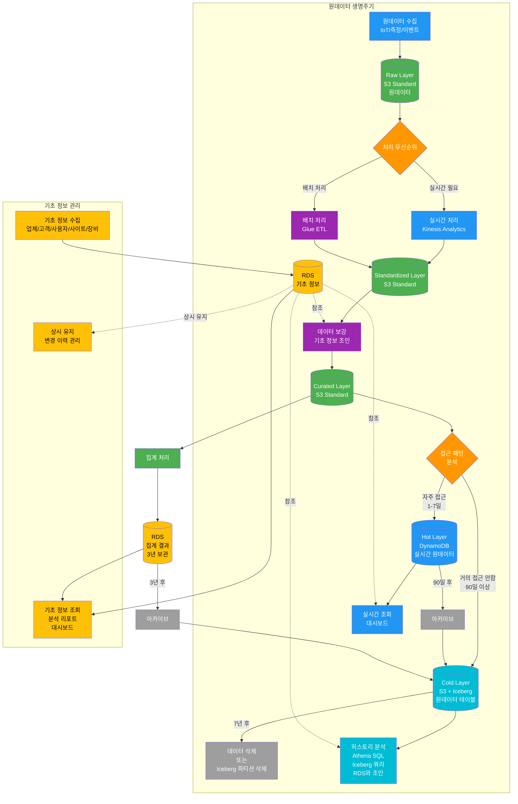
```mermaid
flowchart TD
    subgraph 원데이터["원데이터 생명주기"]
        Ingest[원데이터 수집<br/>IoT/측정/이벤트] --> Raw[(Raw Layer<br/>S3 Standard<br/>원데이터)]
        
        Raw --> Process{처리 우선순위}
        
        Process -->|실시간 필요| HotProcess[실시간 처리<br/>Kinesis Analytics]
        Process -->|배치 처리| BatchProcess[배치 처리<br/>Glue ETL]
        
        HotProcess --> Standardized[(Standardized Layer<br/>S3 Standard)]
        BatchProcess --> Standardized
        
        Standardized --> Enrich[데이터 보강<br/>기초 정보 조인]
        MasterDB[(RDS<br/>기초 정보)] -.->|참조| Enrich
        
        Enrich --> Curated[(Curated Layer<br/>S3 Standard)]
        
        Curated --> Tier{접근 패턴<br/>분석}
        
        Tier -->|자주 접근<br/>1-7일| Hot[(Hot Layer<br/>DynamoDB<br/>실시간 원데이터)]
        Tier -->|거의 접근 안함<br/>90일 이상| Cold[(Cold Layer<br/>S3 + Iceberg<br/>원데이터 테이블)]
        
        Hot -->|90일 후| Archive1[아카이브]
        Archive1 --> Cold
        
        Cold -->|7년 후| Delete[데이터 삭제<br/>또는<br/>Iceberg 파티션 삭제]
        
        Hot --> Query1[실시간 조회<br/>대시보드]
        Cold --> Query3[히스토리 분석<br/>Athena SQL<br/>Iceberg 쿼리<br/>RDS와 조인]
    end
    
    subgraph 기초정보["기초 정보 관리"]
        MasterIngest[기초 정보 수집<br/>업체/고객/사용자/사이트/장비] --> MasterDB
        MasterDB --> Query2[기초 정보 조회<br/>분석 리포트<br/>대시보드]
        MasterDB -.->|상시 유지| Keep[상시 유지<br/>변경 이력 관리]
    end
    
    MasterDB -.->|참조| Query1
    MasterDB -.->|참조| Query3
    
    Aggregate[집계 처리] --> WarmAggregate[(RDS<br/>집계 결과<br/>3년 보관)]
    Curated --> Aggregate
    WarmAggregate --> Query2
    WarmAggregate -->|3년 후| Archive2[아카이브]
    Archive2 --> Cold
    
    style Ingest fill:#2196F3,color:#fff
    style Raw fill:#4CAF50,color:#fff
    style Process fill:#FF9800,color:#fff
    style HotProcess fill:#2196F3,color:#fff
    style BatchProcess fill:#9C27B0,color:#fff
    style Standardized fill:#4CAF50,color:#fff
    style Enrich fill:#9C27B0,color:#fff
    style MasterDB fill:#FFC107,color:#000
    style Curated fill:#4CAF50,color:#fff
    style Tier fill:#FF9800,color:#fff
    style Hot fill:#2196F3,color:#fff
    style Cold fill:#00BCD4,color:#fff
    style Archive1 fill:#9E9E9E,color:#fff
    style Archive2 fill:#9E9E9E,color:#fff
    style Delete fill:#9E9E9E,color:#fff
    style Query1 fill:#2196F3,color:#fff
    style Query2 fill:#FFC107,color:#000
    style Query3 fill:#00BCD4,color:#fff
    style MasterIngest fill:#FFC107,color:#000
    style Keep fill:#FFC107,color:#000
    style Aggregate fill:#4CAF50,color:#fff
    style WarmAggregate fill:#FFC107,color:#000
```

---

## 10. 고객별 맞춤 서비스 프로세스

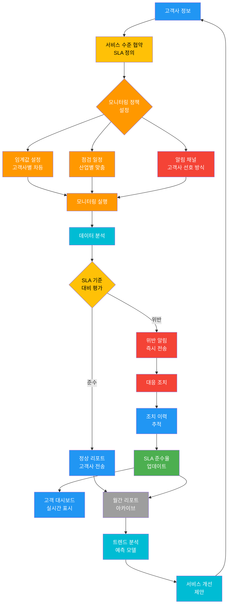
```mermaid
flowchart TD
    Customer[고객사 정보] --> SLA[서비스 수준 협약<br/>SLA 정의]
    
    SLA --> Policy{모니터링 정책<br/>설정}
    
    Policy --> Threshold1[임계값 설정<br/>고객사별 차등]
    Policy --> Schedule1[점검 일정<br/>산업별 맞춤]
    Policy --> Alert1[알림 채널<br/>고객사 선호 방식]
    
    Threshold1 --> Monitor[모니터링 실행]
    Schedule1 --> Monitor
    Alert1 --> Monitor
    
    Monitor --> Analyze[데이터 분석]
    Analyze --> Compare{SLA 기준<br/>대비 평가}
    
    Compare -->|준수| Report1[정상 리포트<br/>고객사 전송]
    Compare -->|위반| Escalate1[위반 알림<br/>즉시 전송]
    
    Escalate1 --> Action[대응 조치]
    Action --> Track[조치 이력<br/>추적]
    
    Track --> Update[SLA 준수율<br/>업데이트]
    Update --> Dashboard[고객 대시보드<br/>실시간 표시]
    
    Report1 --> Archive[월간 리포트<br/>아카이브]
    Update --> Archive
    
    Archive --> Trend[트렌드 분석<br/>예측 모델]
    Trend --> Improve[서비스 개선<br/>제안]
    
    Improve --> Customer
    
    style Customer fill:#2196F3,color:#fff
    style SLA fill:#FFC107,color:#000
    style Policy fill:#FF9800,color:#fff
    style Threshold1 fill:#FF9800,color:#fff
    style Schedule1 fill:#FF9800,color:#fff
    style Alert1 fill:#F44336,color:#fff
    style Monitor fill:#FF9800,color:#fff
    style Analyze fill:#00BCD4,color:#fff
    style Compare fill:#FFC107,color:#000
    style Report1 fill:#2196F3,color:#fff
    style Escalate1 fill:#F44336,color:#fff
    style Action fill:#F44336,color:#fff
    style Track fill:#2196F3,color:#fff
    style Update fill:#4CAF50,color:#fff
    style Dashboard fill:#2196F3,color:#fff
    style Archive fill:#9E9E9E,color:#fff
    style Trend fill:#00BCD4,color:#fff
    style Improve fill:#00BCD4,color:#fff
```

---

## 주요 특징 요약

### 실시간 데이터 수집 및 통합
- **다중 프로토콜 지원**: TCP, MQTT, REST API 등 다양한 프로토콜 통합 (파일은 별도 배치 처리)
- **VPN 터널링 (기존 시스템 연동)**:
  - **목적**: 이전 시스템과 AWS 연동을 위한 보안 통신
  - **구성**: AWS VPN Gateway (Site-to-Site VPN, IPSec 터널)
  - **네트워크**: VPC 내부 네트워크 (Private Subnet)를 통한 내부망 통신
  - **보안**: 사설 IP 통신으로 퍼블릭 노출 없이 기존 시스템과 통신
  - **연동 대상**: 기존 RDBMS, NoSQL, API 서버, 센서 시스템 등
- **인프라 게이트웨이**:
  - **TCP**: ECS 게이트웨이 필요 (TCP 포트 리스닝을 위한 Container Service)
  - **MQTT**: AWS IoT Core (관리형 MQTT 브로커)
  - **REST API**: API Gateway 또는 ECS 서비스 필요
- **Kinesis 연동 방식**:
  - **TCP/API**: Kinesis Producer SDK를 통한 직접 전송 (ECS 서비스 또는 Lambda)
  - **MQTT**: IoT Core Rule Engine을 통한 자동 Kinesis 연동
- **다중 데이터 형식**: 헥사 바이너리, JSON, CSV 등 다양한 데이터 형식 지원
- **통합 스트림**: Kinesis Data Streams를 통한 모든 데이터의 단일 진입점 (원시 형식 보존)
- **컨버트 모듈 위치**: Kinesis Data Streams 뒤에서 Lambda Function으로 실행 (Kinesis Trigger)
- **YAML 기반 변환**: 제품별/디바이스별 변환 규칙을 YAML로 관리 (Lambda 패키지에 포함)
- **YAML 관리**: Git/S3에서 버전 관리, CI/CD 파이프라인을 통한 Lambda 재배포
- **DLQ 처리**: Lambda 실패 시 SQS DLQ로 전송하여 데이터 누락 방지 및 재처리
- **페이로드 변환**: YAML 로직을 통한 표준 JSON 형식 변환
- **원시 데이터 보존**: S3 Raw Layer에 원본 페이로드(헥사/CSV/JSON) 보존으로 재처리 가능

### 파일 데이터 배치 처리
- **별도 프로젝트**: 실시간 처리와 분리된 별도 배치 Job으로 처리
- **스케줄링**: EventBridge 크론 표현식을 통한 주기적 실행
- **처리 방식**: Glue Job, ECS Task, 또는 Lambda를 통한 대용량 파일 처리
- **YAML 규칙**: 배치 Job에도 동일한 YAML 변환 규칙 적용 가능

### 데이터 분류 및 관리
- **공통 요소 (주기 데이터)**: 통신 에러, 통신 품질 등 시간 단위 집계 처리 (Kinesis Analytics → RDS)
- **제품별 관리**: 제품 타입별 스트림 파티션 분리 및 제품별 알람 룰셋 적용 (RDS에서 동적 로드)
- **고객별 관리**: 고객 ID 기반 스트림 파티션 분리, 데이터 격리 및 맞춤 대시보드 제공
- **디바이스별 처리**: 디바이스별 스트림 라우팅 및 제품별 룰셋 기반 알람 처리 (DynamoDB + SNS)

### 제품별 알람 룰셋 시스템
- **제품 타입 식별**: 디바이스 메타데이터 기반 자동 제품 타입 식별
- **룰셋 관리**: RDS에 저장된 제품별 알람 룰셋 동적 로드
- **룰 엔진 적용**: 제품별로 다른 임계값, 패턴, 조합, 예측 모델 적용
- **자동화 대응**: 제품별 자동 대응 액션 및 알림 채널 관리
- **지속적 개선**: 제품별 피드백 기반 룰셋 최적화

### 핵심 운영 사이클: 무중단 서비스 지원
- **데이터 수집**: 다중 프로토콜(TCP/MQTT/API)을 통한 실시간 데이터 수집 및 통합
- **모니터링**: 제품별 룰셋 기반 실시간 모니터링 및 이상 감지
- **알림 발생**: 제품별 심각도에 따른 알림 발송 및 대응 우선순위 결정
- **제어/OTA 처리**: 자동 대응 가능 시 Shadow 제어 또는 OTA 업데이트로 원격 해결
- **기사 출동 처리**: 자동 대응 불가능 시 서비스 기사 출동 또는 원격 기술 지원
- **제품 개선**: 해결 데이터를 기초 데이터로 저장하여 제품 분석 및 개선에 활용
- **무중단 서비스**: 자동 대응 우선 정책으로 기사 출동 최소화 및 빠른 대응
- **피드백 루프**: 제품 개선 사항이 OTA를 통해 배포되어 동일 문제 재발 방지

---

## 11. 서비스 설치 및 배포 프로세스

**목적**: 개발부터 프로덕션 배포까지 전체 CI/CD 파이프라인

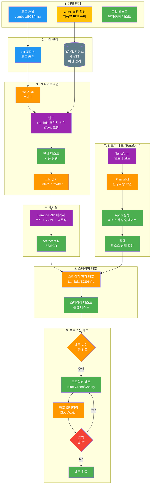
```mermaid
flowchart TD
    subgraph 개발["1. 개발 단계"]
        Code[코드 개발<br/>Lambda/ECS/Infra]
        YAML[YAML 설정 작성<br/>제품별 변환 규칙]
        Test[로컬 테스트<br/>단위/통합 테스트]
    end
    
    subgraph 버전관리["2. 버전 관리"]
        Git[Git 저장소<br/>코드 커밋]
        YAMLRepo[(YAML 저장소<br/>Git/S3<br/>버전 관리)]
        Code --> Git
        YAML --> YAMLRepo
    end
    
    subgraph CI["3. CI 파이프라인"]
        Trigger[Git Push<br/>트리거]
        Build[빌드<br/>Lambda 패키지 생성<br/>YAML 포함]
        UnitTest[단위 테스트<br/>자동 실행]
        Lint[코드 검사<br/>Linter/Formatter]
        
        Trigger --> Build
        Build --> UnitTest
        UnitTest --> Lint
    end
    
    subgraph 패키징["4. 패키징"]
        Package[Lambda ZIP 패키지<br/>코드 + YAML + 의존성]
        Artifact[Artifact 저장<br/>S3/ECR]
        Lint --> Package
        Package --> Artifact
    end
    
    subgraph 스테이징["5. 스테이징 배포"]
        StagingDeploy[스테이징 환경 배포<br/>Lambda/ECS/Infra]
        StagingTest[스테이징 테스트<br/>통합 테스트]
        Artifact --> StagingDeploy
        StagingDeploy --> StagingTest
    end
    
    subgraph 프로덕션["6. 프로덕션 배포"]
        Approval{배포 승인<br/>수동 검토}
        ProdDeploy[프로덕션 배포<br/>Blue-Green/Canary]
        Monitor[배포 모니터링<br/>CloudWatch]
        Rollback{롤백<br/>필요?}
        
        StagingTest --> Approval
        Approval -->|승인| ProdDeploy
        ProdDeploy --> Monitor
        Monitor --> Rollback
        Rollback -->|Yes| ProdDeploy
        Rollback -->|No| Complete[배포 완료]
    end
    
    subgraph 인프라["7. 인프라 배포 (Terraform)"]
        Terraform[Terraform<br/>인프라 코드]
        Plan[Plan 실행<br/>변경사항 확인]
        Apply[Apply 실행<br/>리소스 생성/업데이트]
        Validate[검증<br/>리소스 상태 확인]
        
        Terraform --> Plan
        Plan --> Apply
        Apply --> Validate
    end
    
    Git --> Trigger
    YAMLRepo --> Build
    Validate --> StagingDeploy
    
    style Code fill:#2196F3,color:#fff
    style YAML fill:#FFC107,color:#000
    style Test fill:#4CAF50,color:#fff
    style Git fill:#2196F3,color:#fff
    style YAMLRepo fill:#607D8B,color:#fff
    style Trigger fill:#FF9800,color:#fff
    style Build fill:#9C27B0,color:#fff
    style UnitTest fill:#4CAF50,color:#fff
    style Lint fill:#FF9800,color:#fff
    style Package fill:#9C27B0,color:#fff
    style Artifact fill:#4CAF50,color:#fff
    style StagingDeploy fill:#FF9800,color:#fff
    style StagingTest fill:#4CAF50,color:#fff
    style Approval fill:#FF9800,color:#fff
    style ProdDeploy fill:#4CAF50,color:#fff
    style Monitor fill:#FF9800,color:#fff
    style Rollback fill:#F44336,color:#fff
    style Complete fill:#4CAF50,color:#fff
    style Terraform fill:#9C27B0,color:#fff
    style Plan fill:#FF9800,color:#fff
    style Apply fill:#4CAF50,color:#fff
    style Validate fill:#4CAF50,color:#fff
```

### 배포 전략

- **Lambda 배포**: ZIP 패키지에 YAML 포함, 버전별 별도 배포
- **ECS 배포**: ECR 이미지 기반, Blue-Green 또는 Rolling 배포
- **인프라 배포**: Terraform을 통한 Infrastructure as Code
- **롤백 전략**: 이전 버전 자동 롤백 지원

---

## 12. 기존 시스템 연동 프로세스

**목적**: 온프레미스/하이브리드 환경의 기존 시스템과 AWS 연동

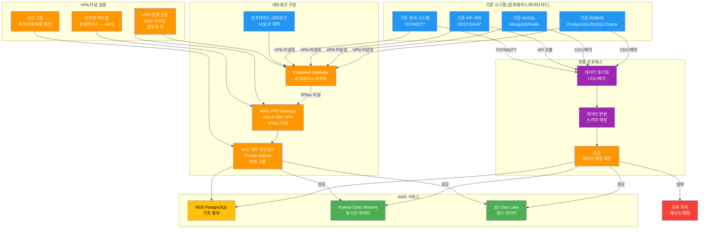
```mermaid
flowchart TD
    subgraph 기존시스템["기존 시스템 (온프레미스/하이브리드)"]
        LegacyRDBMS[기존 RDBMS<br/>PostgreSQL/MySQL/Oracle]
        LegacyNoSQL[기존 NoSQL<br/>MongoDB/Redis]
        LegacyAPI[기존 API 서버<br/>REST/SOAP]
        LegacySensor[기존 센서 시스템<br/>TCP/MQTT]
    end
    
    subgraph 네트워크["네트워크 구성"]
        OnPremNetwork[온프레미스 네트워크<br/>사설 IP 대역]
        VPNGateway[AWS VPN Gateway<br/>Site-to-Site VPN<br/>IPSec 터널]
        VPCNetwork[VPC 내부 네트워크<br/>Private Subnet<br/>보안 그룹]
        CustomerGateway[Customer Gateway<br/>온프레미스 라우터]
    end
    
    subgraph 설정["VPN 터널 설정"]
        VPNConfig[VPN 연결 설정<br/>BGP 라우팅<br/>암호화 키]
        RouteTable[라우팅 테이블<br/>온프레미스 ↔ AWS]
        SecurityGroup[보안 그룹<br/>포트/프로토콜 제한]
    end
    
    subgraph 연동["연동 프로세스"]
        Sync[데이터 동기화<br/>CDC/배치]
        Transform[데이터 변환<br/>스키마 매핑]
        Validate[검증<br/>데이터 품질 확인]
    end
    
    subgraph AWS["AWS 서비스"]
        RDS[RDS PostgreSQL<br/>기초 정보]
        Kinesis[Kinesis Data Streams<br/>실시간 데이터]
        S3[S3 Data Lake<br/>원시 데이터]
    end
    
    LegacyRDBMS -->|VPN 터널링| CustomerGateway
    LegacyNoSQL -->|VPN 터널링| CustomerGateway
    LegacyAPI -->|VPN 터널링| CustomerGateway
    LegacySensor -->|VPN 터널링| CustomerGateway
    
    CustomerGateway -->|IPSec 터널| VPNGateway
    VPNGateway --> VPCNetwork
    OnPremNetwork --> CustomerGateway
    
    VPNConfig --> VPNGateway
    VPNConfig --> CustomerGateway
    RouteTable --> VPNGateway
    SecurityGroup --> VPCNetwork
    
    LegacyRDBMS -->|CDC/배치| Sync
    LegacyNoSQL -->|CDC/배치| Sync
    LegacyAPI -->|API 호출| Sync
    LegacySensor -->|TCP/MQTT| Sync
    
    Sync --> Transform
    Transform --> Validate
    Validate -->|성공| RDS
    Validate -->|성공| Kinesis
    Validate -->|성공| S3
    Validate -->|실패| Error[오류 처리<br/>재시도/알림]
    
    VPCNetwork --> RDS
    VPCNetwork --> Kinesis
    VPCNetwork --> S3
    
    style LegacyRDBMS fill:#2196F3,color:#fff
    style LegacyNoSQL fill:#2196F3,color:#fff
    style LegacyAPI fill:#2196F3,color:#fff
    style LegacySensor fill:#2196F3,color:#fff
    style OnPremNetwork fill:#2196F3,color:#fff
    style VPNGateway fill:#FF9800,color:#fff
    style VPCNetwork fill:#FF9800,color:#fff
    style CustomerGateway fill:#FF9800,color:#fff
    style VPNConfig fill:#FF9800,color:#fff
    style RouteTable fill:#FF9800,color:#fff
    style SecurityGroup fill:#FF9800,color:#fff
    style Sync fill:#9C27B0,color:#fff
    style Transform fill:#9C27B0,color:#fff
    style Validate fill:#FF9800,color:#fff
    style RDS fill:#FFC107,color:#000
    style Kinesis fill:#4CAF50,color:#fff
    style S3 fill:#4CAF50,color:#fff
    style Error fill:#F44336,color:#fff
```

### VPN 터널링 구성 요소

- **AWS VPN Gateway**: Site-to-Site VPN 엔드포인트
- **Customer Gateway**: 온프레미스 라우터/방화벽
- **VPN 연결**: IPSec 터널 (2개 터널로 고가용성)
- **BGP 라우팅**: 동적 라우팅 프로토콜
- **보안 그룹**: VPC 내부 리소스 접근 제어

---

## 13. 구축 필요 리소스 및 시스템 구성

**목적**: 전체 시스템 구축에 필요한 AWS 리소스 및 인프라 구성 정리

### 13-1. 네트워크 및 보안 리소스

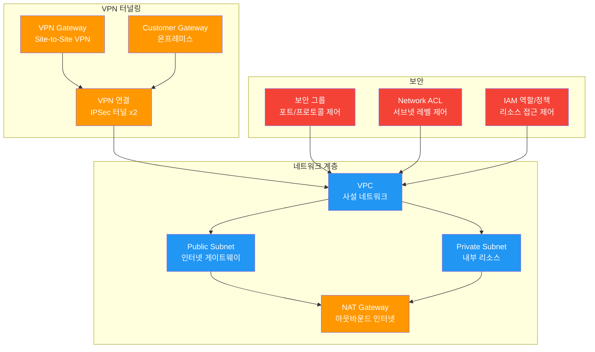
```mermaid
flowchart TD
    subgraph 네트워크["네트워크 계층"]
        VPC[VPC<br/>사설 네트워크]
        PublicSubnet[Public Subnet<br/>인터넷 게이트웨이]
        PrivateSubnet[Private Subnet<br/>내부 리소스]
        NATGateway[NAT Gateway<br/>아웃바운드 인터넷]
    end
    
    subgraph VPN["VPN 터널링"]
        VPNGateway[VPN Gateway<br/>Site-to-Site VPN]
        CustomerGW[Customer Gateway<br/>온프레미스]
        VPNConnection[VPN 연결<br/>IPSec 터널 x2]
    end
    
    subgraph 보안["보안"]
        SecurityGroup[보안 그룹<br/>포트/프로토콜 제어]
        NACL[Network ACL<br/>서브넷 레벨 제어]
        IAM[IAM 역할/정책<br/>리소스 접근 제어]
    end
    
    VPC --> PublicSubnet
    VPC --> PrivateSubnet
    PublicSubnet --> NATGateway
    PrivateSubnet --> NATGateway
    
    VPNGateway --> VPNConnection
    CustomerGW --> VPNConnection
    VPNConnection --> VPC
    
    SecurityGroup --> VPC
    NACL --> VPC
    IAM --> VPC
    
    style VPC fill:#2196F3,color:#fff
    style PublicSubnet fill:#2196F3,color:#fff
    style PrivateSubnet fill:#2196F3,color:#fff
    style NATGateway fill:#FF9800,color:#fff
    style VPNGateway fill:#FF9800,color:#fff
    style CustomerGW fill:#FF9800,color:#fff
    style VPNConnection fill:#FF9800,color:#fff
    style SecurityGroup fill:#F44336,color:#fff
    style NACL fill:#F44336,color:#fff
    style IAM fill:#F44336,color:#fff
```

### 13-2. 데이터 수집 및 게이트웨이 리소스

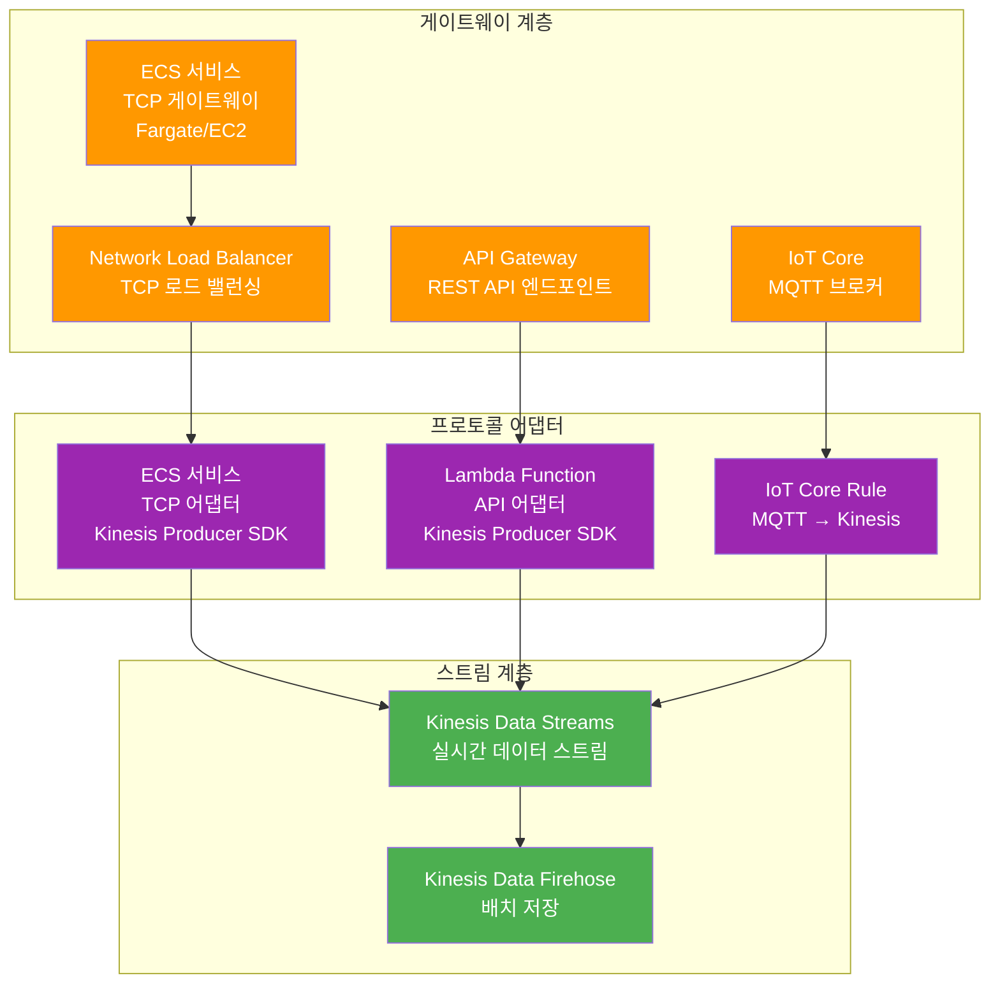
```mermaid
flowchart TD
    subgraph 게이트웨이["게이트웨이 계층"]
        ECSGateway[ECS 서비스<br/>TCP 게이트웨이<br/>Fargate/EC2]
        APIGateway[API Gateway<br/>REST API 엔드포인트]
        IoTCore[IoT Core<br/>MQTT 브로커]
        LoadBalancer[Network Load Balancer<br/>TCP 로드 밸런싱]
    end
    
    subgraph 어댑터["프로토콜 어댑터"]
        ECSAdapter[ECS 서비스<br/>TCP 어댑터<br/>Kinesis Producer SDK]
        LambdaAdapter[Lambda Function<br/>API 어댑터<br/>Kinesis Producer SDK]
        IoTRule[IoT Core Rule<br/>MQTT → Kinesis]
    end
    
    subgraph 스트림["스트림 계층"]
        Kinesis[Kinesis Data Streams<br/>실시간 데이터 스트림]
        Firehose[Kinesis Data Firehose<br/>배치 저장]
    end
    
    ECSGateway --> LoadBalancer
    LoadBalancer --> ECSAdapter
    APIGateway --> LambdaAdapter
    IoTCore --> IoTRule
    
    ECSAdapter --> Kinesis
    LambdaAdapter --> Kinesis
    IoTRule --> Kinesis
    
    Kinesis --> Firehose
    
    style ECSGateway fill:#FF9800,color:#fff
    style APIGateway fill:#FF9800,color:#fff
    style IoTCore fill:#FF9800,color:#fff
    style LoadBalancer fill:#FF9800,color:#fff
    style ECSAdapter fill:#9C27B0,color:#fff
    style LambdaAdapter fill:#9C27B0,color:#fff
    style IoTRule fill:#9C27B0,color:#fff
    style Kinesis fill:#4CAF50,color:#fff
    style Firehose fill:#4CAF50,color:#fff
```

### 13-3. 데이터 처리 및 변환 리소스

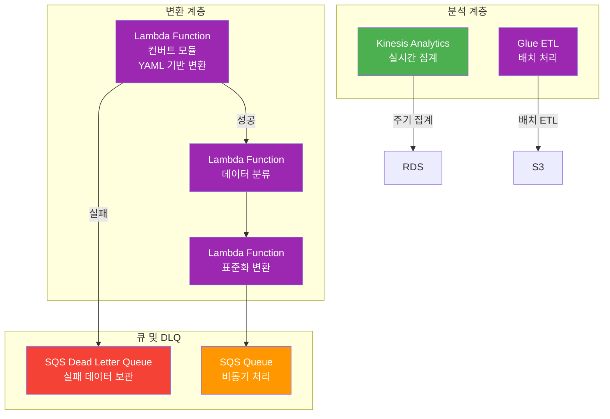
```mermaid
flowchart TD
    subgraph 변환["변환 계층"]
        ConvertLambda[Lambda Function<br/>컨버트 모듈<br/>YAML 기반 변환]
        ClassifyLambda[Lambda Function<br/>데이터 분류]
        TransformLambda[Lambda Function<br/>표준화 변환]
    end
    
    subgraph 큐["큐 및 DLQ"]
        DLQ[SQS Dead Letter Queue<br/>실패 데이터 보관]
        SQS[SQS Queue<br/>비동기 처리]
    end
    
    subgraph 분석["분석 계층"]
        KinesisAnalytics[Kinesis Analytics<br/>실시간 집계]
        Glue[Glue ETL<br/>배치 처리]
    end
    
    ConvertLambda -->|실패| DLQ
    ConvertLambda -->|성공| ClassifyLambda
    ClassifyLambda --> TransformLambda
    TransformLambda --> SQS
    
    KinesisAnalytics -->|주기 집계| RDS
    Glue -->|배치 ETL| S3
    
    style ConvertLambda fill:#9C27B0,color:#fff
    style ClassifyLambda fill:#9C27B0,color:#fff
    style TransformLambda fill:#9C27B0,color:#fff
    style DLQ fill:#F44336,color:#fff
    style SQS fill:#FF9800,color:#fff
    style KinesisAnalytics fill:#4CAF50,color:#fff
    style Glue fill:#9C27B0,color:#fff
```

### 13-4. 데이터 저장소 리소스

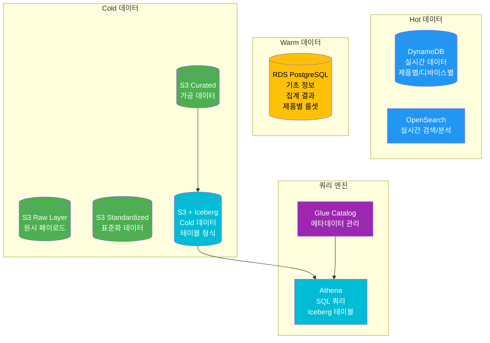
```mermaid
flowchart TD
    subgraph Hot["Hot 데이터"]
        DynamoDB[(DynamoDB<br/>실시간 데이터<br/>제품별/디바이스별)]
        OpenSearch[OpenSearch<br/>실시간 검색/분석]
    end
    
    subgraph Warm["Warm 데이터"]
        RDS[(RDS PostgreSQL<br/>기초 정보<br/>집계 결과<br/>제품별 룰셋)]
    end
    
    subgraph Cold["Cold 데이터"]
        S3Raw[(S3 Raw Layer<br/>원시 페이로드)]
        S3Standardized[(S3 Standardized<br/>표준화 데이터)]
        S3Curated[(S3 Curated<br/>가공 데이터)]
        S3Iceberg[(S3 + Iceberg<br/>Cold 데이터<br/>테이블 형식)]
    end
    
    subgraph 쿼리["쿼리 엔진"]
        Athena[Athena<br/>SQL 쿼리<br/>Iceberg 테이블]
        GlueCatalog[Glue Catalog<br/>메타데이터 관리]
    end
    
    S3Curated --> S3Iceberg
    S3Iceberg --> Athena
    GlueCatalog --> Athena
    
    style DynamoDB fill:#2196F3,color:#fff
    style OpenSearch fill:#2196F3,color:#fff
    style RDS fill:#FFC107,color:#000
    style S3Raw fill:#4CAF50,color:#fff
    style S3Standardized fill:#4CAF50,color:#fff
    style S3Curated fill:#4CAF50,color:#fff
    style S3Iceberg fill:#00BCD4,color:#fff
    style Athena fill:#00BCD4,color:#fff
    style GlueCatalog fill:#9C27B0,color:#fff
```

### 13-5. 분석 및 AI/ML 리소스

```mermaid
flowchart TD
    subgraph 룰엔진["룰 엔진"]
        RulesEngine[Lambda Function<br/>룰 엔진<br/>제품별 룰셋]
        RDSRules[(RDS<br/>제품별 룰셋<br/>설정)]
    end
    
    subgraph ML["ML/AI 서비스"]
        SageMaker[SageMaker<br/>ML 모델<br/>제품별 학습]
        Bedrock[Bedrock<br/>LLM 분석<br/>RCA/예측]
        Forecast[Forecast<br/>예측 분석]
    end
    
    subgraph 오케스트레이션["오케스트레이션"]
        EventBridge[EventBridge<br/>이벤트 오케스트레이션]
        StepFunctions[Step Functions<br/>복잡한 워크플로우]
    end
    
    RulesEngine --> RDSRules
    RDSRules -.->|룰셋 로드| RulesEngine
    
    SageMaker --> EventBridge
    Bedrock --> EventBridge
    Forecast --> EventBridge
    
    EventBridge --> StepFunctions
    
    style RulesEngine fill:#FF9800,color:#fff
    style RDSRules fill:#FFC107,color:#000
    style SageMaker fill:#00BCD4,color:#fff
    style Bedrock fill:#00BCD4,color:#fff
    style Forecast fill:#00BCD4,color:#fff
    style EventBridge fill:#4CAF50,color:#fff
    style StepFunctions fill:#4CAF50,color:#fff
```

### 13-6. 제어 및 모니터링 리소스

```mermaid
flowchart TD
    subgraph 제어["제어 계층"]
        IoTShadow[IoT Device Shadow<br/>디바이스 상태 관리]
        OTAService[OTA Service<br/>펌웨어 업데이트]
        ControlLambda[Lambda Function<br/>자동 제어]
    end
    
    subgraph 모니터링["모니터링"]
        CloudWatch[CloudWatch<br/>메트릭/로그/알람]
        SNS[SNS<br/>알림 발송]
        Dashboard[QuickSight/커스텀<br/>대시보드]
    end
    
    subgraph 스케줄링["스케줄링"]
        EventBridgeSchedule[EventBridge<br/>스케줄러<br/>크론 표현식]
    end
    
    ControlLambda --> IoTShadow
    ControlLambda --> OTAService
    IoTShadow --> IoTDevice[IoT 디바이스]
    OTAService --> IoTDevice
    
    CloudWatch --> SNS
    SNS --> Dashboard
    EventBridgeSchedule --> ControlLambda
    
    style IoTShadow fill:#4CAF50,color:#fff
    style OTAService fill:#4CAF50,color:#fff
    style ControlLambda fill:#9C27B0,color:#fff
    style CloudWatch fill:#FF9800,color:#fff
    style SNS fill:#F44336,color:#fff
    style Dashboard fill:#2196F3,color:#fff
    style EventBridgeSchedule fill:#FF9800,color:#fff
    style IoTDevice fill:#2196F3,color:#fff
```

### 13-7. 전체 리소스 목록

#### 네트워크 및 보안
- **VPC**: 사설 네트워크 (CIDR 블록)
- **Subnet**: Public/Private 서브넷 (가용 영역별)
- **Internet Gateway**: 퍼블릭 인터넷 접근
- **NAT Gateway**: 프라이빗 서브넷 아웃바운드
- **VPN Gateway**: Site-to-Site VPN
- **Customer Gateway**: 온프레미스 라우터
- **VPN Connection**: IPSec 터널 (2개, 고가용성)
- **Security Group**: 인스턴스 레벨 방화벽
- **Network ACL**: 서브넷 레벨 방화벽
- **Route Table**: 라우팅 테이블

#### 게이트웨이 및 어댑터
- **ECS Service**: TCP 게이트웨이 (Fargate/EC2)
- **Network Load Balancer**: TCP 로드 밸런싱
- **API Gateway**: REST API 엔드포인트
- **IoT Core**: MQTT 브로커
- **ECS Task Definition**: 컨테이너 정의
- **ECR**: 컨테이너 이미지 저장소

#### 데이터 스트림
- **Kinesis Data Streams**: 실시간 데이터 스트림
- **Kinesis Data Firehose**: 배치 저장
- **Kinesis Analytics**: 실시간 집계

#### Lambda 함수
- **컨버트 모듈**: YAML 기반 데이터 변환
- **데이터 분류**: 제품별/고객별/디바이스별 분류
- **표준화 변환**: 스키마 변환 및 보강
- **룰 엔진**: 제품별 알람 룰셋 적용
- **자동 제어**: Shadow/OTA 제어
- **DLQ 처리**: 실패 데이터 재처리
- **배치 처리**: 파일 데이터 처리

#### 데이터 저장소
- **DynamoDB**: Hot 데이터 (실시간)
- **RDS PostgreSQL**: Warm 데이터 (기초 정보, 집계 결과)
- **S3**: Raw/Standardized/Curated Layer
- **S3 + Iceberg**: Cold 데이터 (장기 보관)
- **OpenSearch**: 실시간 검색/분석

#### 분석 및 AI/ML
- **SageMaker**: ML 모델 학습 및 추론
- **Bedrock**: LLM 기반 분석
- **Forecast**: 예측 분석
- **Athena**: SQL 쿼리 (Iceberg 테이블)
- **Glue**: ETL 처리 및 카탈로그 관리

#### 오케스트레이션
- **EventBridge**: 이벤트 오케스트레이션 및 스케줄링
- **Step Functions**: 복잡한 워크플로우

#### 모니터링 및 알림
- **CloudWatch**: 메트릭, 로그, 알람
- **SNS**: 알림 발송
- **QuickSight**: 대시보드 (또는 커스텀)

#### 큐 및 메시징
- **SQS**: Dead Letter Queue 및 비동기 처리

#### 기타
- **IAM**: 역할 및 정책
- **Secrets Manager**: 시크릿 관리
- **Parameter Store**: 설정 관리
- **CodePipeline**: CI/CD 파이프라인
- **CodeBuild**: 빌드 서비스
- **CodeDeploy**: 배포 서비스

---

---

## 14. 설계 문서와 웹 애플리케이션 매핑

**목적**: 설계 문서의 내용이 대시보드와 프레젠테이션에 어떻게 반영되는지 매핑

### 14-1. 설계 문서 → 대시보드 매핑

```mermaid
flowchart TD
    subgraph 설계문서["설계 문서 (PROCESS_FLOW.md)"]
        D1[1. 전체 로드맵]
        D2[2. 데이터 통합 플랫폼]
        D3[3. 지능형 모니터링]
        D4[4. 원격 제어]
        D5[5. OTA 업데이트]
        D6[6. 자동 진단]
        D8[8. 시스템 아키텍처]
        D9[9. 데이터 생명주기]
        D10[10. 고객별 서비스]
        D11[11. 설치/배포]
        D12[12. 기존 시스템 연동]
        D13[13. 구축 리소스]
    end
    
    subgraph 대시보드["대시보드 (DashboardApp)"]
        DB1[Frame 1. 문제 정의<br/>ProblemFrame]
        DB2[Frame 2. 표준화<br/>SchemaFrame]
        DB3[Frame 3. 통합 플랫폼<br/>DataIntegrationFrame]
        DB4[Frame 4. 모니터링<br/>MonitoringFrame]
        DB5[Frame 5. 자동 제어<br/>RemoteControlFrame]
        DB6[Frame 6. 지능형 분석<br/>AnalysisFrame]
        DB7[Frame 7. 활용 확장<br/>FutureFrame]
    end
    
    D2 --> DB3
    D3 --> DB4
    D4 --> DB5
    D5 --> DB5
    D6 --> DB6
    D8 --> DB3
    D9 --> DB3
    D10 --> DB7
    D11 --> DB7
    D12 --> DB3
    D13 --> DB7
    
    style 설계문서 fill:#2196F3,color:#fff
    style 대시보드 fill:#4CAF50,color:#fff
```

### 14-2. 설계 문서 → 프레젠테이션 매핑

```mermaid
flowchart TD
    subgraph 설계문서["설계 문서 (PROCESS_FLOW.md)"]
        D1[1. 전체 로드맵]
        D2[2. 데이터 통합]
        D3[3. 모니터링]
        D6[6. 자동 진단]
        D8[8. 시스템 아키텍처]
        D10[10. 고객별 서비스]
    end
    
    subgraph 프레젠테이션["프레젠테이션 (PresentationApp)"]
        P1[제목 슬라이드]
        P2[현재 문제점<br/>ProblemSlide]
        P3[솔루션 개요<br/>SolutionSlide]
        P4[시스템 아키텍처<br/>ArchitectureSlide]
        P5[핵심 기능<br/>BenefitsSlide]
        P6[구현 로드맵<br/>RoadmapSlide]
        P7[ROI<br/>ROISlide]
    end
    
    D1 --> P6
    D2 --> P3
    D2 --> P4
    D3 --> P5
    D6 --> P5
    D8 --> P4
    D10 --> P7
    
    style 설계문서 fill:#2196F3,color:#fff
    style 프레젠테이션 fill:#FF9800,color:#fff
```

### 14-3. 설계 문서 구성 요소 매핑 테이블

| 설계 문서 섹션 | 내용 | 대시보드 매핑 | 프레젠테이션 매핑 |
|--------------|------|---------------|----------------|
| 1. 전체 로드맵 | 6단계 구현 계획 | FutureFrame | RoadmapSlide |
| 2. 데이터 통합 플랫폼 | 전체 데이터 흐름 | DataIntegrationFrame | SolutionSlide, ArchitectureSlide |
| 2-1. 실시간 데이터 수집 | 프로토콜별 상세 | DataIntegrationFrame | ArchitectureSlide |
| 2-2. 파일 배치 처리 | 배치 Job 프로세스 | DataIntegrationFrame | - |
| 3. 지능형 모니터링 | 제품별 룰셋 적용 | MonitoringFrame | BenefitsSlide |
| 4. 원격 제어 | Shadow 기반 제어 | RemoteControlFrame | BenefitsSlide |
| 5. OTA 업데이트 | 펌웨어 업데이트 | RemoteControlFrame | BenefitsSlide |
| 6. 자동 진단 및 대응 | 폐쇄 루프 | AnalysisFrame | BenefitsSlide |
| 6-1. 핵심 운영 사이클 | 무중단 서비스 지원 | MonitoringFrame, RemoteControlFrame | BenefitsSlide |
| 7. 통신 오류 배치 체크 | 주기적 점검 | MonitoringFrame | - |
| 8. 전체 시스템 아키텍처 | 계층별 구성 | DataIntegrationFrame | ArchitectureSlide |
| 9. 데이터 생명주기 | Hot/Warm/Cold 관리 | DataIntegrationFrame | SolutionSlide |
| 10. 고객별 맞춤 서비스 | SLA 기반 서비스 | FutureFrame | ROISlide |
| 11. 설치 및 배포 | CI/CD 파이프라인 | FutureFrame | - |
| 12. 기존 시스템 연동 | VPN 터널링 | DataIntegrationFrame | ArchitectureSlide |
| 13. 구축 필요 리소스 | AWS 리소스 목록 | FutureFrame | - |

---

## 사용 방법

이 문서의 Mermaid 다이어그램은 다음 도구에서 확인할 수 있습니다:

1. **GitHub/GitLab**: README나 마크다운 파일에서 자동 렌더링
2. **VS Code**: Mermaid Preview 확장 프로그램 설치
3. **온라인 에디터**: [Mermaid Live Editor](https://mermaid.live/)
4. **Notion, Confluence**: Mermaid 플러그인 사용

### Next.js 웹 애플리케이션 실행

```bash
# 프로젝트 디렉토리로 이동
cd 10.planning

# 의존성 설치
npm install

# 개발 서버 실행
npm run dev
```

**페이지 URL**:
- **홈 페이지**: `http://localhost:3000/` (서론/소개)
- **대시보드**: `http://localhost:3000/dashboard`
- **프레젠테이션**: `http://localhost:3000/presentation`
- **프로세스 플로우**: `http://localhost:3000/process-flow`
- **설계 문서**: `http://localhost:3000/docs`

### Next.js 프로젝트 구조 상세

```mermaid
flowchart TD
    subgraph NextJS["Next.js 프로젝트 (10.planning/)"]
        AppRouter[app/ 디렉토리<br/>App Router]
        Components[components/ 디렉토리<br/>React 컴포넌트]
        Public[public/ 디렉토리<br/>정적 파일]
        Docs[00.doc/ 디렉토리<br/>설계 문서]
    end
    
    subgraph Pages["페이지 (app/)"]
        Home[page.tsx<br/>홈 페이지<br/>서론/소개]
        Dashboard[dashboard/page.tsx<br/>대시보드]
        Presentation[presentation/page.tsx<br/>프레젠테이션]
        ProcessFlow[process-flow/page.tsx<br/>프로세스 플로우]
        DocsViewer[docs/page.tsx<br/>문서 뷰어]
    end
    
    subgraph Components["컴포넌트 (components/)"]
        DashboardComps[dashboard/<br/>대시보드 컴포넌트]
        PresentationComps[presentation/<br/>프레젠테이션 컴포넌트]
        UIComps[ui/<br/>공통 UI 컴포넌트]
        MermaidViewer[MermaidViewer<br/>다이어그램 뷰어]
        MarkdownViewer[MarkdownViewer<br/>문서 뷰어]
    end
    
    AppRouter --> Home
    AppRouter --> Dashboard
    AppRouter --> Presentation
    AppRouter --> ProcessFlow
    AppRouter --> DocsViewer
    
    Dashboard --> DashboardComps
    Presentation --> PresentationComps
    ProcessFlow --> MermaidViewer
    DocsViewer --> MarkdownViewer
    
    DashboardComps --> UIComps
    PresentationComps --> UIComps
    MermaidViewer --> UIComps
    MarkdownViewer --> UIComps
    
    DocsViewer --> Docs
    
    style NextJS fill:#4CAF50,color:#fff
    style Pages fill:#2196F3,color:#fff
    style Components fill:#FF9800,color:#fff
    style Docs fill:#9C27B0,color:#fff
```

---

**최종 업데이트**: 2026년 3월
